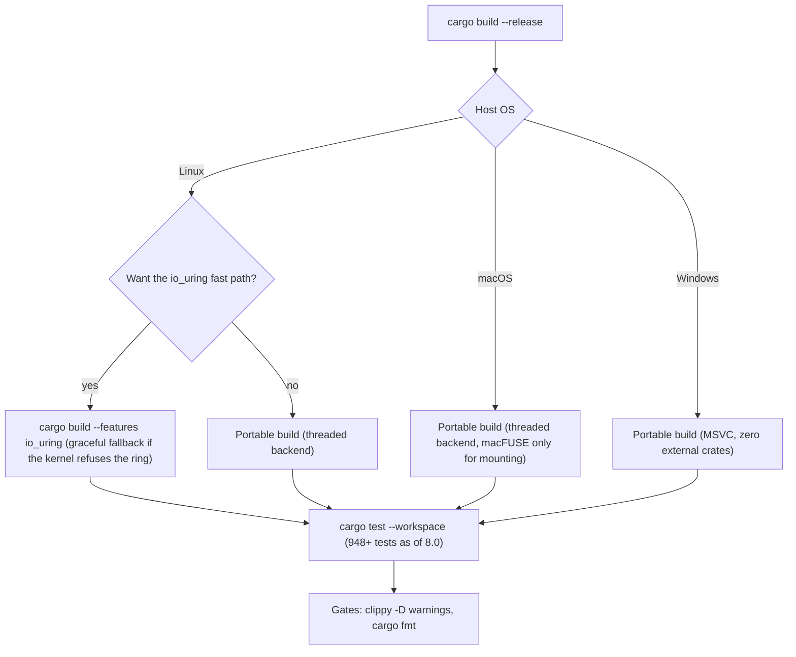

# Building LionFS

LionFS 8.0 builds from one workspace on Linux, macOS, and Windows.

## Workspace layout (8.0)

```
crates/lionfs          the local engine (lib lionfs_core, 52 tools)   MSRV 1.83
crates/lionfs-cluster  the distributed plane (lib lionfs_cluster)     MSRV 1.89 (std file locking)
crates/lionfs-cli      the `lion` front-end
```

## Toolchain decision at a glance



## Prerequisites

- **Rust** 1.89+ for the full workspace (`lionfs-cluster` uses std file
  locking, stabilized in 1.89; the engine crate floors at 1.83 —
  `ErrorKind::NotADirectory`, used de-facto since 7.1's xattr.rs).
- **Linux**: nothing else for the default build. FUSE *mounting*
  needs `libfuse` for the kernel side (distro package `fuse3` or
  `libfuse-dev`); `cargo test` does not need it.
- **macOS**: nothing for the default build; FUSE *mounting* needs
  [macFUSE](https://osxfuse.github.io/).
- **Windows**: only the Rust toolchain (MSVC target). The PAL uses raw
  FFI — zero external crates.

## Commands

```bash
cargo build --release                        # portable, every OS
cargo build --release --features io_uring   # Linux fast path
cargo test --workspace                       # 948+ tests, every OS
cargo test -p lionfs --features io_uring     # engine suite + ring tests
cargo clippy --lib --bins -- -D warnings     # lint gate (CI parity)
cargo fmt                                    # format
cargo bench                                  # criterion benches
```

Quick tour after building:

```bash
./target/debug/lion guide                # the capability map
./target/debug/lfs_cluster               # the merged-plane showcase
mkfs_lfs /tmp/vol.img 64                 # format
./target/debug/lion mount /tmp/vol.img /mnt/point   # FUSE mount
```

## Feature flags

| Feature | Default | Effect |
|---|---|---|
| `io_uring` | off | Compiles the Linux io_uring engine backend. Without it (or on non-Linux, or where the kernel refuses the ring) the engine uses the threaded backend — correct, slower, logged. |

### Build-matrix arithmetic

Three operating systems times two feature states gives the nominal
configuration matrix

$$|\mathcal{M}| = 3 \times 2 = 6$$

but `io_uring` only engages on Linux, so the effective matrix is
$2 + 1 + 1 = 4$ configurations — and every one of them has to keep
the suite green. The extra Linux cell buys the fast path; measured
with `lfs_engine` (the README carries the same numbers):

$$S_{\mathrm{write}} = \frac{707}{115} \approx 6.1\times, \qquad S_{\mathrm{read}} = \frac{1627}{117} \approx 13.9\times$$

for 4 KiB writes and reads respectively, io_uring versus the threaded
backend on the same host.

## Targets of interest

| Binary | Purpose |
|---|---|
| `mkfs_lfs` | format an image/device (optionally a RAID pool) |
| `mount_lfs` | mount via FUSE (unix) |
| `lfs_palinfo` | platform capability report + PAL self-test |
| `lfs_engine` | I/O engine benchmark (backend-aware) |
| `lfs_zns` | ZNS zone-append simulation + media policy matrix |
| `lfs_ioperf` | the 1.x in-process core benchmark harness |
| (30+ more) | scrub, verify, repair, pool, raid, telemetry, … see `tools/` |

## Cross-compiling

The PAL keeps the core platform-neutral, so cross builds are standard
cargo:

```bash
rustup target add x86_64-pc-windows-gnu
cargo build --target x86_64-pc-windows-gnu
```

## Docker

```bash
docker build -t lionfs-dev .
docker run --rm -v "$PWD":/src lionfs-dev cargo test
```
