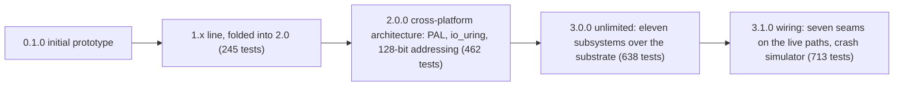
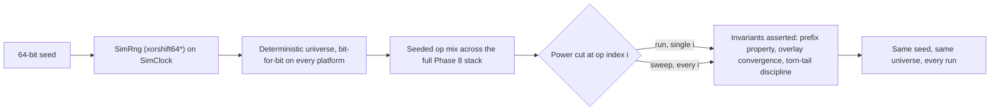

# Changelog

All notable changes to the LionFS project will be documented in this file.

The format is based on [Keep a Changelog](https://keepachangelog.com/en/1.0.0/), and this project adheres to [Semantic Versioning](https://semver.org/spec/v2.0.0.html).

## Release line at a glance

Test-suite growth per release (all green, with and without `io_uring`
where applicable):

$$N: 245 \to 462 \to 638 \to 713$$

— a cumulative factor of $713/245 \approx 2.9\times$ over the 1.x
line, with per-release deltas

$$\Delta_k = N_k - N_{k-1}: \quad \Delta_{2.0} = 217, \quad \Delta_{3.0} = 176, \quad \Delta_{3.1} = 75$$

## [3.1.0] - The Phase 8 Wiring Release

The 3.0 policy layers were consultative: they answered "what should
happen?" while the engine did what it already did. 3.1 wires them in.
Test suite: 638 → **713** (all green); the deterministic crash
simulator proves every wiring decision is a pure function of
(seed, op index).

### Added — The wiring layer (`src/wiring/`)
- **QoS into the shard dispatcher** (`qos_gate.rs`): the admission
  seam (quota early-reject → dual token bucket; Realtime's guarantee
  survives an empty bucket as a metered overrun, BestEffort/Bulk
  delay), plus `GroupCommitPicker` -- WFQ virtual-finish ordering for
  group commit's batch pick (weights 8:4:1, service ratio proven in
  property tests).
- **Record journal onto the small-write path** (`small_write.rs`):
  route decision (≤4032 B → log), group-commit window policy, the
  read overlay (read-your-write), checkpoint drain into the tree via
  a caller-supplied sink, and post-crash overlay rebuild from
  replay -- writer view and replay view provably converge.
- **GC execution loop** (`gc_loop.rs`): census → plan → evacuate →
  reclaim-event feedback; panic mode stays Bulk-class but drops the
  rate limit; `run_to_health` terminates at the kick watermark, an
  honest all-live refusal, or the round cap.
- **Retention daemon + rebalance driver** (`retention_daemon.rs`):
  GFS passes rate-limited by interval (caller-supplied time), failed
  expirations retried next pass; rebalance rounds until
  `is_balanced`, leaving devices drained first.
- **Guardian + Prometheus onto the sockets** (`telemetry_bridge.rs`):
  one object both sockets scrape -- 19 bounded metric series covering
  Guardian advisories (per kind, with evidence gauges and the window
  stall detector) plus every wiring layer's A/B counters;
  deterministic scrapes, advisory stream for the telemetry socket.
- **Key-envelope flow** (`key_flow.rs`): mkfs create / mount unlock
  with a 3-attempt budget and lockout (online-guess throughput
  0.18/s at 600k PBKDF2 iterations), passphrase rotation via rewrap
  (master untouched, file keys stable), full audit trail.
- **Migration onto the real tar stream** (`tar_stream.rs`): a ustar
  parser (checksum-verified, GNU longname, prefix composition) →
  `ImportSink` write path → manifest recorded per file → SHA-256
  read-back verification. Hardlinks/PAX counted, not materialized.

### Added — The deterministic crash simulator (`src/sim/`, ②)
- `SimClock` + seeded `SimRng` (xorshift64*): same seed, same
  universe, bit-for-bit, on every platform.
- `CrashSimulator`: the full Phase 8 stack on the simulated clock
  with seeded op mixes; power cuts injected at deterministic op
  indexes and tear offsets; invariants asserted, not observed --
  **prefix property** (replay = ledger prefix), **overlay
  convergence** (writer view == rebuilt replay view), torn-tail
  discipline, telemetry surviving the crash.
- `sweep`: the exhaustive crash-point sweep (every op index is a test
  case -- the FoundationDB discipline).
- New tool `lfs_simulate` (`run` / `sweep` / `determinism` modes).

The simulator's determinism contract, as a picture:

### Changed — Tuned defaults (③)
- **GC watermarks**: kick 20% → **25%**, aggressive 8% → **10%**
  (background band 12 → 15 points: panic mode becomes rare, not
  nightly); wear penalty 5 → 8 bps/100 cycles; age half-life 7d →
  5d; plan cap 8 → 12 segments.
- **Retention budgets**: hourly 24 → **48** (two full days of
  recovery points); yearly 3 → **7** (SOX-grade horizon).
- **QoS weights**: per-class tuned profile (RT 16 GiB/s, BE 4 GiB/s,
  bulk 1 GiB/s; bursts 1 GiB/256 MiB/64 MiB) with WFQ weights
  **8:4:1** (RT:BE:bulk service ratio under saturation).

## [3.0.0] - The Unlimited Release (LFS-RFC-004)

Eleven production-blocker subsystems from the 3.0 gap analysis, all
implemented as consultative policy layers over the unchanged 2.0
substrate. Test suite: 462 → **638** (all green, with and without
`io_uring`).

### Added — Capacity plane (`src/addressing/va256.rs`)
- **256-bit `WideAddr`** (RFC-004 §3): opt-in mkfs-time namespace width
  for fabric pools — domain(24)/namespace(24)/volume(32)/region(32)/
  device(32)/LBA(48)/byte-offset(64) field layout, field-order `Ord`,
  lossless `From<VolumeAddr>` embedding with `try_compact` inversion.
- `CapacityPlane` selector with stable superblock `plane` tags
  (Compact=0/Wide=1); mount refuses unknown planes.

### Added — QoS & multi-tenancy (`src/qos/`)
- 24 IO priority slots (Realtime/BestEffort/Bulk × 8 sub-levels,
  level-major).
- **Dual token buckets** (bytes/s + ops/s, burst caps, lazy integer
  refill against caller-supplied time; zero rates rejected).
- **Per-namespace quotas**: soft/hard space+inode limits, grace
  windows, bounded denial ring (1024), evaluate-then-charge protocol.
- **WFQ in virtual time**: declared-cost finish times (idempotent
  while pending — anti-laundering), monotonic virtual clock,
  tie-break by queue index. Property tests: exact alternation,
  64K-vs-4K amortization (16:1), 1:3 weights → ~3:1 service.

### Added — Small-file record journal (`src/recordlog/`)
- ≤4032 B writes batch into one sequential log write: 40-byte header
  + payload + CRC32, types Create/Data/Delete/Truncate/Commit/
  Checkpoint; `Commit` = durability point, `Checkpoint` carries the
  drained-through watermark.
- Torn-tail vs corrupt-header replay distinction; CRC failure stops
  replay; hard payload-size enforcement before bytes touch the sink.
- Checkpoint policy: byte/record budgets + chatty-burst detection.

### Added — Copy-GC (`src/gc/`)
- Rosenblum-Ousterhout cost/benefit planner extended with wear
  leveling (5 bps/100 cycles) and an age prior (7-day half-life).
- Watermarks: idle ≥20% free, background 20→8%, **panic mode** <8%
  (pure freeable-bytes ordering); plans capped at 8 segments with
  deterministic tiebreak; all-live pools return `None` honestly.
- `ReclaimEvent` census updates (refcount drops feed the planner
  without device rescans).

### Added — Guardian, autonomous operations (`src/guardian/`)
- **Ransomware entropy watch**: integer Shannon entropy (256-symbol,
  16-step quantized log2), rewrite-fraction and lure-extension EWMAs,
  weights 0.5/0.3/0.2, freeze line at 8000 bps — compression
  workloads cap at 5000 (never freeze), encrypt-in-place reaches the
  line in ~6 windows.
- **Drive-failure predictor**: Weibull baseline (k=1.30, η=80 kh) ×
  SMART-telemetry multipliers; risk bands Healthy/Watch/Degraded/
  Failing; median-remaining-life point estimate (days for Failing,
  weeks for Degraded). Age modulates remaining life only — telemetry
  drives alarms.
- **Workload classifier**: EWMA moments → Db/Log/Stream/Meta/Vm/Vhost
  cascade feeding policy retunes.
- **Agent & advisory bus**: bounded ring, escalation-safe rate
  limiting (keys carry band/class so a worse verdict is never
  suppressed), reversible actions only (FreezeSnapshots/
  EscalateScrub/PlanMigration/RetunePolicies). Runs strictly
  out-of-band — the data path stays deterministic.

### Added — Observability (`src/telemetry/prometheus.rs`)
- Dependency-free Prometheus text exposition (format 0.0.4): HELP/
  TYPE, label escaping, deterministic family/label ordering.
- 49-bucket log-linear latency histograms (1 µs → 36 min + Inf) with
  cumulative `_bucket{le}`/`_sum`/`_count`; interpolated quantiles;
  saturating counters/gauges; `Rc<Handle>` cells (one RefCell borrow
  per observe on the completion path).

### Added — Migration (`src/migrate/`)
- 10-rule magic-byte detection: ext4/XFS/Btrfs/ZFS/F2FS/NTFS/FAT32/
  exFAT/HFS+/APFS at documented offsets (first-match-wins, bounds-
  safe on short images).
- **Manifest protocol**: (path, size, SHA-256) ledger; verification
  distinguishes extra/missing/size-mismatch/digest-mismatch;
  `is_complete()` = zero failures ∧ all checked.
- Import planner: tar-stream (default) / per-file (NTFS ADS, HFS+
  forks, APFS forks) / raw-block (unmountable, operator sign-off
  required); bounded progress steps; destination size as a range.

### Added — Container/VM awareness (`src/container/`)
- Image-layer CAS: digest-keyed registration, refcounted re-pulls
  (`saved_bytes` accounting), hot-dedup-index pinning, sharing ratio
  export, sweep-after-GC.
- Virtiofs passthrough policy table: host-path → tag with cache model
  (none/auto/always), DAX, identity squash; tag collisions refused.

### Added — Key management (`src/security/kdf.rs`)
- **PBKDF2-HMAC-SHA256** (hand-rolled over sha2, RFC 8018, 600k
  default iterations, known-answer tested) → KEK; volume master
  wrapped via ChaCha20-Poly1305.
- Per-file keys = HMAC-PRF under a versioned domain tag — **re-key
  and passphrase rotation are metadata-only**.
- Volatile-zeroizing master on drop (no `zeroize` crate; Windows
  stays std-only); `KeyEnvelope` is deliberately not `Debug`.

### Added — Retention & pool evolution
- **GFS snapshot retention** (`src/fs/retention.rs`): 24h/14d/8w/12m/
  3y budgets, additive representative selection, integer Hinnant
  civil calendar + ISO-8601 week keys (2020-W53 edge tested).
- **Online rebalance** (`src/pool/rebalance.rs`):
  capacity-proportional targets, health-discounted evacuation
  (Watch −25%/Degraded −50%/Failing = drain), drain-to-remove with
  completion reports, 1 GiB budgeted moves on the CoW path in the
  Bulk class, `is_balanced()` convergence (property-tested).

### Added — Tooling
- `lfs_guardian sim` (full advisory pipeline demo), `lfs_migrate
  demo|detect|plan`, `lfs_gc sim` (watermark bands + wear demo),
  `lfs_retention sim` (GFS verdicts over synthetic history).

### Changed
- Cargo: version 3.0.0; description carries the 3.0 feature set.
- RFC-004 (`docs/rfc/LFS-RFC-004-unlimited.md`) is normative for all
  of the above; 10 new specification files under `specifications/`.
- The 3.0 modules follow the 2.0 determinism rule: no wall clock
  inside policy objects (caller-supplied time everywhere).

### Fixed
- 2.0's unused `Read` import in `security::encryption.rs` (warning
  hygiene during the 3.0 audit pass).

## [2.0.0] - The Cross-Platform Architecture Release (LFS-RFC-002 + LFS-RFC-003)

### Added — Platform Abstraction Layer (`src/pal/`)
- **Cross-platform core**: Linux, macOS, and Windows build from one code base; the PAL is the only place platform differences exist. The Windows build pulls **zero external crates** (raw `extern "system"` FFI for `FlushFileBuffers`, `IOCTL_DISK_GET_LENGTH_INFO`, `ProcessPrng`/`RtlGenRandom`).
- Positioned I/O (pread/pwrite ↔ seek_read/seek_write), durability flavors (fdatasync / F_FULLFSYNC / FlushFileBuffers), unified geometry probing (Linux BLKGETSIZE64+BLKSSZGET+BLKPBSZGET+BLKOPTGET, macOS DKIOC*, Windows IOCTL, stat fallback), OS CSPRNG (getrandom / getentropy / ProcessPrng), and wake primitives (eventfd / self-pipe / condvar-generation).
- `libc` and `fuser` are now unix-scoped dependencies; errno and mode constants live in `pal::posix` (the FUSE wire ABI, as constants rather than libc imports).

### Added — I/O Engine (Pillar I, `src/io_engine/`)
- **io_uring backend** (feature `io_uring`): registered files, batched `io_uring_enter`, kernel-side blocking via `submit_and_wait(1)` with exact kernel-pending accounting, zone-append placed-offset bookkeeping, graceful logged fallback when the kernel refuses the ring. Measured live: 707 MiB/s 4 KiB writes / 1627 MiB/s reads (vs 115/117 threaded).
- Portable threaded engine (the correctness floor), Vyukov bounded MPMC queues, per-core shard table with splitmix64 routing, **group commit** (5 ms / 1 MiB batch windows, one flush per batch, private-tx opt-out), registered-buffer arena with dynamic lease exclusivity and counted bounce-buffer slow path.

### Added — Scalability (Pillar II)
- **128-bit volume addressing** (`src/addressing/va.rs`): volume/region/device/LBA field layout, structured ordering, checked arithmetic.
- **Packed 16-byte extent records** (`src/addressing/extent16.rs`): u48/u48/u24 + GRAN/RAW/ENC/SHARED/DEDUP flags, bytemuck-Pod, saturating end-arithmetic.
- **B-epsilon tree** (`src/beepsilon/`): buffered leaves, 2 KiB flush threshold, 25% padding, extent coalescing pass.
- **Persistent HAMT** (`src/hamt/`): 32-way bitmap-compressed trie for the inode namespace, structural sharing for RCU publication.
- **Inode v3** (`src/ondisk/inode_v3.rs`): 64-byte core + inline payloads (≤4032 B — small files become one metadata read, zero data blocks), unambiguous branch discipline on the wire, tail packer with ~4/3 write amplification.

### Added — Reliability (Pillar III)
- **Five-state mount recovery machine** (PROBE/REPLAY/CHECKPOINT/RECONCILE/WRITABLE) with audit records and fault-injection tests (convergence-after-kill).
- **Dual-speed checksums**: xxHash64 (hot pages) / BLAKE3-128 (cold + clusters, domain-separated tags) / CRC32C (structural); constant-time verification.
- **Autonomous repair planner**: quarantine → reconstruct (parity-P/PQ/mirror) → rewrite → swap-in-transaction → release; no-redundancy pools report the loss honestly.
- **Generalized Reed-Solomon RS(n,k)** (`src/pool/erasure.rs`): Vandermonde-systematic construction (right-multiplied by the top-block inverse — the MDS-correct form), any-k-of-n reconstruction, 200-round random-erasure property tests.

### Added — Media tiering (Pillar IV, `src/media/`)
- ZNS zone model: zone-append planning (85% fill switch), completion-time placed offsets, RECONCILE-from-device-report, zone reset/offline; `lfs_zns sim` shows WAF 1.000.
- SMR band allocator: per-file band confinement, elevator sweep planning, explicit `RandomWriteRejected` for random writes to host-managed bands.
- Universal alignment: 4K/16K/64K classes from probed geometry, covering allocation rounding, submission split/merge, counted violations.
- CXL-PMEM tier placement + CLWB fence path (CPUID-probed, x86-64 Linux).

### Added — Compression & dedup pipeline (Pillar V, `src/pipeline/`)
- Per-inode tiering (probe-then-pin: LZ4 / zstd-3 / zstd-12 / raw).
- Punch-through escape hatch on the third RMW against a cluster; cold re-compression after two quiescent scrub cycles.
- FastCDC content-defined chunking (2 K/8 K/32 K, gear hash, deterministic table; local-shift property tested).
- Three-level dedup index (bloom / hot LRU / on-disk tree) at the 0.1%-of-pool RAM budget; BLAKE3-128 chunk hashes.
- QAT/SIMD/software backend selection with counted rejections.

### Added — VFS & tooling
- **Platform-neutral `VfsOps` surface** (`src/vfs/`) + FUSE bridge: the engine no longer implements fuser's trait; Linux/macOS mount through the bridge, Windows/WinFsp has a complete binding design (RFC-003 §5).
- `lfs_palinfo` (platform capability report + PAL self-test), `lfs_engine` (engine benchmark), `lfs_zns` (zone simulator + policy matrix).
- Criterion benches: `beepsilon_bench`, `fastcdc_bench`.
- 3-OS CI matrix (Linux + macOS + Windows) with feature and clippy jobs.

### Changed
- The core is **free of `libc`/fuser/unix imports** (all constants via `pal::posix`, directory names via `&str`, timestamps via a neutral `TimeOrNow`).
- `mount_lfs`, the library mount path, and the C API all route through the FUSE bridge.
- `fill_random` uses the PAL CSPRNG (was `/dev/urandom`).
- Cargo: version 2.0.0, `rust-version` 1.75, unix-scoped fuser/libc, optional Linux `io-uring`, release profile with thin-LTO.
- Test suite: **245 → 462** tests (all green with and without `io_uring`).

### Fixed
- io_uring owner-loop deadlock: the wait decision now uses the owner's exact kernel-pending count instead of the dispatcher's racy in-flight counter.
- io_uring/threaded semantic parity: EOF reads are errors on both backends; zone-append completions carry placed offsets and stats on both.
- The B-epsilon/HAMT/Vyukov-queue/algebra bugs found by the new tests themselves (see the specs' "kept fixed" notes).

## [Unreleased] (1.x line, folded into 2.0.0)
- Extensive, highly-modular project directory structure; initial Phase 1 extent-based filesystem; `mkfs_lfs`, `mount_lfs`, `fsck`, `debug` utilities; zero-copy metadata via bytemuck; free-space bitmap allocator; inline extents in 256-byte inodes; dynamic directory entries; FUSE daemon for POSIX ops on Linux.

## [0.1.0] - Initial Prototype
- Proof-of-concept initialization for LionFS logic testing.
