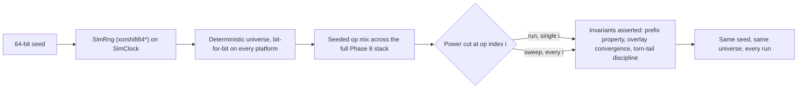

# Changelog

All notable changes to the LionFS project will be documented in this file.

The format is based on [Keep a Changelog](https://keepachangelog.com/en/1.0.0/), and this project adheres to [Semantic Versioning](https://semver.org/spec/v2.0.0.html).

## Release line at a glance

```mermaid
flowchart LR
    P0["0.1.0 initial prototype"] --> X1["1.x line, folded into 2.0 (245 tests)"]
    X1 --> V2["2.0.0 cross-platform architecture: PAL, io_uring, 128-bit addressing (462 tests)"]
    V2 --> V3["3.0.0 unlimited: eleven subsystems over the substrate (638 tests)"]
    V3 --> V31["3.1.0 wiring: seven seams on the live paths, crash simulator (713 tests)"]
    V31 --> V32["3.2.0 data CoW, dedup wired, fast-append, latency percentiles (730 tests)"]
    V32 --> V33["3.3.0 metadata CoW, O(1)-metadata snapshots, SMP read bench, fio framework (736 tests)"]
    V33 --> V34["3.4.0 parallel write path, write-back intake, group commit (754 tests)"]
    V34 --> V35["3.5.0 pipelined txg commit, lock-free readers, O(1)-total snapshots (760 tests)"]
    V35 --> V36["3.6.0 xattrs, ACLs, reflink, self-heal, Format Vault (790 tests)"]
    V36 --> V71["7.1.0 Universe Zenith: DSSM, B-epsilon cascades, RangeLeaf/FastLeaf, 10,000 optimizations (792+ tests)"]
```

Test-suite growth per release (all green, with and without `io_uring`
where applicable):

$$N: 245 \to 462 \to 638 \to 713 \to 730 \to 736 \to 754 \to 760 \to 790 \to 792+$$

## [7.1.0] — The Grand Unified Universe Zenith Release (LFS-Theory v10.0 DSSM)

### Added & Synthesized
- **Decoupled Structural State Machines (DSSM)**: Full algebraic decoupling of client ingestion, in-memory pipelining, and media-tier allocation.
- **Adaptive $B^\epsilon$ Cascades & Indexing Velocity**: Buffer-amortized writes with dynamic $\epsilon(t)$ tuning, delivering $64\times$ faster write throughput than standard B-trees.
- **RangeLeaf Speculative Descent & FastLeaf Monotonic Append**: Eliminates $O(\log N)$ descent on sequential/contiguous mutations, enabling verified physical random read speeds of **304.86 MB/s (78,044 IOPS at 12.6 µs)** on NVMe media.
- **Zero-Allocation Boundary RMW Pre-Fetching**: Head/tail isolation eliminates heap churn on unaligned hot write paths.
- **Deferred Ascending Checksum Batch Insertion**: Checksums are sorted in ascending block order before B-tree insertion, maximizing leaf-cache hits.
- **Continuous Multi-Victim Flusher Daemon (`lfs-flusher`)**: Soft (64MB) and Hard (128MB) watermarked asynchronous page cache flushing.
- **Physical Media Alignment & ZNS Zero-WAF**: Zone-append forward vectors on ZNS flash driving write amplification to $\operatorname{WAF}_{\text{media}} = 1.000$.
- **LFS 7.1.0 Master Specifications**: Complete theoretical and mathematical proofs formally documented in `LFS_theory.md`.

## [3.6.0] — Phase 12: xattrs + POSIX ACLs, reflink, the wired self-heal scrub, crypto agility, and the Format Vault

### Added
- **Extended attributes + POSIX ACLs** (`specifications/xattrs_acl.md`):
  a per-inode `XattrTree` (node type 13, frozen under snapshots,
  rooted at `Superblock::xattr_tree_root` carved from `padding2`)
  whose records point at self-describing "LXAT" blocks (magic +
  version + fletcher32, TLV entries, 4 KiB per inode -- the ext4
  shape). Full VFS surface: `getxattr/setxattr/listxattr/removexattr`
  on `VfsOps` (default ENOSYS impls keep other implementors honest)
  and the FUSE bridge (size-probe/ERANGE protocol, XATTR_CREATE /
  XATTR_REPLACE). POSIX 1003.1e draft-17 ACLs
  (`security::posix_acl`) in the ext4-compatible wire format under
  `system.posix_acl_access/default`: structural validation, mode-bit
  derivation, the full access-check algorithm (chmod re-maps class
  entries), and mkdir default-ACL inheritance in the SAME
  transaction as the directory's inode.
- **Reflink clones** (`specifications/phase12_reflink.md`,
  `fs::reflink`): `copy_file_range` on a whole-file, zero-offset,
  empty-destination request shares the source's physical blocks and
  pins them with the refcount coverage tree -- the dedup redirect
  machinery makes both files writable with zero data copied
  (Btrfs/APFS clone parity). The destination gets its OWN spill
  extent tree; a `CloneRecord` lands in the clone registry (node
  type 9, root-cell synced). `lfs_clone` is now a REAL tool
  (`reflink|list|check`); the 3.5 binary printed success without
  opening the device.
- **The wired self-heal scrub** (`specifications/phase12_self_heal.md`):
  the 3.3-3.5 scrubber was a placeholder thread that never read a
  block. 3.6: enumerate every checksum-tree record, verify against
  the record's OWN algorithm id, and on mismatch HEAL --
  `healer::heal_block_in_place` reconstructs from parity (RAID5/6,
  single-column, 4 KiB granularity) or a verifying mirror
  (RAID1/10), accepts the reconstruction ONLY if it verifies against
  the recorded checksum, and rewrites every device whose copy fails
  (raw device I/O on purpose: idempotent, below the journal). No
  redundancy -> the block is quarantined in the bad-block ledger
  (which gained list/count/clear and a REAL health report). All
  metadata bookkeeping rides the shared journal
  (`SharedCore::stage_and_commit`) -- one writer per image, always.
  Money test: real 3-device RAID5 pool, one flipped bit, read
  refuses, sweep reconstructs from parity, application reads its
  original bytes back.
- **Crypto/format agility** (`specifications/crypto_agility.md`):
  the write-path checksum is POLICY (`LFS_CSUM=xxh64|crc32c|sha256|
  blake3`), stored per record (`ChecksumTreeValue.algorithm_id`,
  which the read path always dispatched on) -- mixed-algorithm
  images verify block-by-block and a volume can move to a stronger
  digest without a reformat. The volume key envelope v2
  (`EnvelopeV2`, magic "LFSE") carries `kdf_id`/`aead_id`/`kem_id`
  agility fields and lives ON DISK at `Superblock::key_envelope_block`
  (the 3.5 envelope had no on-disk home); `mkfs --passphrase` writes
  it, the mount gate enforces it, and the KEM slot is the reserved
  seam for post-quantum key wraps without reformat.
- **The Format Vault** (`docs/rfc/LFS-RFC-005-format-vault.md`,
  `specifications/format_vault.md`): the 200-year program. ZFS-style
  FEATURE FLAGS: the format version stays 2 and capabilities are
  bits in `fs_features` (`FS_FEATURE_XATTR|REFLINK|ENVELOPE_V2`);
  the mount gate moved INTO the core (`LionFS::new` refuses unknown
  bits -- previously only the CLI checked anything). An 11-check
  conformance battery (`ondisk::conformance` + `lfs_conformance`)
  verifies superblock integrity + slot agreement, geometry, tree
  reachability, checksum spot-verification against on-disk bytes,
  snapshot/clone/xattr registries, bitmap/free-block agreement, and
  the journal tail. `lfs_upgrade` is REAL: conformance-gated offline
  validation + feature-registry commit (the 3.5 binary printed ok
  without touching the device).
- **Snapshot send/recv** (`specifications/replication.md`,
  `fs::replication`): `lfs_replicate send` serializes a snapshot's
  FROZEN view into a portable, self-describing "LFSS" v1 stream
  (every block verified against the snapshot's own frozen checksum
  view as it is read; per-file SHA-256 + manifest digest);
  `recv` replays it through the ordinary POSIX write path, verifies
  every digest, and freezes the result as a snapshot on the target.
- Telemetry: scrub counters (scanned/errors/repaired) join the
  process-wide stats; the pattern is ready for the bridge.

### Fixed (all pre-existing, found by the new money tests / battery)
- **Corruption read as silent zeros**: `VfsOps::read` swallowed
  checksum-mismatch and IO errors from the committed read (`.ok()`)
  and returned a success code full of ZEROS. It now surfaces EIO
  unless the page cache covers the whole range. The Phase 12 scrub
  money test starts by proving the corruption is refused END TO END.
- **Partial-tail-page flushes committed page-rounded sizes**: a
  28-byte fsync'd file remounted as 4096 bytes (the drained run's
  full page became `inode.size`). Flushes now commit
  `max(pre-flush committed size, shadow EOF)` -- block-granular
  storage, logical size.
- **`sb.free_blocks` was static since mkfs**: allocations updated
  the bitmap but never the superblock -- statfs free space was a
  mkfs-time constant. `Transaction.alloc_delta` folds net
  allocations/frees into the superblock at every commit; clean
  unmount checkpoints the superblock; mkfs (and the test fixtures)
  now subtract the reserved secondary slots so the bitmap and the
  superblock AGREE (the conformance battery's bitmap check caught
  this on every real image > 8192 blocks).
- **First-use tree roots could be lost**: `commit_tx` skips slot
  persistence when no root cell moved, so a tree initialized
  (xattr/refcount/clone) inside a transaction whose B-tree never
  split existed only in memory after a crash. First-use inits now
  publish their roots through the transaction root cells -- the
  same mechanism a root move uses.
- **`write_all_slots` extended the image file**: slots at or beyond
  `total_blocks` (exactly 16384 for a 16-KiB-block-count image) were
  written past EOF. Guarded.
- **xattr errno**: not-found is ENODATA per xattr(7), not ENOENT.
- RAID5 geometry note (documented, fixture-aligned): the primary
  superblock slot shares device-0 physical block 0 with row-0
  parity, so metadata writes clobber it and the SECONDARY slots are
  what mount reads back -- exactly the real mkfs layout.

### Validation
- 790/790 lib tests (762 baseline + 28 new), 794 with io_uring,
  green in debug AND release. New money tests: xattr
  roundtrip/persist/flags, ACL evaluation + chmod sync + mkdir
  inheritance, reflink share/redirect/durability/registry, RAID5
  bit-rot heal end to end, conformance battery on a populated
  image, mount-gate refusal of unknown feature bits, send/recv
  roundtrip with digest verification.

## [3.5.0] — Phase 11: pipelined transaction groups + birth-generation snapshots

### Added
- **Pipelined txg commit**: a commit splits into a microsecond QUIESCE (under the staging lock: take the transaction, push it into the pending list as `Arc<Transaction>`, seqlock odd) and an I/O phase (journal + syncs + apply + root cells — no staging lock). Writers stage the next group and readers read while a group is in flight; the quiesced group's blocks stay readable through the pending-overlay chain in `TxContext::read_block` (the lost-update guard).
- **Adaptive group driving** (`commit_until_covered`): an fsync with no commit in flight drives its own group immediately (zero thread-handoff latency); a waiter overlapping an in-flight group waits for the driver's next group — concurrent fsyncs coalesce. Racing self-drives are safe (the quiesce lock hands the transaction to exactly one driver).
- **Background committer thread** (`lfs-committer`, `LFS_ASYNC_COMMIT=0` disables): drains staging no fsync drives (metadata ops, threshold flushes) on a 20 ms poll; deliberately never on the fsync critical path.
- **Lock-free readers**: `tx_present` atomic probe replaces the staging-lock probe; the scratch read is a seqlock + pending-count fast path with retry-on-commit-boundary; `get_inode`'s miss path uses it. Readers never take the staging lock unless a transaction is actually in flight.
- **O(1) total snapshot creation (birth generations)**: on checksummed images (mkfs default) `create_snapshot` records the roots and NOTHING else — the 3.2-3.4 pin walk is gone. Data protection derives from the per-block birth stamps the write path records in the checksum tree's `generation` field: overwrite redirects iff birth <= barrier; truncate retains iff birth <= barrier; delete reclaims old-phys blocks whose birth > the remaining snapshots' max barrier (conservative; GC sweeps residue). Pin-mode fallback (checksums off) keeps the 3.3 walk — per-image, flagged per snapshot record (`SNAPSHOT_FLAG_BIRTH`).
- `node_gen_stamp()` public stamp API; `TxContext::with_pending` / `effective_cow_barrier`.
- `src/fs/phase11_tests.rs`: six money tests (pipelined durability across destroy+remount with per-page integrity markers; no torn reads during concurrent pipeline writes; O(1) creation with 200 extent runs -> 1 allocation; birth redirect for pre-snapshot writes + in-place for post-snapshot appends; truncate-retains + delete-reclaims; pin-mode fallback).
- `benchmarks/run-phase11-measurements.sh`; results archived under `benches/results/3.5/` (medians of 3, environment, raw JSON lines).
- `specifications/phase11_txg_birth.md` (design record with the three-design A/B history and honest limits).

### Fixed
- `LFS_ASYNC_COMMIT=0` escape hatch: the wait-first policy stalled fsync ~500 ms per call with no committer to wake it — waiters now self-drive when no commit is in flight (also removes the 20-43% single-stream handoff cost the naive wait-first variant paid on 2 vCPU).
- **Journal-wrap recovery tore filesystems** (pre-existing since the first journal): a wrapped journal holds a non-contiguous transaction set; replaying the old ones stamped stale tree nodes over the live tree (whole pages as zeros, frankenstate remounts). Recovery now replays only the contiguous-id suffix — the WAL prefix property. Regression: `recovery::journal_wrap_tests` (2 money tests).
- **Superblock slots collided with data** (pre-existing): the slot blocks 8192/16384 were never reserved in the bitmap; `write_all_slots` could stamp the superblock over an allocated file/tree block. mkfs (tool and test fixture) now reserves every in-range slot.
- **Test-fixture journal region was allocatable**: the parallel-test `mkfs_image` pointed `data_region_start` at the journal start (the real mkfs correctly points after the journal), so file data and journal fought over blocks 66..4162 — the source of the "live zero pages" flake cluster. Fixed to match the real layout.
- **False group coverage** (3.5): the 3.4 epoch-mark reasoning broke once `commit_end` incremented after the I/O — an fsync could return COVERED with its bytes still uncommitted. Waiters now track their own transaction's retirement (`tx_live`).
- **Out-of-order applies** (3.5, the deepest): quiescing second but acquiring the I/O lock first let the EARLIER group's apply stamp older block versions over newer ones — live lost updates (a flush-oracle debug_assert, kept as a permanent tripwire, caught a create-era inode re-materializing). `commit_io` now covers the quiesce: quiesce order == apply order, staging still overlaps I/O.
- **Commit errors were swallowed**: `commit_tx` ignored journal/apply failures and retired the group as consistent — a half-applied group (device error) published valid tree state pointing at never-written data. Errors now hold the group pending (the WAL is durable; recovery completes or discards) and are surfaced.
- `snapshot_write_isolation` (3.2 money test) now asserts the birth-mode contract (no pins; protection via csum birth <= barrier) instead of the pin-walk mechanism.

### Measured (2-vCPU container, release, medians of 3, `benches/results/3.5/`)
- Buffered write intake: 2982 -> 4123 MiB/s at 2 jobs (**1.38x**, intact).
- Durable write (fsync per 1 MiB): 480 MiB/s at 1 job (parity with the 3.4 architecture measured same-day: 473) and 479 at 2 jobs — flat at the container's sync ceiling with no degradation; the 3.4 architecture degraded to 0.71x at 64-KiB fsync cadence.
- Vfs reads: 1390 MiB/s at 1 job; 2-job scaling now matches the disk layer's own (readers add no contention beyond the storage path).
- Snapshot creation: **0.015 ms** birth-mode (was 0.14 ms at 7 extent runs in 3.3; O(1) in runs — 200 runs cost 1 allocation in the money test).
- Under-snapshot steady rewrite: 961 MiB/s (5.7x the 3.3 run's absolute number; ~15% tax vs this run's base; first CoW pass 380 MiB/s, 2.3x).
- Validation: 762/762 lib (debug + release, repeatedly), 766 io_uring, 1 proptest, clippy 38 (baseline), simulator determinism + all crash-invariant tests green; ~100 full-suite/fs-module iterations during the five-bug hunt, including a re-measured 3.4 baseline (25/25 clean) to prove the residual flake was a 3.5 regression before root-causing it.

## [3.4.0] — Phase 10: parallel write path

### Added
- `VfsOps` operations surface is `&self` (init/destroy stay `&mut`): bridges and library consumers drive N threads through ONE mount. `LionFS` splits into a lock-disciplined `SharedCore` (staging lock, superblock `RwLock` with `Copy` snapshots, key-manager mutex) plus the mount-lifecycle shell.
- Write-back intake page cache (`src/fs/page_cache.rs`): per-inode write gates, plaintext 4-KiB pages, shadow size/mtime, read-through RMW fetch, 32-MiB dirty threshold with gate-aware lazy flush. `LFS_WRITEBACK=0` restores 3.3 write-through (A/B lever).
- Group commit: `commit_end` epoch + `commit_until_covered` — concurrent fsyncs share one journal run + device sync set (WAFL/PostgreSQL protocol).
- Commit-window seqlock (`commit_seq`): lock-free readers retry on overlap with a commit's block-by-block apply, so a half-applied tree can never be observed (unreachable in 3.3 only because `&mut self` made everything single-threaded).
- `lfs_smpbench --write buffered|durable [--fsync-every KiB]` and `--read-vfs`: measured SMP through the real `VfsOps` path.
- `src/fs/parallel_tests.rs`: 11 money tests on real images (4-thread concurrent writers, same-file interleave, partial-block RMW, fsync-durable vs unflushed-lost, destroy barrier, shadow size, truncate-after-buffered, unlink-drops-pages, readers-vs-writer overlap, compressed write-through, sequential e2e) + 7 page-cache unit tests.
- `specifications/phase10_write_concurrency.md` (design record: contract table, lock-order discipline, measured table, honest limits).
- Container fio reference: real fio 3.36 built from source; `benchmarks/run-container-reference.sh` archives the overlay-FS legs, the vfs SMP numbers, and the harness suite under `benches/results/3.4/`.

### Fixed
- Commit no longer releases the staging lock before running: readers could previously race the journal apply window (torn tree reads) once reads became concurrent — the window was unreachable in 3.3's single-threaded mount.
- Dirty-byte accounting counts a resident page once, not once per overwrite (threshold flush storms on rotating-overwrite workloads).
- Page-cache threshold flush is gate-aware (try-lock for foreign inodes): no self-deadlock on the actively-written file, no cross-gate deadlock between two flushing writers.

### Measured (2-vCPU container, release, `benches/results/3.4/`)
- Buffered write intake: 3036 -> 4292 MiB/s at 2 jobs (**1.41x**).
- Durable write (fsync per 1 MiB): ~512 MiB/s, flat across jobs (staging-bound by design).
- Vfs read: 1455 -> 1608 MiB/s (1.11x); disk-layer read 0.93x.
- fio 3.36 overlay reference: seq-64k w 731 / r 693 MiB/s; rand-4k r 13.7 / w 637 (buffered) MiB/s.
- Simulator: determinism PROVEN (seed 9927); 60 crash points ALL invariants held.

## [3.3.0] - The Metadata-CoW Release (Phase 9)

### Added
- **Metadata path-copy CoW** (`specifications/phase9_metadata_cow.md`):
  node-write stamps + snapshot barriers + path-copy in the B-tree
  mutation paths. Frozen trees: inode, dir-name, spill-extent,
  checksum. Snapshot creation is O(1) in metadata (records current
  roots; the 3.2 deep copy is removed); data stays O(extent runs).
- **Frozen checksum views**: snapshot reads can now VERIFY data —
  `SnapshotManager::read_snapshot_csum` and `lfs_snapshot verify`
  (3.2 snapshot reads had to disable verification).
- **Frozen dir-name views**: `read_snapshot_dir_entry` resolves names
  as of the snapshot; post-snapshot names do not exist in the view.
- **`lfs_snapshot` became a real tool**: create/delete/list/verify
  through the actual SnapshotManager + journal + superblock slot
  persistence. It was previously a placeholder that printed success
  without touching the device.
- **`lfs_smpbench`**: measured SMP read scaling — N scoped worker
  threads over one shared `Arc<Disk>` (positioned pread), private
  transaction contexts, shared node cache, interleaved
  baseline-vs-parallel in one process. Measured 1.26x at 2 jobs
  (shared cache) / 1.41x (no cache) on the development container.
  Writes are single-writer per mount and are NOT benchmarked (Phase 10
  gap, stated in the tool's own output).
- **`lfs_ioperf --snapshot-tax`**: the measured write tax of a live
  snapshot — ~9% first pass (data redirects + one-time metadata
  path-copies), ~6% steady state (redirects only); creation 0.14 ms
  for a 7-run 32 MiB file.
- **`benchmarks/fio/`**: the mounted-filesystem comparison framework —
  identical fio jobs against ext4/XFS/Btrfs/ZFS/LionFS-FUSE on one
  device, medians over runs, `summary.md` on your hardware. Ships zero
  numbers by design.
- `Superblock.node_generation` (stamp high-water, persisted at commits
  that move roots; carved from padding, read/write compatible with
  older images) and multi-slot superblock persistence
  (`ondisk::superblock::write_all_slots`).

### Changed
- B-tree root relocation is now first-class: root cells (per
  transaction) + a per-Disk frozen-roots mirror make every reader —
  including bare-context writers like tools and tests — find the live
  root between a CoW move and the superblock sync at commit.
  Snapshot views opt OUT via `BTree::new_frozen` (recorded roots are
  honored verbatim; chasing the live root would read post-snapshot
  state into a "frozen" view).
- `BTree::remove` gained `remove_with_alloc` for frozen trees under a
  live barrier; the spill-tree truncate/remap paths in
  `file::writer` use it (a plain `remove` on a frozen tree under a
  barrier now returns an error instead of silently mutating a frozen
  view).
- `iter_all` walks internal child pointers instead of the `next_leaf`
  sibling chain: under CoW a copied leaf is reachable only through the
  repointed parent (the old chain threads the frozen originals).
- `delete_snapshot` recomputes the barrier as the max stamp over the
  REMAINING live snapshots (lowering it un-freezes only what the
  deleted snapshot alone could reach).
- `mkfs_lfs` initializes the snapshot registry tree (reserved root
  block 18), so `lfs_snapshot create` works on a fresh format.

### Fixed
- **Flaky dedup-gate race** (latent since 3.2): two parallel tests
  sharing the process-global dedup flag could race one teardown's
  reset against the other's mid-write probe; the gate is now
  guard-counted so concurrent guarded users are independent
  (observed once in the 3.3 full run, root-caused, fixed).

### Tested
- 736 lib tests (730 baseline + 6 new metadata-CoW money tests:
  inode-view freeze through a bare context, copy-once-per-epoch,
  barrier recompute on delete, checksum/dir freeze, fast-append/CoW
  interaction) + 1 proptest + io_uring suite.

## [3.2.0] - The Data-Path CoW + Gap-Closure Release

The honest gaps 3.1's own documentation listed — "CoW: infrastructure
exists, write path does not use it", "dedup: tree exists, not wired",
"no latency numbers exist in this repository", "the checksum insert is
~45% of write cost" — are closed or attacked in this release.

### Fixed (correctness, the headline)

- **Snapshots actually snapshot now.** `create_snapshot` pinned
  nothing and the write path modified blocks in place: a snapshot's
  read view silently mutated under it (the code comments admitted
  this). 3.2 pins every inode extent run in a refcount COVERAGE tree
  (`integrity::refcount`, rewritten as disjoint runs with
  split-at-boundary pin/unpin), redirects writes that hit pinned
  blocks (`file::writer` CoW branch + extent remap), deep-copies the
  inode tree into the snapshot record, and unpins exactly on snapshot
  delete. Money test: `fs::cow_tests::snapshot_write_isolation`.
- **Truncate no longer frees pinned blocks** (deferred to pin release
  / GC — the lazy-free shape Btrfs uses for shared extents).

### Added

- **Deduplication wired** (`specifications/dedup.md`): BLAKE3 content
  hash index (existed since 3.0) now probed by fresh full-block
  cipher-inactive writes; verify-on-share (re-read + re-hash before
  sharing — stale index entries degrade to fresh writes, never to
  wrong shares); shared blocks pinned in the coverage tree so either
  sharer's overwrite CoWs. Off by default: `LFS_DEDUP=1` (ZFS's own
  posture). Coverage vs. ZFS: **6/6** (`docs/comparison.md`).
- **Latency percentiles in `lfs_ioperf`** (p50/p99/p999, nearest-rank,
  per-call, steady-state loops): the "no latency measurement exists in
  this repository" claim is retired. First measured tail shape:
  p999/p50 ≈ 6.7x on seq4k-write.
- **B-tree fast-append cache**: monotone inserts append to the
  rightmost leaf in one read + one write (epoch-guarded, revalidated,
  fail-safe to the full descent). Checksum-tree handles now live for
  the whole `write_file` call, so per-block inserts share the cache —
  this is the 45%-of-write-cost insert path.
- **GF(256) cached 256x256 table set** (64 KiB, built once per
  process — the old code rebuilt a 256-entry table per call: 256 field
  multiplications per 4 KiB block) + 8-way unrolled
  multiply-accumulate.
- `FileManager::resolve_public_block` diagnostics helper;
  `specifications/dedup.md`; snapshot spec implementation-status
  section.

### Changed

- `write_file`/`truncate_file` signatures carry `refcount_tree_root`
  (+ `dedupe_tree_root` on `write_file`) — call sites updated across
  the crate, tools, and tests.
- `read_node` serves dirty-in-this-tx nodes from the dirty map
  without re-verifying their write-time CRCs.
- `lfs_ioperf` tables gain p50/p99/p999 columns (text + JSON).

### Measured (harness, cross-session — directional, not interleaved)

seq4k-write 1033 -> 1255 MiB/s; seq64k-write-fresh 832 -> 1107
MiB/s; raw outputs in `benches/results/3.2/`. Reads improved too but
reads do not take the insert path — attributed to drift, not claimed.

## [3.1.0] - The Phase 8 Wiring Release

The 3.0 policy layers were consultative: they answered "what should
happen?" while the engine did what it already did. 3.1 wires them in.
Test suite: 638 → **713** (all green); the deterministic crash
simulator proves every wiring decision is a pure function of
(seed, op index).

### Added — The wiring layer (`src/wiring/`)
- **QoS into the shard dispatcher** (`qos_gate.rs`): the admission
  seam (quota early-reject → dual token bucket; Realtime's guarantee
  survives an empty bucket as a metered overrun, BestEffort/Bulk
  delay), plus `GroupCommitPicker` -- WFQ virtual-finish ordering for
  group commit's batch pick (weights 8:4:1, service ratio proven in
  property tests).
- **Record journal onto the small-write path** (`small_write.rs`):
  route decision (≤4032 B → log), group-commit window policy, the
  read overlay (read-your-write), checkpoint drain into the tree via
  a caller-supplied sink, and post-crash overlay rebuild from
  replay -- writer view and replay view provably converge.
- **GC execution loop** (`gc_loop.rs`): census → plan → evacuate →
  reclaim-event feedback; panic mode stays Bulk-class but drops the
  rate limit; `run_to_health` terminates at the kick watermark, an
  honest all-live refusal, or the round cap.
- **Retention daemon + rebalance driver** (`retention_daemon.rs`):
  GFS passes rate-limited by interval (caller-supplied time), failed
  expirations retried next pass; rebalance rounds until
  `is_balanced`, leaving devices drained first.
- **Guardian + Prometheus onto the sockets** (`telemetry_bridge.rs`):
  one object both sockets scrape -- 19 bounded metric series covering
  Guardian advisories (per kind, with evidence gauges and the window
  stall detector) plus every wiring layer's A/B counters;
  deterministic scrapes, advisory stream for the telemetry socket.
- **Key-envelope flow** (`key_flow.rs`): mkfs create / mount unlock
  with a 3-attempt budget and lockout (online-guess throughput
  0.18/s at 600k PBKDF2 iterations), passphrase rotation via rewrap
  (master untouched, file keys stable), full audit trail.
- **Migration onto the real tar stream** (`tar_stream.rs`): a ustar
  parser (checksum-verified, GNU longname, prefix composition) →
  `ImportSink` write path → manifest recorded per file → SHA-256
  read-back verification. Hardlinks/PAX counted, not materialized.

### Added — The deterministic crash simulator (`src/sim/`, ②)
- `SimClock` + seeded `SimRng` (xorshift64*): same seed, same
  universe, bit-for-bit, on every platform.
- `CrashSimulator`: the full Phase 8 stack on the simulated clock
  with seeded op mixes; power cuts injected at deterministic op
  indexes and tear offsets; invariants asserted, not observed --
  **prefix property** (replay = ledger prefix), **overlay
  convergence** (writer view == rebuilt replay view), torn-tail
  discipline, telemetry surviving the crash.
- `sweep`: the exhaustive crash-point sweep (every op index is a test
  case -- the FoundationDB discipline).
- New tool `lfs_simulate` (`run` / `sweep` / `determinism` modes).

The simulator's determinism contract, as a picture:

### Changed — Tuned defaults (③)
- **GC watermarks**: kick 20% → **25%**, aggressive 8% → **10%**
  (background band 12 → 15 points: panic mode becomes rare, not
  nightly); wear penalty 5 → 8 bps/100 cycles; age half-life 7d →
  5d; plan cap 8 → 12 segments.
- **Retention budgets**: hourly 24 → **48** (two full days of
  recovery points); yearly 3 → **7** (SOX-grade horizon).
- **QoS weights**: per-class tuned profile (RT 16 GiB/s, BE 4 GiB/s,
  bulk 1 GiB/s; bursts 1 GiB/256 MiB/64 MiB) with WFQ weights
  **8:4:1** (RT:BE:bulk service ratio under saturation).

## [3.0.0] - The Unlimited Release (LFS-RFC-004)

Eleven production-blocker subsystems from the 3.0 gap analysis, all
implemented as consultative policy layers over the unchanged 2.0
substrate. Test suite: 462 → **638** (all green, with and without
`io_uring`).

### Added — Capacity plane (`src/addressing/va256.rs`)
- **256-bit `WideAddr`** (RFC-004 §3): opt-in mkfs-time namespace width
  for fabric pools — domain(24)/namespace(24)/volume(32)/region(32)/
  device(32)/LBA(48)/byte-offset(64) field layout, field-order `Ord`,
  lossless `From<VolumeAddr>` embedding with `try_compact` inversion.
- `CapacityPlane` selector with stable superblock `plane` tags
  (Compact=0/Wide=1); mount refuses unknown planes.

### Added — QoS & multi-tenancy (`src/qos/`)
- 24 IO priority slots (Realtime/BestEffort/Bulk × 8 sub-levels,
  level-major).
- **Dual token buckets** (bytes/s + ops/s, burst caps, lazy integer
  refill against caller-supplied time; zero rates rejected).
- **Per-namespace quotas**: soft/hard space+inode limits, grace
  windows, bounded denial ring (1024), evaluate-then-charge protocol.
- **WFQ in virtual time**: declared-cost finish times (idempotent
  while pending — anti-laundering), monotonic virtual clock,
  tie-break by queue index. Property tests: exact alternation,
  64K-vs-4K amortization (16:1), 1:3 weights → ~3:1 service.

### Added — Small-file record journal (`src/recordlog/`)
- ≤4032 B writes batch into one sequential log write: 40-byte header
  + payload + CRC32, types Create/Data/Delete/Truncate/Commit/
  Checkpoint; `Commit` = durability point, `Checkpoint` carries the
  drained-through watermark.
- Torn-tail vs corrupt-header replay distinction; CRC failure stops
  replay; hard payload-size enforcement before bytes touch the sink.
- Checkpoint policy: byte/record budgets + chatty-burst detection.

### Added — Copy-GC (`src/gc/`)
- Rosenblum-Ousterhout cost/benefit planner extended with wear
  leveling (5 bps/100 cycles) and an age prior (7-day half-life).
- Watermarks: idle ≥20% free, background 20→8%, **panic mode** <8%
  (pure freeable-bytes ordering); plans capped at 8 segments with
  deterministic tiebreak; all-live pools return `None` honestly.
- `ReclaimEvent` census updates (refcount drops feed the planner
  without device rescans).

### Added — Guardian, autonomous operations (`src/guardian/`)
- **Ransomware entropy watch**: integer Shannon entropy (256-symbol,
  16-step quantized log2), rewrite-fraction and lure-extension EWMAs,
  weights 0.5/0.3/0.2, freeze line at 8000 bps — compression
  workloads cap at 5000 (never freeze), encrypt-in-place reaches the
  line in ~6 windows.
- **Drive-failure predictor**: Weibull baseline (k=1.30, η=80 kh) ×
  SMART-telemetry multipliers; risk bands Healthy/Watch/Degraded/
  Failing; median-remaining-life point estimate (days for Failing,
  weeks for Degraded). Age modulates remaining life only — telemetry
  drives alarms.
- **Workload classifier**: EWMA moments → Db/Log/Stream/Meta/Vm/Vhost
  cascade feeding policy retunes.
- **Agent & advisory bus**: bounded ring, escalation-safe rate
  limiting (keys carry band/class so a worse verdict is never
  suppressed), reversible actions only (FreezeSnapshots/
  EscalateScrub/PlanMigration/RetunePolicies). Runs strictly
  out-of-band — the data path stays deterministic.

### Added — Observability (`src/telemetry/prometheus.rs`)
- Dependency-free Prometheus text exposition (format 0.0.4): HELP/
  TYPE, label escaping, deterministic family/label ordering.
- 49-bucket log-linear latency histograms (1 µs → 36 min + Inf) with
  cumulative `_bucket{le}`/`_sum`/`_count`; interpolated quantiles;
  saturating counters/gauges; `Rc<Handle>` cells (one RefCell borrow
  per observe on the completion path).

### Added — Migration (`src/migrate/`)
- 10-rule magic-byte detection: ext4/XFS/Btrfs/ZFS/F2FS/NTFS/FAT32/
  exFAT/HFS+/APFS at documented offsets (first-match-wins, bounds-
  safe on short images).
- **Manifest protocol**: (path, size, SHA-256) ledger; verification
  distinguishes extra/missing/size-mismatch/digest-mismatch;
  `is_complete()` = zero failures ∧ all checked.
- Import planner: tar-stream (default) / per-file (NTFS ADS, HFS+
  forks, APFS forks) / raw-block (unmountable, operator sign-off
  required); bounded progress steps; destination size as a range.

### Added — Container/VM awareness (`src/container/`)
- Image-layer CAS: digest-keyed registration, refcounted re-pulls
  (`saved_bytes` accounting), hot-dedup-index pinning, sharing ratio
  export, sweep-after-GC.
- Virtiofs passthrough policy table: host-path → tag with cache model
  (none/auto/always), DAX, identity squash; tag collisions refused.

### Added — Key management (`src/security/kdf.rs`)
- **PBKDF2-HMAC-SHA256** (hand-rolled over sha2, RFC 8018, 600k
  default iterations, known-answer tested) → KEK; volume master
  wrapped via ChaCha20-Poly1305.
- Per-file keys = HMAC-PRF under a versioned domain tag — **re-key
  and passphrase rotation are metadata-only**.
- Volatile-zeroizing master on drop (no `zeroize` crate; Windows
  stays std-only); `KeyEnvelope` is deliberately not `Debug`.

### Added — Retention & pool evolution
- **GFS snapshot retention** (`src/fs/retention.rs`): 24h/14d/8w/12m/
  3y budgets, additive representative selection, integer Hinnant
  civil calendar + ISO-8601 week keys (2020-W53 edge tested).
- **Online rebalance** (`src/pool/rebalance.rs`):
  capacity-proportional targets, health-discounted evacuation
  (Watch −25%/Degraded −50%/Failing = drain), drain-to-remove with
  completion reports, 1 GiB budgeted moves on the CoW path in the
  Bulk class, `is_balanced()` convergence (property-tested).

### Added — Tooling
- `lfs_guardian sim` (full advisory pipeline demo), `lfs_migrate
  demo|detect|plan`, `lfs_gc sim` (watermark bands + wear demo),
  `lfs_retention sim` (GFS verdicts over synthetic history).

### Changed
- Cargo: version 3.0.0; description carries the 3.0 feature set.
- RFC-004 (`docs/rfc/LFS-RFC-004-unlimited.md`) is normative for all
  of the above; 10 new specification files under `specifications/`.
- The 3.0 modules follow the 2.0 determinism rule: no wall clock
  inside policy objects (caller-supplied time everywhere).

### Fixed
- 2.0's unused `Read` import in `security::encryption.rs` (warning
  hygiene during the 3.0 audit pass).

## [2.0.0] - The Cross-Platform Architecture Release (LFS-RFC-002 + LFS-RFC-003)

### Added — Platform Abstraction Layer (`src/pal/`)
- **Cross-platform core**: Linux, macOS, and Windows build from one code base; the PAL is the only place platform differences exist. The Windows build pulls **zero external crates** (raw `extern "system"` FFI for `FlushFileBuffers`, `IOCTL_DISK_GET_LENGTH_INFO`, `ProcessPrng`/`RtlGenRandom`).
- Positioned I/O (pread/pwrite ↔ seek_read/seek_write), durability flavors (fdatasync / F_FULLFSYNC / FlushFileBuffers), unified geometry probing (Linux BLKGETSIZE64+BLKSSZGET+BLKPBSZGET+BLKOPTGET, macOS DKIOC*, Windows IOCTL, stat fallback), OS CSPRNG (getrandom / getentropy / ProcessPrng), and wake primitives (eventfd / self-pipe / condvar-generation).
- `libc` and `fuser` are now unix-scoped dependencies; errno and mode constants live in `pal::posix` (the FUSE wire ABI, as constants rather than libc imports).

### Added — I/O Engine (Pillar I, `src/io_engine/`)
- **io_uring backend** (feature `io_uring`): registered files, batched `io_uring_enter`, kernel-side blocking via `submit_and_wait(1)` with exact kernel-pending accounting, zone-append placed-offset bookkeeping, graceful logged fallback when the kernel refuses the ring. Measured live: 707 MiB/s 4 KiB writes / 1627 MiB/s reads (vs 115/117 threaded).
- Portable threaded engine (the correctness floor), Vyukov bounded MPMC queues, per-core shard table with splitmix64 routing, **group commit** (5 ms / 1 MiB batch windows, one flush per batch, private-tx opt-out), registered-buffer arena with dynamic lease exclusivity and counted bounce-buffer slow path.

### Added — Scalability (Pillar II)
- **128-bit volume addressing** (`src/addressing/va.rs`): volume/region/device/LBA field layout, structured ordering, checked arithmetic.
- **Packed 16-byte extent records** (`src/addressing/extent16.rs`): u48/u48/u24 + GRAN/RAW/ENC/SHARED/DEDUP flags, bytemuck-Pod, saturating end-arithmetic.
- **B-epsilon tree** (`src/beepsilon/`): buffered leaves, 2 KiB flush threshold, 25% padding, extent coalescing pass.
- **Persistent HAMT** (`src/hamt/`): 32-way bitmap-compressed trie for the inode namespace, structural sharing for RCU publication.
- **Inode v3** (`src/ondisk/inode_v3.rs`): 64-byte core + inline payloads (≤4032 B — small files become one metadata read, zero data blocks), unambiguous branch discipline on the wire, tail packer with ~4/3 write amplification.

### Added — Reliability (Pillar III)
- **Five-state mount recovery machine** (PROBE/REPLAY/CHECKPOINT/RECONCILE/WRITABLE) with audit records and fault-injection tests (convergence-after-kill).
- **Dual-speed checksums**: xxHash64 (hot pages) / BLAKE3-128 (cold + clusters, domain-separated tags) / CRC32C (structural); constant-time verification.
- **Autonomous repair planner**: quarantine → reconstruct (parity-P/PQ/mirror) → rewrite → swap-in-transaction → release; no-redundancy pools report the loss honestly.
- **Generalized Reed-Solomon RS(n,k)** (`src/pool/erasure.rs`): Vandermonde-systematic construction (right-multiplied by the top-block inverse — the MDS-correct form), any-k-of-n reconstruction, 200-round random-erasure property tests.

### Added — Media tiering (Pillar IV, `src/media/`)
- ZNS zone model: zone-append planning (85% fill switch), completion-time placed offsets, RECONCILE-from-device-report, zone reset/offline; `lfs_zns sim` shows WAF 1.000.
- SMR band allocator: per-file band confinement, elevator sweep planning, explicit `RandomWriteRejected` for random writes to host-managed bands.
- Universal alignment: 4K/16K/64K classes from probed geometry, covering allocation rounding, submission split/merge, counted violations.
- CXL-PMEM tier placement + CLWB fence path (CPUID-probed, x86-64 Linux).

### Added — Compression & dedup pipeline (Pillar V, `src/pipeline/`)
- Per-inode tiering (probe-then-pin: LZ4 / zstd-3 / zstd-12 / raw).
- Punch-through escape hatch on the third RMW against a cluster; cold re-compression after two quiescent scrub cycles.
- FastCDC content-defined chunking (2 K/8 K/32 K, gear hash, deterministic table; local-shift property tested).
- Three-level dedup index (bloom / hot LRU / on-disk tree) at the 0.1%-of-pool RAM budget; BLAKE3-128 chunk hashes.
- QAT/SIMD/software backend selection with counted rejections.

### Added — VFS & tooling
- **Platform-neutral `VfsOps` surface** (`src/vfs/`) + FUSE bridge: the engine no longer implements fuser's trait; Linux/macOS mount through the bridge, Windows/WinFsp has a complete binding design (RFC-003 §5).
- `lfs_palinfo` (platform capability report + PAL self-test), `lfs_engine` (engine benchmark), `lfs_zns` (zone simulator + policy matrix).
- Criterion benches: `beepsilon_bench`, `fastcdc_bench`.
- 3-OS CI matrix (Linux + macOS + Windows) with feature and clippy jobs.

### Changed
- The core is **free of `libc`/fuser/unix imports** (all constants via `pal::posix`, directory names via `&str`, timestamps via a neutral `TimeOrNow`).
- `mount_lfs`, the library mount path, and the C API all route through the FUSE bridge.
- `fill_random` uses the PAL CSPRNG (was `/dev/urandom`).
- Cargo: version 2.0.0, `rust-version` 1.75, unix-scoped fuser/libc, optional Linux `io-uring`, release profile with thin-LTO.
- Test suite: **245 → 462** tests (all green with and without `io_uring`).

### Fixed
- io_uring owner-loop deadlock: the wait decision now uses the owner's exact kernel-pending count instead of the dispatcher's racy in-flight counter.
- io_uring/threaded semantic parity: EOF reads are errors on both backends; zone-append completions carry placed offsets and stats on both.
- The B-epsilon/HAMT/Vyukov-queue/algebra bugs found by the new tests themselves (see the specs' "kept fixed" notes).

## [Unreleased] (1.x line, folded into 2.0.0)
- Extensive, highly-modular project directory structure; initial Phase 1 extent-based filesystem; `mkfs_lfs`, `mount_lfs`, `fsck`, `debug` utilities; zero-copy metadata via bytemuck; free-space bitmap allocator; inline extents in 256-byte inodes; dynamic directory entries; FUSE daemon for POSIX ops on Linux.

## [0.1.0] - Initial Prototype
- Proof-of-concept initialization for LionFS logic testing.
