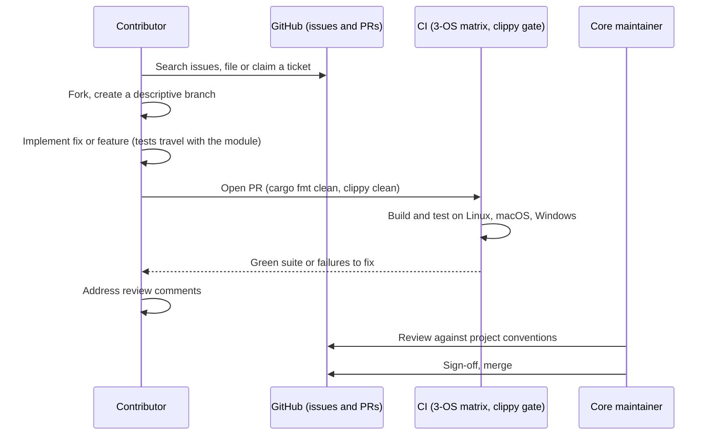

# Contributing to LionFS

First off, thank you for considering contributing to LionFS. It's people like you that make LionFS such a great storage system.

## The contribution flow at a glance



## Where do I go from here?

If you've noticed a bug or have a feature request, make sure to check our [Issues](https://github.com/lionxlover/lionfs/issues) page to see if someone else in the community has already created a ticket. If not, go ahead and make one!

## Fork & create a branch

If this is something you think you can fix, then fork LionFS and create a branch with a descriptive name.

## Get the test suite running

LionFS 8.0 is a 3-crate workspace (`lionfs` the local engine, MSRV
1.83; `lionfs-cluster` the distributed plane, MSRV 1.89 for std file
locking; `lionfs-cli` the `lion` front-end), cross-platform (Linux,
macOS, Windows). Prerequisites:
- Rust 1.89+ for the full workspace (latest stable recommended); the
  engine crate alone floors at 1.83 if you're only building `lionfs`
- Linux: nothing for tests; `libfuse3-dev` only for mount experiments
- macOS: [macFUSE](https://osxfuse.github.io/) only for mount experiments
- Windows: only the Rust toolchain (MSVC)

To build and run tests:
```bash
cargo test --workspace           # full suite (948+ tests as of 8.0)
cargo test --features io_uring   # Linux: with the ring backend
cargo build --all-targets
cargo clippy --lib --bins -- -D warnings   # the CI lint gate
```

## Implement your fix or feature

At this point, you're ready to make your changes! Feel free to ask for help; everyone is a beginner at first 😸

## Code Style

- Use `cargo fmt` before committing.
- Ensure `cargo clippy` emits zero warnings (`cargo clippy --all-targets --all-features -- -D warnings`).
- Stick to safe Rust wherever possible. Unsafe code must be extensively commented and isolated to the lowest possible tier of the `disk` or `ondisk` hierarchy.

## Pull Request Process

1. Ensure any install or build dependencies are removed before the end of the layer when doing a build.
2. Update the README.md with details of changes to the interface, this includes new environment variables, exposed ports, useful file locations and container parameters.
3. Increase the version numbers in any examples files and the README.md to the new version that this Pull Request would represent.
4. The PR will be merged once you have the sign-off of at least one core maintainer.

## 2.0-specific rules (the short list)

1. **No platform conditionals outside `src/pal/`** (and the `vfs`
   bridges). See PORTING.md.
2. **No `libc::` in core modules** — constants come from `pal::posix`.
3. **Every unsafe block carries a SAFETY comment** — the PAL's FFI in
   particular.
4. **Numbers need commands.** Any performance claim in docs must come
   with the runnable command that produced it (the RFC-002 honesty
   rule).
5. **Tests travel with the module.** New write-path code ships with
   new kill-point/failure cases, listed in the PR (RFC-002 §9.5).

## The merge gate, in one line

$$\mathrm{mergeable} \iff \mathrm{clippy} = 0 \wedge N_{\mathrm{fail}} = 0 \wedge \mathrm{signoff} \ge 1$$

Rule 5 makes the suite count monotone: a landed PR leaves
$N_{\mathrm{tests}}$ no smaller than it found it, which is how the
count walked $245 \to 462 \to 638 \to 713$ while staying green. (The
`462` in the build snippet above is the 2.0-era count; 3.1.0 stands
at 713.)
