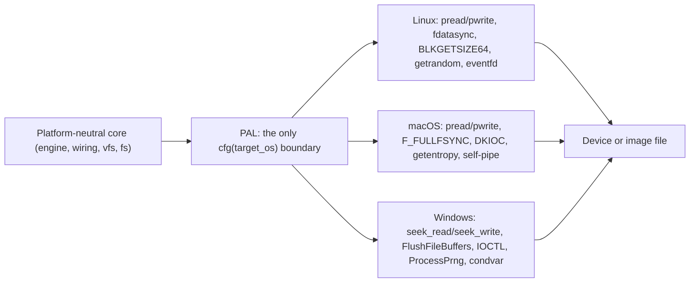
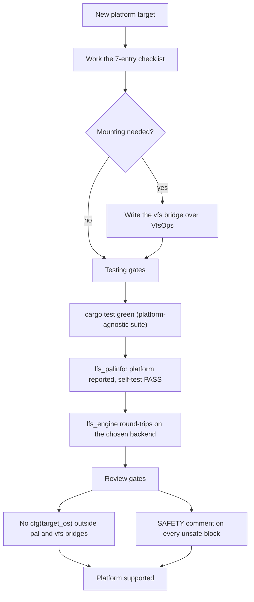

# Porting LionFS to a New Platform

LionFS's portability rule: **all platform conditionals live in
`src/pal/`** (plus mount bridges at the `vfs` boundary). Porting means
implementing seven PAL functions and (optionally) a mount bridge.

The porting surface is exactly

$$5\ \mathrm{PAL\ areas} + \mathrm{platform\ variant} + \mathrm{Cargo\ scoping} = 7\ \mathrm{checklist\ entries}$$

and the review gate is per-operation semantic equivalence:

$$\forall\, o \in \mathrm{ops}: \ \mathrm{behavior}_{\mathrm{new}}(o) = \mathrm{behavior}_{\mathrm{ref}}(o)$$

— behavior differences between platforms are bugs, not features.

## The checklist

1. **`pal::platform`** — add the `Platform` variant (runtime probe +
   `cfg!` alignment), wire `os_version_string()`.
2. **`pal::file`** — `pread_at`/`pwrite_at` over the platform's
   positioned I/O. Requirements: cursor-independent reads/writes, or a
   documented single-issuer-per-handle discipline (the engine shards
   already enforce ownership).
3. **`pal::sync`** — `sync_data` (the cheapest real data barrier) and
   `sync_file`. If the platform has no data-only barrier, map to the
   full barrier and *document it* — never claim durability you can't
   deliver (see the macOS `F_FULLFSYNC` note).
4. **`pal::geometry`** — `probe_block_device(file)` returning
   size/logical/physical/optimal. Image files fall back to
   `metadata().len()` + 512.
5. **`pal::random`** — CSPRNG. Only the OS source; never a weaker
   fallback.
6. **`pal::waker`** — `Waker::new/wake/wait`: level-triggered,
   timeout-capable cross-thread wakeup.
7. **`Cargo.toml`** — scope any new dependency under
   `[target.'cfg(your-platform)'.dependencies]`. Windows's rule is
   zero external crates; keep the bar high.

Then, optionally, the mount bridge: implement `fuser`-equivalent
translation in a new `src/vfs/your_bridge.rs` over the unchanged
`VfsOps` trait (RFC-003 §5 has the WinFsp worked example).

## The porting flow at a glance

## Testing gates

- `cargo test` green (the suite is platform-agnostic by design).
- `lfs_palinfo` reports your platform and PASSes the PAL self-test.
- The engine picks a backend (threaded floor at minimum) and
  `lfs_engine` round-trips.

## Review gates

- No `#[cfg(target_os)]` outside `src/pal/` and the `vfs` bridges
  (CI's portability-gate job greps for this).
- Every `unsafe` block carries a SAFETY comment (the FFI in
  particular).
- Behavior differences between platforms are bugs, not features.
