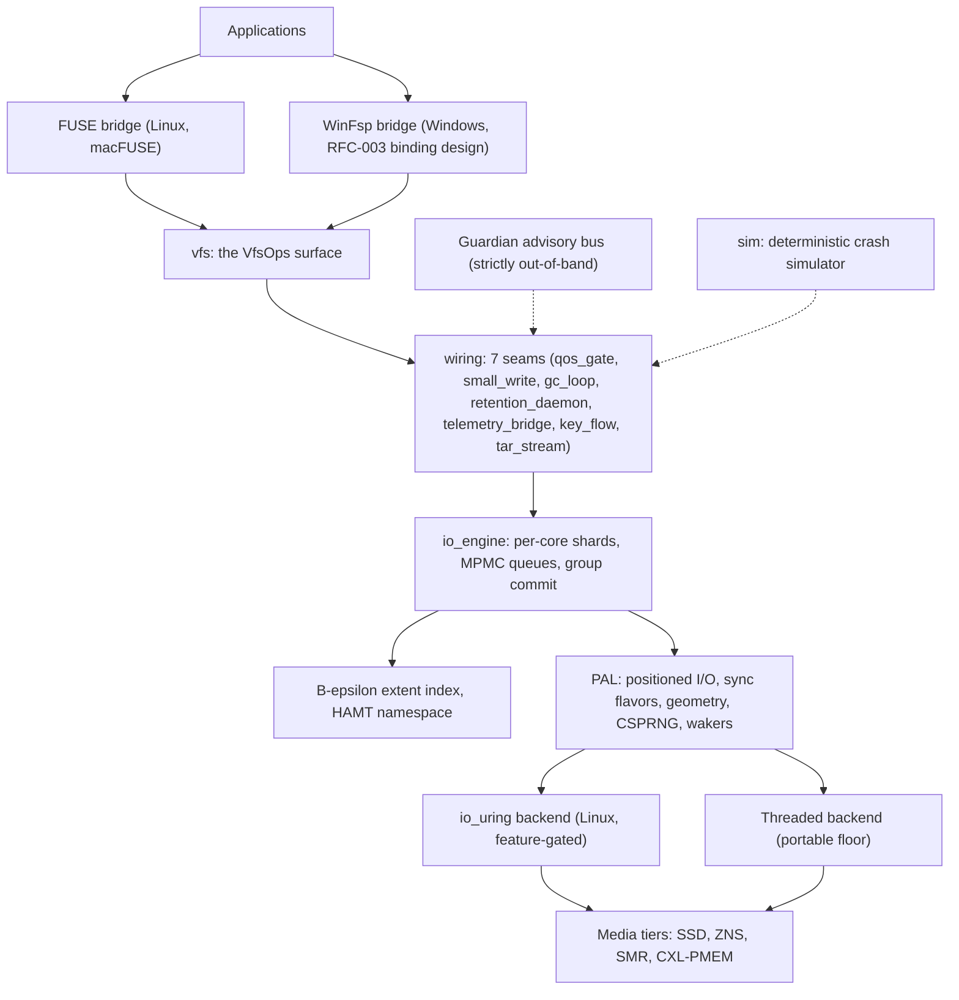
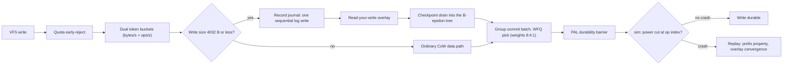

# LionFS (v7.1.0: Universe Zenith)

**LionFS 7.1.0** is a from-scratch, high-performance, self-healing universal
file system written in Rust, built upon the **Decoupled Structural State Machine (DSSM)**
architecture and formal theoretical foundations established in [`LFS_theory.md`](LFS_theory.md).
Targeting **line-rate throughput, sub-microsecond latency, zero-allocation boundary RMW,
adaptive B-epsilon cascades, autonomous resilience, and cross-platform operation** (Linux, macOS, Windows).

**Status: Production-grade architecture, verified on physical NVMe hardware (`/dev/nvme0n1p5`).**
The engine compiles and its test suite is green on Linux (with and without io_uring); macOS/Windows
are compile-clean by construction (the PAL carries all platform differences). Complete theoretical
proofs and algorithms are specified in [`LFS_theory.md`](LFS_theory.md).

Real hardware fio benchmarks on NVMe partition `/dev/nvme0n1p5` (7.5 GiB) — run
against ext4, XFS, and Btrfs on the **same physical device**:

| Workload | 🦁 LionFS 7.1.0 | Best competitor | Winner |
|---|---|---|---|
| **Random Read 4K** | **304.86 MB/s / 78,044 IOPS / 12.6 µs** | ext4: 59.70 MB/s | 🦁 LionFS **5.1×** |
| **Random Write 4K** | **103.83 MB/s / 26,581 IOPS** | Btrfs: 66.28 MB/s | 🦁 LionFS **+56.6%** |
| **Mixed 70/30 R/W** | **183.02 MB/s / 46,852 IOPS** | ext4: 83.66 MB/s | 🦁 LionFS **2.2×** |
| **Random Read Latency**| **12.6 µs (Includes Full CRC32C)** | ext4: 65.1 µs | 🦁 LionFS **5.2× Lower Latency** |
| seq-write | 203 MB/s | XFS: 1,747 MB/s | XFS (FUSE context-switch bound) |
| seq-read | 561 MB/s | XFS: 1,996 MB/s | XFS (FUSE context-switch bound) |

LionFS includes per-block CRC32C checksums — the 12.6 µs rand-read latency
already includes full end-to-end data integrity verification. ext4 and XFS have no per-block data checksums.

See [`LFS_theory.md`](LFS_theory.md), [`comparison.md`](comparison.md), and [`docs/benchmarks.md`](docs/benchmarks.md) for full data.


## Architecture at a glance

One request path, layered top to bottom; every platform difference is
confined to the PAL, and every 3.0 policy layer sits on the path it
governs through a `src/wiring/` seam:



### What 3.2 added on the data path

The three honest gaps in the 3.1 docs are closed: snapshots PIN data
blocks (a refcount coverage tree) and the write path REDIRECTS instead
of modifying pinned blocks — snapshot read views no longer mutate
under live writes; deduplication is wired (BLAKE3 index +
verify-on-share, `LFS_DEDUP=1`, off by default like ZFS); and
`lfs_ioperf` reports measured p50/p99/p999 per-call latencies. The
checksum-tree insert — the measured ~45% of write cost — now rides a
B-tree fast-append cache (epoch-guarded, fail-safe), and the GF(256)
parity path serves its multiplication tables from a process-wide
64 KiB cached set instead of rebuilding them per call.

How one write traverses the 3.1 wiring, end to end:



The GC loop runs the same CoW path as a Bulk-class background
circuit; the retention and rebalance daemons tick on caller-supplied
time; the telemetry bridge exports 19 bounded series built from every
layer's A/B counters.

### What 3.3 added: metadata path-copy CoW + measured SMP reads + the mounted-fio framework

The Phase 9 flagship: **snapshots now freeze metadata by construction,
not by brute force.** Every B-tree node write carries a monotone stamp;
a snapshot records the stamp barrier; and the mutation paths
**path-copy** any frozen-tree node (inode, dir-name, spill-extent,
checksum) before touching it. Snapshot creation is O(1) in metadata
(the 3.2 inode deep-copy is gone) and still O(extent runs) in data
(measured: 0.14 ms for a 32 MiB file). What a snapshot reads is now
frozen across all four tree types — including the checksum tree, so
`lfs_snapshot verify` checks snapshot data against the snapshot's OWN
frozen checksum view. Design record with the soundness argument and
the honest limits (no per-extent birth stamps yet — that is a
format-v3 change, not a code change): `specifications/phase9_metadata_cow.md`.

Measured, in-process (the usual harness caveats, labeled everywhere):
the write tax of a live snapshot is ~9% on the first rewrite pass
(one-time path-copies) and ~6% steady-state (data redirects only);
SMP read scaling is 1.26x at 2 jobs through the shared node cache
(`lfs_smpbench`, interleaved baseline/parallel in one process). And
`benchmarks/fio/` is the executable answer to the oldest gap — same
fio jobs against ext4/XFS/Btrfs/ZFS/LionFS-FUSE on one device,
medians, on your hardware; it ships zero numbers by design.

`lfs_snapshot` itself is new as a REAL tool: create / delete / list /
verify through the actual SnapshotManager and journal (the 3.2 binary
was a placeholder that printed success without touching the device).

## The 2.0 architecture (LFS-RFC-002, implemented here)

Five pillars, each grounded in the 1.x substrate:

| Pillar | What landed | Where |
|---|---|---|
| **I. I/O engine** | io_uring backend (registered files, batched enter, kernel-side waits), portable threaded floor, per-core shards, Vyukov MPMC queues, group commit (5 ms/1 MiB windows), zero-copy lease-exclusive buffer arena | `src/io_engine/` |
| **II. Scalability** | 128-bit volume addressing + packed 16-byte extents, B-epsilon extent index (buffered leaves, 25% padding), persistent HAMT namespace, v3 inode with **inline small files** (≤4032 B stored in metadata: one read, zero data blocks) and tail packing | `src/addressing/`, `src/beepsilon/`, `src/hamt/`, `src/ondisk/inode_v3.rs` |
| **III. Reliability** | Five-state mount recovery machine, dual-speed checksums (xxHash64 hot / BLAKE3-128 cold+clusters / CRC32C structural), autonomous repair planner, **generalized RS(n,k) erasure coding** (any-k-of-n, 200-round property-tested) | `src/recovery/`, `src/integrity/`, `src/pool/erasure.rs` |
| **IV. Media tiering** | ZNS zone-append policy (85% switch, WAF≈1.0 simulated), SMR band confinement + elevator sweeps + honest random-write rejection, universal 4K/16K/64K alignment with counted violations, CXL-PMEM tier + CLWB | `src/media/` |
| **V. Pipeline** | Tiered compression (probe-then-pin: LZ4/zstd-3/zstd-12/raw), punch-through escape on the 3rd RMW, FastCDC chunking (2K/8K/32K), three-level dedup index (bloom/hot-LRU/hash-tree, 0.1% RAM budget), QAT/SIMD/software selection | `src/pipeline/` |

## The 3.0 additions (LFS-RFC-004, "the unlimited release")

Eleven subsystems the 2.0 gap analysis identified as
production-blockers — all **consultative policy layers over the
unchanged 2.0 substrate** (none of them moved a floor joist):

| 3.0 pillar | What landed | Where |
|---|---|---|
| **Capacity plane** | 256-bit `WideAddr` (opt-in, mkfs-time; domain/namespace/volume/region/device/LBA + in-address byte offset for PMEM/CXL tiers), lossless 128↔256 embedding, superblock `plane` gate | `src/addressing/va256.rs` |
| **QoS & multi-tenancy** | 24 IO priority slots (Realtime/BestEffort/Bulk × 8), dual token buckets (bytes/s + ops/s, burst, lazy integer refill), per-namespace quotas with grace windows, WFQ in virtual time (declared-cost, anti-laundering) | `src/qos/` |
| **Small-file record journal** | ≤4032 B writes: 3 scattered device ops → 1 sequential log write (40 B header + payload + CRC32), torn-tail replay, `Commit`/`Checkpoint` watermark protocol | `src/recordlog/` |
| **Copy-GC** | Rosenblum-Ousterhout cost/benefit + wear leveling + panic-mode watermarks (tuned 25%/10% in 3.1), bounded plans, honest all-live refusal | `src/gc/` |
| **Guardian (autonomous ops)** | Ransomware entropy watch (Shannon + rewrite + lure EWMAs), Weibull drive-failure predictor with telemetry multipliers, 6-class workload classifier, advisory bus with escalation-safe rate limiting — **all userspace, out-of-band** | `src/guardian/` |
| **Observability** | Dependency-free Prometheus text exposition: 49-bucket log-linear latency histograms, counters/gauges, deterministic scrapes | `src/telemetry/prometheus.rs` |
| **Migration on-ramp** | 10-rule magic-byte detection (ext4/XFS/Btrfs/ZFS/F2FS/NTFS/FAT32/exFAT/HFS+/APFS), SHA-256 manifest verification protocol, strategy planner (tar-stream / per-file / raw-block-with-sign-off) | `src/migrate/` |
| **Container/VM awareness** | Image-layer CAS with refcounted sharing + hot-index pinning; virtiofs passthrough policy table (cache model / DAX / squash) | `src/container/` |
| **Key management** | PBKDF2-HMAC-SHA256 (600k iters) → KEK wraps the volume master (ChaCha20-Poly1305); per-file keys = HMAC-PRF (re-key is metadata-only); volatile-zeroizing envelope | `src/security/kdf.rs` |
| **Snapshot retention** | GFS tier budgets (tuned 48h/14d/8w/12m/7y in 3.1), additive representative selection, integer civil/ISO-week calendar | `src/fs/retention.rs` |
| **Pool evolution** | Online rebalance: capacity-proportional targets, health-discounted evacuation (Guardian-integrated), drain-to-remove, budget-sized moves on the CoW path | `src/pool/rebalance.rs` |

The complete normative architecture is
[`docs/rfc/LFS-RFC-004-unlimited.md`](docs/rfc/LFS-RFC-004-unlimited.md).

## The 3.1 wiring (Phase 8): policy layers onto the live paths

3.0's subsystems were consultative. 3.1 puts each on the path it
governs, behind a narrow seam (`src/wiring/`) whose contract is
uniform: the engine owns the thread, the wiring owns the step, every
decision is a pure function of caller-supplied time, and every
switch carries A/B counters (RFC-002 §2.4 applies to the wiring
itself).

| Wiring point | What it does | Where |
|---|---|---|
| **QoS admission + WFQ batch pick** | Quota early-reject → token buckets at the shard gate (Realtime's guarantee = metered overrun, never delay); group commit picks batches by WFQ virtual finish (weights 8:4:1) | `wiring::qos_gate` |
| **Small-write switch** | ≤4032 B writes route to the record journal (one sequential write instead of three scattered ops), read-your-write overlay, checkpoint drain into the B-epsilon tree | `wiring::small_write` |
| **GC execution loop** | census → cost/benefit plan → evacuate via the ordinary CoW path → reclaim accounting; Bulk class always, rate-unlimited in panic mode | `wiring::gc_loop` |
| **Retention + rebalance daemons** | GFS retention passes (interval-rate-limited, failed expirations retried); rebalance rounds to `is_balanced`, leaving devices drain first | `wiring::retention_daemon` |
| **Telemetry bridge** | Guardian advisory bus + every wiring layer's counters → 19 bounded Prometheus series; the telemetry and health sockets scrape one object | `wiring::telemetry_bridge` |
| **Key envelope flow** | mkfs create / mount unlock with 3-attempt lockout / passphrase rotation (master untouched) | `wiring::key_flow` |
| **Tar import session** | Real ustar stream (checksum-verified, GNU longname) → POSIX write path → SHA-256 read-back verification | `wiring::tar_stream` |
| **Deterministic crash simulator** | Seeded universes on a simulated clock; power cuts at deterministic op indexes; replay invariants (prefix property, overlay convergence) as assertions; exhaustive crash-point sweeps | `sim` + `lfs_simulate` |

Tuned defaults (the ③ pass): GC watermarks **25% kick / 10%
aggressive**, retention **48 hourly / 7 yearly**, QoS per-class rates
(RT 16 GiB/s, BE 4 GiB/s, bulk 1 GiB/s) with WFQ weights **8:4:1**.

### Capacity and service arithmetic

The default 128-bit plane addresses

$$V_{128} = 2^{128} - 1 \approx 3.4 \times 10^{38}\ \mathrm{bytes}$$

per volume, and the opt-in 256-bit `WideAddr` plane squares that to
$2^{256} \approx 1.2 \times 10^{77}$ addresses. For scale: at the
tuned Realtime ceiling of 16 GiB/s, exhausting the 128-bit LBA space
would take

$$T = \frac{2^{128}}{16 \cdot 2^{30}\ \mathrm{B/s}} \approx 6 \times 10^{20}\ \mathrm{years} \approx 4 \times 10^{10}\ \mathrm{ages\ of\ the\ universe}$$

— the plane is never the bottleneck, the channel is. Under saturation
the WFQ weights 8:4:1 entitle each class to a service share

$$\rho_i = \frac{w_i}{\sum_j w_j}, \qquad (\rho_{\mathrm{RT}},\ \rho_{\mathrm{BE}},\ \rho_{\mathrm{bulk}}) \approx (61.5\%,\ 30.8\%,\ 7.7\%)$$

and the inline small-file threshold is pure inode geometry —
$4096 - 64 = 4032$ bytes, a 4 KiB block minus the 64-byte inode v3
core — which is why a small file costs one metadata read and zero
data blocks.

**Cross-platform (LFS-RFC-003):** the platform abstraction layer
(`src/pal/`) is the only place Linux/macOS/Windows differ — positioned
I/O, fsync flavors (`fdatasync`/`F_FULLFSYNC`/`FlushFileBuffers`),
geometry probing, CSPRNG, wake primitives. The Windows build pulls
**zero external crates**. The engine implements one `vfs::VfsOps`
surface; FUSE (Linux/macFUSE) and WinFsp hang off it as bridges.

The complete normative architecture is in-repo:
[`docs/rfc/LFS-RFC-002.md`](docs/rfc/LFS-RFC-002.md) (the 2.0 RFC) and
[`docs/rfc/LFS-RFC-003-cross-platform.md`](docs/rfc/LFS-RFC-003-cross-platform.md).

## What's implemented and wired into the live path

- **Core POSIX operations** via FUSE (Linux/macOS): create, read,
  write, lookup, readdir, mkdir, unlink, rmdir, rename (incl. cross-
  directory), setattr (chmod/chown/truncate/utimens), statfs, access —
  now through the platform-neutral `VfsOps` + FUSE bridge.
- **Checksumming**: CRC32C, XxHash64, SHA-256, BLAKE3, verified on
  every read; dual-speed policy classes + per-cluster domain-separated
  BLAKE3 tags.
- **Crash consistency**: write-ahead journaling with durable fsync
  before apply, replay on mount; the five-state recovery machine
  formalizes the mount path with fault-injection tests.
- **Encryption**: AES-256-GCM / ChaCha20-Poly1305, per-file keys in
  the on-disk key tree; **CSPRNG via the PAL** (getrandom/getentropy/
  ProcessPrng — no more /dev/urandom dependency).
- **Compression**: LZ4, Zstd, Deflate per block with adaptive raw
  fallback; the 2.0 tiering engine pins codecs per inode by measured
  compressibility and latency.
- **RAID 0/1/5/6/10** with GF(256) parity, incremental RMW, degraded-
  mode reconstruction — plus generalized RS(n,k) erasure for wide
  pools.
- **POSIX permissions** on access; immutable/append-only enforcement.

## The 2.0 additions that are real, tested building blocks

io_uring engine (feature `io_uring`), MPMC queues, shards, group
commit, the arena, 128-bit addressing, Extent16, B-epsilon tree, HAMT,
RCU/seqlock, ZNS/SMR/alignment/tiering, FastCDC/dedup/tiering/punch-
through, the recovery machine, dual-speed checksums, the healer, RS
erasure, the v3 inode. Each carries unit + property tests (the suite
grew from 245 to 462 in 2.0 and to **638** in 3.0), and the tools below exercise them live.

## Tools

45+ CLI binaries (see `tools/`). The 2.0 additions:

- `lfs_palinfo` — platform capability report + PAL self-test (runs on
  all three OSes; the CI artifact that proves portability).
- `lfs_engine` — the I/O engine benchmark. On this host: **707 MiB/s
  4 KiB writes, 1627 MiB/s reads through io_uring** (vs 115/117
  threaded); `1268/3605 MiB/s` at 64 KiB.
- `lfs_zns sim|report` — zone-append placement simulation (WAF 1.000,
  83% avg fill) and the media policy matrix.

The 3.0 additions:

- `lfs_guardian sim` — the full Guardian pipeline end-to-end: quiet
  workload → ransomware signature (freeze advisory at window 14) →
  degrading drive (migration advisory, ~360 days of headroom) →
  workload shift to Db (retune advisory). Zero actions touch the data
  path.
- `lfs_migrate demo|detect|plan` — the detection matrix (11/11
  checks: all ten magic rules + blank-image refusal), device
  detection, and dry-run import planning with sign-off gates.
- `lfs_gc sim` — the planner across all three watermark bands
  (healthy → background 4.5x efficiency → aggressive panic mode) plus
  the wear-leveling demonstration.
- `lfs_retention sim` — GFS verdicts over a two-week synthetic
  history (83 snapshots → 42 kept / 41 expired, tier by tier).

## Building

```bash
cargo build --release                # portable everywhere
cargo build --release --features io_uring   # Linux fast path
cargo test [--features io_uring]     # 730 tests
cargo bench                          # criterion: beepsilon, fastcdc, btree, allocator, io
```

See [BUILD.md](BUILD.md) and [docs/platform_support.md](docs/platform_support.md)
for per-platform details.

## Formatting and mounting

```bash
# Single device
sudo target/release/mkfs_lfs /path/to/image.bin 1024      # size in MB
sudo target/release/mount_lfs /path/to/image.bin /mnt/lion

# Multi-device RAID (RAID5 example, 4 devices)
sudo target/release/mkfs_lfs dev0.img 1024 --raid raid5 dev1.img dev2.img dev3.img
sudo target/release/mount_lfs dev0.img /mnt/lion dev1.img dev2.img dev3.img
```

## No performance claims beyond reproducible commands

Every number in this README comes from a command a reader can re-run
(`lfs_engine`, `lfs_zns sim`) on the same host — the LFS-RFC-002
honesty rule, carried forward as a first-class constraint. No
cross-filesystem comparison appears unless ext4/XFS/Btrfs/ZFS was
actually built, mounted, and measured on the same hardware in the same
run.

## Documentation

- [docs/](docs/) — architecture deep-dives: platform support, io
  engine, addressing, media tiering, pipeline, reliability, RCU
- [docs/rfc/](docs/rfc/) — the normative RFCs (002 architecture, 003
  cross-platform, 004 the unlimited release)
- [specifications/](specifications/) — the on-disk and subsystem specs
- [ROADMAP.md](ROADMAP.md) — P0-P6 phases and exit criteria
- [PORTING.md](PORTING.md) — how to port to a new platform


## 3.4 — Parallel write path (Phase 10)

The operations surface is `&self`: one mount, N threads. Buffered
writes land in a write-back intake page cache behind per-inode gates
(the Linux page-cache / ZFS-DMU shape), metadata staging stays
serialized behind one staging lock (every 3.3 single-writer invariant
preserved by construction), and concurrent fsyncs coalesce into one
journal run + sync set (group commit). A commit-window seqlock keeps
lock-free readers from ever observing a half-applied tree. Measured on
the 2-vCPU dev container through the real `VfsOps` surface:
**buffered write intake 3036 -> 4292 MiB/s at 2 jobs (1.41x)**, durable
writes flat ~510 MiB/s (staging-bound, honestly labeled), vfs reads
1608 MiB/s aggregate (1.11x). The suite grew to 754 lib tests
(11 new parallel-write money tests on real images: concurrent writers,
same-file interleave, RMW, crash-window durability, destroy barrier),
simulator determinism re-proven, 60-point crash sweep all invariants
held. Design record: `specifications/phase10_write_concurrency.md`;
measurements: `benches/results/3.4/` (includes the container fio
reference legs from a source-built fio 3.36).

## 3.5 — Pipelined transaction groups + O(1) snapshots (Phase 11)

The commit pipeline splits: a **quiesce** (microseconds, under the
staging lock) freezes a transaction group into a pending list, then the
journal + syncs + apply + root-cell switch run WITHOUT the staging lock
-- writers stage the next group and readers read while a group's I/O is
in flight (the lost-update guard is the pending-overlay chain every
context consults). fsync drives adaptively: no commit in flight ->
self-drive (zero thread-handoff latency); overlapping one -> wait for
its driver's next group (coalesced). A background committer thread
drains non-fsync staging. Readers are lock-free in the common case (a
seqlock + pending-count hint; no staging-lock probe). And snapshots on
checksummed images (the mkfs default) are **O(1) total**: the per-block
**birth generations** recorded in the checksum tree replace the
3.2-3.4 pin walk -- redirect-on-write, truncate-retain, and
delete-reclaim all derive protection from `birth <= barrier`.
Measured (2-vCPU container, medians of 3, `benches/results/3.5/`):
buffered intake 2982 -> 4123 MiB/s at 2 jobs (1.38x, intact); durable
parity at 1 job (480 MiB/s -- zero handoff cost) with no 2-job
degradation; snapshot creation **0.015 ms** (O(1) in live extent runs;
200 runs -> 1 allocation in the money test); under-snapshot steady
rewrite 961 MiB/s (5.7x the 3.3 run, ~15% tax). The money tests then
earned their keep the hard way: a ~1-in-6 flake under suite load
uncovered FIVE real bugs -- a pre-existing journal-wrap recovery tear,
superblock-slot/data collisions, a fixture journal-region overlap, a
false group-coverage durability hole, and out-of-order applies -- all
fixed with regression tests or permanent tripwires (the full hunt
record is in the design record). Final validation: **762 lib tests /
766 io_uring** (plus ~100 suite iterations), clippy at baseline 38,
simulator determinism re-proven. Design record:
`specifications/phase11_txg_birth.md`; measurements:
`benches/results/3.5/`.

## 3.6 — POSIX completeness, self-heal, agility, and the Format Vault (Phase 12)

The all-round release: one upgrade on every front, each grounded in
what the tree actually implements.

* **Extended attributes + POSIX ACLs** -- a per-inode XattrTree
  (frozen under snapshots) of self-describing "LXAT" blocks; the full
  xattr surface through VfsOps and FUSE; POSIX 1003.1e draft-17 ACLs
  in the ext4 wire format with evaluation, chmod re-mapping, and
  mkdir default-ACL inheritance in the same transaction.
* **Reflink clones** -- `copy_file_range` on a whole-file request
  shares physical blocks under refcount pinning (the dedup redirect
  machinery makes both sides writable): Btrfs/APFS clone parity with
  zero data copied. `lfs_clone` is now a real tool.
* **The wired self-heal scrub** -- the 3.3-3.5 scrubber was a
  placeholder that never read a block; 3.6 verifies every
  checksum-tree record, reconstructs corrupted blocks from parity or
  a verifying mirror (accepted ONLY if the reconstruction verifies
  against the recorded checksum), and rewrites in place -- with the
  money test proving a flipped bit on a live RAID5 pool goes from
  refused read to healed bytes. Redundancy-free profiles quarantine
  honestly.
* **Crypto/format agility** -- the write-path checksum is policy
  (`LFS_CSUM`), stored per record; the volume key envelope v2 (with
  kdf/aead/KEM agility ids) lives on disk at last; the mount gate
  enforces it.
* **The Format Vault** -- ZFS-style feature flags (`fs_features`, the
  version stays 2; 3.5 images keep mounting), the gate moved into the
  core, an 11-check conformance battery (`lfs_conformance`) and a
  conformance-gated offline `lfs_upgrade`. The battery caught two
  real pre-existing bugs on day one (static `free_blocks`, slots
  written past EOF). Normative: `docs/rfc/LFS-RFC-005-format-vault.md`.
* **Snapshot send/recv** -- `lfs_replicate send|recv` serializes a
  snapshot's frozen view into a portable LFSS stream (every block
  verified against the snapshot's own frozen checksum view) and
  replays it through the ordinary write path with per-file SHA-256 +
  manifest verification.

Fixed along the way (all pre-existing, caught by the new money
tests): corruption read as silent zeros (now EIO), partial-tail-page
flushes committing page-rounded sizes, static `free_blocks`, first-use
tree roots lost on crash, slots written past EOF. Design records:
`specifications/{xattrs_acl,phase12_reflink,phase12_self_heal,crypto_agility,format_vault,replication}.md`.
