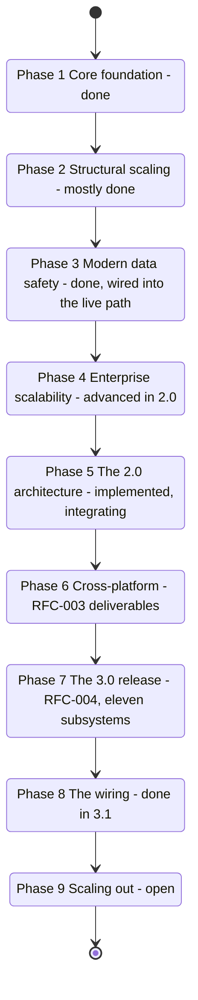
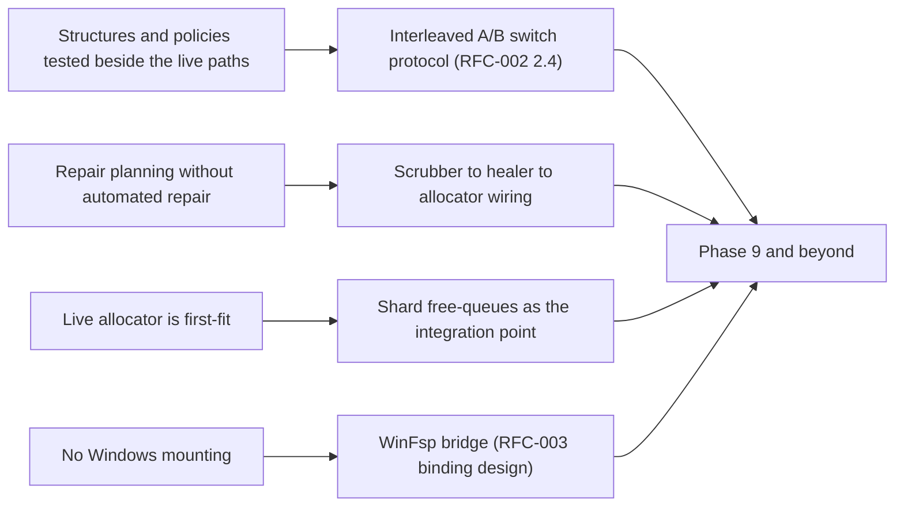

# LionFS Roadmap

This tracks what's actually built versus planned. See `README.md` for
the user-facing status; this is the phase-by-phase view against the
LFS-RFC-002 P0-P6 program and the RFC-003 platform deliverables.

## Phase graph

The exit criterion in one line: a checkbox flips to `[x]` only with
the full suite green — the count has only ever moved up,
$245 \to 462 \to 638 \to 713$ — and every wiring step measured under
the interleaved A/B protocol (RFC-002 2.4). Phase 8 closed 7 of its 8
entries, $\frac{7}{8} = 87.5\%$; the open entry — the xfstests port
and the journal TLA+ model — is Phase 9-scoped.

## Phase 1: Core Foundation — done
- [x] Extent-based layout, contiguous block allocator, 256-byte inodes
- [x] FUSE integration: create/read/write/lookup/mkdir/unlink/rename (incl. cross-directory)/setattr/statfs/access
- [x] `mkfs_lfs`, `mount_lfs`, `dump_lfs`, `debug_lfs` (superblock/inode inspection)

## Phase 2: Structural Scaling — mostly done
- [x] Cross-directory renames with rollback on destination-side failure
- [x] Journaling with durable fsync between journal write and apply; crash replay on mount
- [ ] B-Tree extent management beyond the 7 inline extents per inode (the **B-epsilon tree** that replaces it is implemented and tested in `src/beepsilon/`; wiring it into the write path is the P3 integration)
- [ ] Extended attributes / ACLs beyond basic POSIX mode bits

## Phase 3: Modern Data Safety — done, wired into the live path
- [x] Checksumming: CRC32C, XxHash64, SHA-256, BLAKE3, verified on every read; **dual-speed policy + domain-separated cluster tags** (2.0)
- [x] Compression: LZ4, Zstd, Deflate, adaptive; **per-inode tiering** (2.0)
- [x] Encryption: AES-256-GCM, ChaCha20-Poly1305, per-file keys, key tree
- [ ] Passphrase-derived wrapping key for the key tree

## Phase 4: Enterprise Scalability — substantially advanced in 2.0
- [x] Multi-device RAID 0/1/5/6/10 with GF(256) dual parity and degraded reads
- [x] Superblock on every device (profile discovery before assembly)
- [x] **Generalized RS(n,k) erasure coding** with random-erasure property tests (2.0)
- [~] Deduplication: the **three-level index** (bloom/hot-LRU/hash-tree) and FastCDC chunking are implemented and tested (2.0); the allocation-side refcount reuse remains the wiring step
- [~] Self-healing: the **repair planner** (quarantine→reconstruct→swap-in-tx) is implemented (2.0); scrubber-to-healer wiring is the integration

## Phase 5: The 2.0 Architecture (LFS-RFC-002) — implemented, integrating
- [x] **PAL** (`src/pal/`): Linux/macOS/Windows from one code base (P0's portability half)
- [x] **io_uring engine** with graceful fallback; measured 707 MiB/s 4K writes (P0's performance half; the threaded floor is the CI workhorse)
- [x] Per-core shards, MPMC queues, group commit, zero-copy arena (P1)
- [x] 128-bit addressing, Extent16, B-epsilon tree, HAMT, inode v3 with inline files (P2 — structures done, format integration next)
- [x] Recovery state machine, dual-speed checksums, healer, RS erasure (P3's machinery; deferred-verify wiring next)
- [x] ZNS/SMR/alignment/CXL policies (P4 — policy layer; device-side `IORING_OP_ZONE_APPEND` lands with the crate's exposure of it)
- [x] Tiered compression, punch-through, FastCDC, dedup index, offload selection (P5 — policy layer; QAT device binding is hardware-gated)
- [ ] SPDK bypass plane (P6 — opt-in per pool; design only)
- [ ] CXL journal on real hardware (P6 — the CLWB path is probed and probed-for)

## Phase 6: Cross-Platform (LFS-RFC-003)
- [x] Windows/macOS compile-clean core; 3-OS CI matrix
- [x] `lfs_palinfo` capability prober + PAL self-test
- [x] VfsOps + FUSE bridge (Linux + macOS/macFUSE mounting)
- [ ] WinFsp bridge (Windows mounting — the binding design is RFC-003 §5)
- [ ] IOCP submission backend for Windows; kqueue backend for macOS

## Phase 7: The 3.0 Release (LFS-RFC-004, "unlimited") — implemented, integrating
- [x] **Capacity plane**: 256-bit `WideAddr` with lossless 128-bit
      embedding (structures + tests; Wide extents are the wiring)
- [x] **QoS**: IO classes, dual token buckets, quotas with grace,
      WFQ (policy layers + property tests; dispatcher integration next)
- [x] **Small-file record journal**: format, CRC'd replay, torn-tail
      discipline, checkpoint policy (write-path switch is Phase 8)
- [x] **Copy-GC planner**: cost/benefit + wear + panic mode; the
      scrubber→healer→allocator loop it drives is Phase 8
- [x] **Guardian**: entropy watch, Weibull failure prediction,
      workload classifier, advisory bus (live telemetry socket: Phase 8)
- [x] **Prometheus registry**: histograms, exposition format (health-
      socket exporter: Phase 8)
- [x] **Migration**: magic detection, manifest protocol, strategy
      planner (the live tar stream: Phase 8)
- [x] **Container/VM**: layer CAS + virtiofs policy table (runtime
      hooks: Phase 8)
- [x] **Key management**: PBKDF2 + AEAD envelope + PRF hierarchy
      (mkfs/mount passphrase prompts: Phase 8)
- [x] **GFS retention** + **online rebalance** (daemon loops: Phase 8)
- [x] Test suite 462 → **638**; four new tools with runnable
      simulations (`lfs_guardian/migrate/gc/retention`)
- [x] **3.1 tuned defaults** (③): GC watermarks 25/10 (was 20/8),
      wear 8 bps, 5-day half-life, 12-segment plans; retention
      48h/14d/8w/12m/7y (was 24/14/8/12/3); per-class QoS rates with
      8:4:1 WFQ weights

## Phase 8: The 3.0 wiring (the A/B-measured switches) — done in 3.1
- [x] Record journal onto the small-write path: `wiring::small_write`
      (route switch, window policy, read overlay, checkpoint drain,
      post-crash overlay rebuild from replay; measured per RFC-002
      §2.4 via the router's route counters)
- [x] QoS admission into the shard dispatcher; WFQ into
      group-commit's batch pick: `wiring::qos_gate` (token-bucket
      admission with the Realtime guarantee; WFQ batch pick with
      tuned 8:4:1 weights)
- [x] GC-planner → scrubber → allocator execution loop:
      `wiring::gc_loop` (census → plan → evacuate → reclaim-event
      feedback; Bulk class, rate-unlimited panic mode)
- [x] Retention into the snapshot daemon; rebalance into the pool
      manager: `wiring::retention_daemon` (interval-rate-limited GFS
      passes; balanced-terminating rebalance rounds)
- [x] Guardian onto the live telemetry socket; Prometheus onto the
      health socket: `wiring::telemetry_bridge` (19 bounded series,
      both sockets scrape one object)
- [x] Migration tooling onto the real tar stream:
      `wiring::tar_stream` (ustar parser + ImportSink + manifest +
      SHA-256 read-back verification)
- [x] Key-envelope prompts in mkfs/mount; rewrap tool:
      `wiring::key_flow` (create/unlock/lockout/rotation with the
      audit trail)
- [x] The deterministic full-stack simulator over the 3.0 policy set
      (FoundationDB-style): `sim` + `sim::crash` (seeded universes,
      exhaustive crash-point sweeps, replay invariants as
      assertions) + the `lfs_simulate` tool
- [ ] xfstests port; journal TLA+ model (Phase 9)

## Phase 9: Scaling out
- [ ] SPDK bypass plane (RFC-002 P6, opt-in per pool)
- [ ] CXL journal on real hardware (CLWB path is probed and
      probed-for)
- [ ] WinFsp bridge (RFC-003 §5 binding design)
- [ ] Wide-plane (256-bit) volume format: mkfs flag + 32-byte extent
      records

## Known gaps worth calling out specifically

- The 2.0 structures (B-epsilon, HAMT, inode v3, io_uring engine) and
  the 3.0 policy layers (QoS, record journal, GC, Guardian, retention,
  rebalance, migration, container, KDF) are implemented and tested
  **beside** the live paths; the remaining work is switching the
  engine onto them, phase by phase, under the interleaved A/B
  measurement protocol.
- Automated *repair* (as opposed to the implemented repair planning)
  still needs the scrubber→healer→allocator wiring.
- Locality/best-fit allocation policies exist but the live allocator
  remains first-fit; the shard free-queues are the integration point.
- WinFsp mounting on Windows is the last platform gap.

## Where the remaining work goes

Counting the open surface: Phase 8 has one open entry, Phase 9 lists
four, and the partially-done Phase 2 and Phase 4 items land on the
same switch protocol — the remaining wiring concentrates in Phase 9:

$$|\mathrm{Phase\ 8\ open}| = 1, \qquad |\mathrm{Phase\ 9}| = 4\ \mathrm{open\ items}$$
