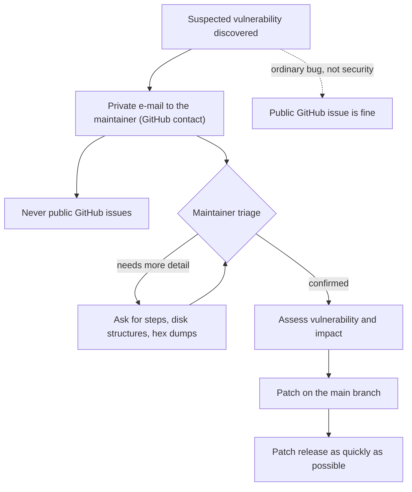

# Security Policy

## Supported Versions

Currently, LionFS is in Phase 1 (Alpha) and is **not intended for production use**. Security patches will only be applied to the `main` branch.

| Version | Supported          |
| ------- | ------------------ |
| 0.1.0   | :white_check_mark: |
| < 0.1.0 | :x:                |

## Reporting a Vulnerability

If you discover a security vulnerability within LionFS, please send an e-mail to the maintainer via their GitHub contact information. All security vulnerabilities will be promptly addressed.

Please do **not** report security vulnerabilities via public GitHub issues.

How a report travels:

### What to include
- A description of the vulnerability and its impact.
- Steps to reproduce the vulnerability (if possible).
- Any relevant disk structures or hex dumps that trigger the issue (e.g., malformed inodes causing arbitrary code execution or out-of-bounds reads).

We take security seriously and will work to release a patch as quickly as possible.

## Online-guessing arithmetic (the 3.1 key envelope)

Context for brute-force reports against the wrapped key tree: the
3.1 key-envelope flow (`wiring::key_flow`) derives the KEK with
PBKDF2-HMAC-SHA256 at 600k iterations, with a 3-attempt budget and
lockout on mount unlock; the measured online-guess throughput is
$r \approx 0.18$ attempts per second. Time to try $n$ passphrases:

$$t(n) = \frac{n}{r} \implies t(10^6) \approx 5.6 \times 10^6\ \mathrm{s} \approx 64\ \mathrm{days}$$

Offline attacks against a stolen volume are a different threat model
— that is what the wrapped envelope and the per-file PRF hierarchy
are for.
