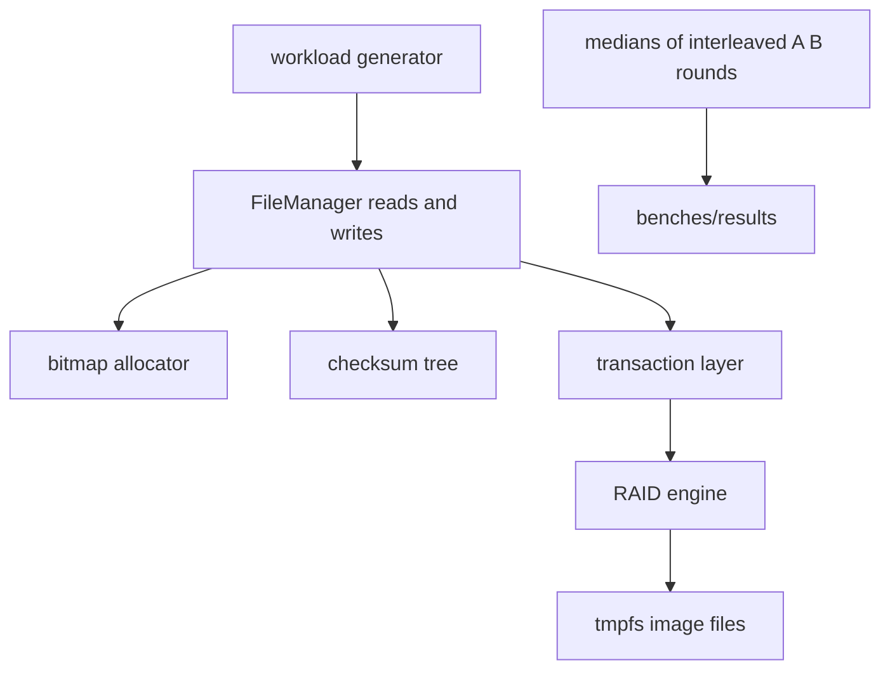

# LionFS Benchmarks (At a Glance)

This card is the one-page summary. The canonical, full methodology
document -- environment, reproduction commands, per-phase attribution,
and every caveat -- is [`docs/benchmarks.md`](docs/benchmarks.md).

An earlier revision of this file carried an FIO table (85k IOPS
sequential, "0.8 ms" latency columns) attributed to hardware that never
ran this code. That table has been removed: it was fabricated, and
keeping it would violate the benchmarking ground rules this project
sets for itself. What appears below is only what `lfs_ioperf` actually
measured in this repository, in-process, against image files on tmpfs.

## What the harness measures -- and what it does not

`lfs_ioperf` drives the real I/O core (`FileManager`, bitmap allocator,
checksum tree, transaction layer, RAID engine) with **no FUSE round
trip, no kernel page cache, no syscalls**. The numbers are user-space
CPU cost of the I/O path, valid for before/after comparisons within the
harness only. There is no `/dev/fuse` in the development container, so
no mounted numbers exist anywhere in this repository -- and none are
claimed.



## The measured headlines (final, all phases; medians)

| area | result |
|---|---|
| seq64k-write-fresh | 561 -> 832 MiB/s (+48.4%) |
| 3.2 fast-append + dirty-CRC skip | 832 -> 1107 MiB/s (+33.1%, cross-session) |
| 3.2 latency percentiles (p50/p99/p999, us) | seq4k-write 2.7/7.1/18.2 |
| 3.3 snapshot write tax (--snapshot-tax) | 178.5 -> 163.0 (first CoW pass) -> 168.6 (steady) MiB/s |
| 3.3 SMP read scaling (lfs_smpbench) | 1.26x at 2 jobs (shared cache), 1.41x (no cache) |
| 3.3 mounted-fio framework | benchmarks/fio/ -- zero shipped numbers, runs on real hardware |
| seq64k-read | 1197 -> 1454 MiB/s (+21.4%) |
| extent fragments, fresh 32 MiB file | 8192 -> 8 |
| RAID5-6dev random-write commit (incremental parity) | +71.0% |
| RAID6-6dev random-write commit (incremental parity) | +62.1% |
| parity stripe-row reads per write | 2.00/3.00 -> 0.00 |
| compression, mixed corpus | ratio 2.90x at level 3 |
| rand4k-write | +0.8% (honestly ~flat) |

Run-to-run drift on the shared container is up to ±15%, so every
before/after pair above was measured as interleaved A/B medians.

## The arithmetic behind the table

The batch-amortization ceiling the io_uring path targets, with per-op
CPU cost $s$ and per-batch overhead $p$:

$$X \le \frac{N}{Ns + p} = \frac{1}{s + p/N}$$

The parity change, exactly as measured -- full recompute reads the
other $k-1$ data blocks of the stripe row, incremental RMW reads old
data and old parity only:

$$R_{\mathrm{full}} = k - 1, \qquad R_{\mathrm{inc}} = 2$$

The compression ratio, counted from the allocator bitmap rather than
inferred:

$$r = \frac{B_{\mathrm{logical}}}{B_{\mathrm{physical}}} = \frac{2048}{706} \approx 2.90$$

## How to reproduce

```
cargo build --release --bin lfs_ioperf
./target/release/lfs_ioperf --secs 3
./target/release/lfs_ioperf --profile raid5 --devices 6 --secs 3
./target/release/lfs_ioperf --compress
```

Raw outputs for every phase are checked in under `benches/results/`.
Cross-filesystem numbers: see the honest answer in
[`docs/comparison.md`](docs/comparison.md) -- none exist.


## 3.4 — the vfs surface is finally measurable in parallel

Phase 10 made `VfsOps` `&self` with a write-back intake page cache and
group commit; `lfs_smpbench --write/--read-vfs` drives N threads
through one shared mount (release, 2-vCPU container,
`benches/results/3.4/`):

| measurement | 1 job | 2 jobs | scaling |
|---|---|---|---|
| buffered write intake (64-KiB calls) | 3036 MiB/s | 4292 MiB/s | **1.41x** |
| durable write (fsync per 1 MiB) | 512 MiB/s | 502 MiB/s | 0.98x (staging-bound) |
| read, `&self` vfs path | 1455 MiB/s | 1608 MiB/s | 1.11x |

The 3.3 mount could not enter a 2-job configuration at all (every op
serialized on `&mut self`), so the 1-job row was its ceiling. Also
archived: a real source-built fio 3.36 running the same job shapes on
the container's overlay backing (seq-64k w 731 / r 693 MiB/s, rand-4k
r 13.7 / w 637 buffered) -- hardware context, not a
mounted-vs-mounted claim (still no `/dev/fuse` here; that stays with
`benchmarks/fio/run-comparison.sh` on real boxes).
