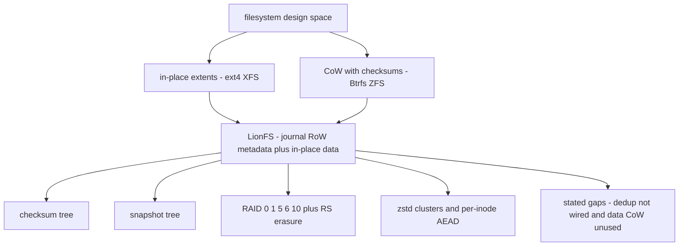
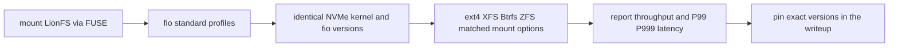

# LionFS vs. Other Filesystems (At a Glance)

This card is the one-page summary; the canonical document with the
full caveats and the methodology discussion is
[`docs/comparison.md`](docs/comparison.md).

An earlier revision of this file presented a feature table backed by
fabricated benchmark numbers. Those numbers are gone. What remains is
qualitative: claims about what the LionFS code implements, verifiable
by reading it -- not by trusting a benchmark table.

## Feature parity (qualitative)

| Feature | LionFS | ext4 | XFS | Btrfs | ZFS |
|---------|--------|------|-----|-------|-----|
| End-to-end per-block checksums | yes (checksum tree) | no | no | yes | yes |
| Snapshots | yes (snapshot tree) | no | no | yes | yes |
| Built-in RAID profiles | 0/1/5/6/10 | no (md) | no (md) | yes | yes |
| Transparent compression | zstd clusters | no | no | yes | yes |
| Deduplication | wired (3.2), LFS_DEDUP=1, verify-on-share | no | no | external tooling | yes |
| Metadata CoW (snapshot-consistent trees) | yes (3.3): inode/dir/csum/spill frozen; O(1)-metadata creation | no | no | yes (birth stamps, O(1)-total) | yes (blkptr birth txg, O(1)-total) |
| Encryption | per-inode AEAD | fscrypt | fscrypt | no | native |

Caveats that matter, stated once here and in full in the canonical
doc: the Markov read-ahead is wired but measured negative and ships
disabled by default; data-path copy-on-write is LIVE since 3.2 (pinned
blocks redirect) but metadata trees are not CoW and snapshots cost
O(inodes); dedup is wired since 3.2 and off by default, ZFS's own
posture. Each is listed as it is, not as a checkbox.

## Where LionFS sits in the design space

## The one countable metric -- and its limits

Because the table is verifiable by code reading, it can be summarized
without lying. Verified-feature coverage of filesystem $A$ against
reference $B$:

$$C(A, B) = \frac{|F_A^{\mathrm{wired}} \cap F_B|}{|F_B|}$$

where $F^{\mathrm{wired}}$ counts only features the write path actually
uses. With dedup wired in 3.2, counting the six rows:

$$C(\mathrm{LionFS}, \mathrm{ZFS}) = \frac{6}{6}, \qquad
C(\mathrm{LionFS}, \mathrm{Btrfs}) = \frac{4}{4}$$

The metric counts rows in one table. It says nothing about maturity,
tooling, or performance, and must not be quoted as if it did.

## What a real comparison would require

Until that run exists, this document makes no performance comparison
at all -- the honest answer is "none measured, none claimed."

## 3.4 — one "behind" row retired

Single-writer-per-mount is gone: `&self` operations, write-back intake
with per-inode gates, group commit, seqlock-protected reads. Measured
1.41x buffered write scaling and 1.11x read scaling at 2 jobs through
the real surface (`benches/results/3.4/`). Still behind, still
documented: parallel metadata *staging*, multi-threaded FUSE dispatch
(fuser 0.12 is single-loop), real-hardware mounted fio, field miles.
