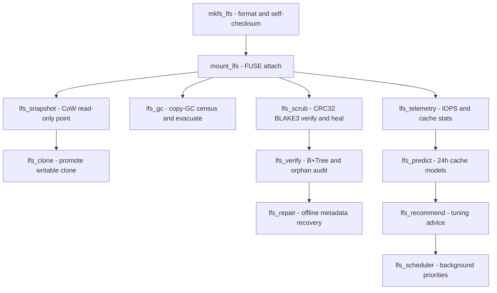
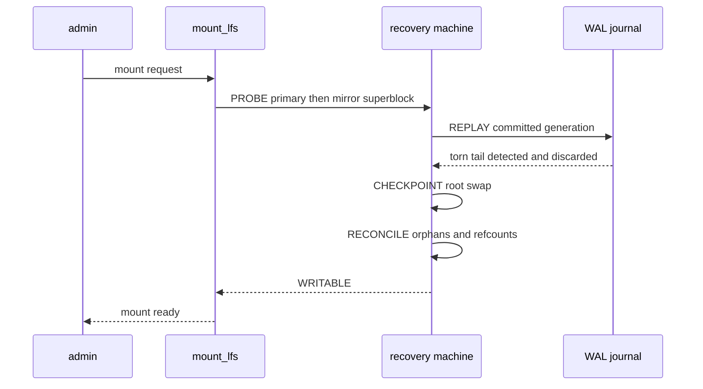

# LionFS 1.0 Administration Guide

LionFS provides exactly **25 standalone administrative binaries** for granular management, telemetry, and repair of your volumes.

All tools support standard POSIX CLI flags and output strictly deterministic JSON formatting natively, making them perfect for CI/CD automation pipelines, Grafana ingestion, and Ansible orchestration.

## 1. Core Lifecycle
- `mkfs_lfs`: Creates and formats a new LionFS volume.
- `mount_lfs`: Mounts a LionFS volume into the userspace (FUSE).
- `lfs_admin`: Central administration interface for global flags.
- `lfs_volume`: Modifies volume labels and resizes existing filesystems.

## 2. Integrity & Repair
- `lfs_scrub`: Launches a background self-healing scrubber to read all blocks, verify CRC32/BLAKE3 checksums, and rewrite corrupted data from RAID parity mirrors.
- `lfs_verify`: Verifies B+Tree structural hierarchies and detects orphan inodes.
- `lfs_repair`: Attempts offline correction of catastrophic Superblock or Journal metadata failure.
- `lfs_health`: Emits a top-level JSON health report of the active storage pool.

## 3. Storage Pools & RAID
- `lfs_pool`: Manages storage pools, adds/removes physical drives to the active pool.
- `lfs_raid`: Configures or modifies the active RAID profile (e.g., Single to Mirror).
- `lfs_rebuild`: Triggers an active rebuild array sequence when replacing a failed drive.

## 4. Snapshots & Clones
- `lfs_snapshot`: Creates an instantaneous Copy-on-Write (CoW) read-only snapshot.
- `lfs_clone`: Promotes a snapshot into an independent writable clone.

## 5. Security & Optimization
- `lfs_compress`: Triggers background Zstd/LZ4 compression across uncompressed extents.
- `lfs_dedupe`: Triggers an offline or background block-level deduplication scan.
- `lfs_encrypt`: Re-keys or activates AES-GCM encryption on directories.
- `lfs_keys`: Manages the local cryptographic key hashes stored in the Superblock.

## 6. Telemetry & AI
- `lfs_telemetry`: Dumps real-time IOPS, cache-hit rates, and latency curves.
- `lfs_predict`: Invokes the AI optimization engine to analyze the telemetry database and output predictive caching models for the next 24 hours of operation.
- `lfs_recommend`: Outputs automated tuning advice based on current workloads (e.g., "Increase cache size due to 90% thrash rate").
- `lfs_scheduler`: Modifies background work priority queues (e.g., throttling scrubber during peak business hours).
- `lfs_policy`: Configures global automation policies.

## 7. Development & Benchmarking
- `lfs_debug`: Outputs internal hex-dumps of targeted B+Tree logical blocks.
- `lfs_dump`: Dumps the Superblock and WAL journal for crash investigations.
- `lfs_profile`: Attaches to the userspace process to extract performance flame graphs.
- `lfs_benchmark`: A built-in Criterion/FIO-style benchmarking utility to validate IOPS scalability directly against the storage medium.

## 8. Volume Lifecycle Workflow

The 25 binaries above form a pipeline, not a menu. The minimal
production sequence from a blank device to a self-maintaining volume,
with the repair tools on standby:

`lfs_gc` and `lfs_retention` below are 3.x-era tools added beyond the
25 binaries of sections 1-7, alongside `lfs_guardian`, `lfs_migrate`,
and the 3.1 `lfs_simulate`.

Mount is not a single call. `mount_lfs` drives the five-state recovery
machine (PROBE, REPLAY, CHECKPOINT, RECONCILE, WRITABLE) before the
first operation is accepted:

### GC and retention arithmetic (3.1)

Pool utilization is $\rho = L/C$, with $L$ live bytes and $C$ pool
capacity. The 3.1 copy-GC daemon kicks at $\rho > 0.25$ and exits
aggressive mode at $\rho < 0.10$; the transient runway those watermarks
buy is

$$t_{\mathrm{panic}} = \frac{0.25 - 0.10}{f - r}$$

where $f$ is the fill rate and $r$ the reclaim rate. Retention keeps
one representative snapshot per GFS tier -- 48 hourly, 14 daily, 8
weekly, 12 monthly, 7 yearly -- so a fully populated tree holds

$$N_{\mathrm{GFS}} = 48 + 14 + 8 + 12 + 7 = 89$$

snapshot points, each created by `lfs_snapshot` and expired by
`lfs_retention`.

### Crash drills: lfs_simulate (3.1)

`lfs_simulate run | sweep | determinism` drives the deterministic crash
simulator (`src/sim/`): seeded universes, power cuts at deterministic
op indexes and tear offsets, and replay invariants asserted after
every cut. The exhaustive sweep makes every crash point a test case:

$$N_{\mathrm{universes}} = |\mathrm{seeds}| \times N_{\mathrm{ops}} \times |\mathrm{tear\ offsets}|$$

That machinery is part of what took the suite to 713 green tests; run
a sweep before and after any storage-stack change.
