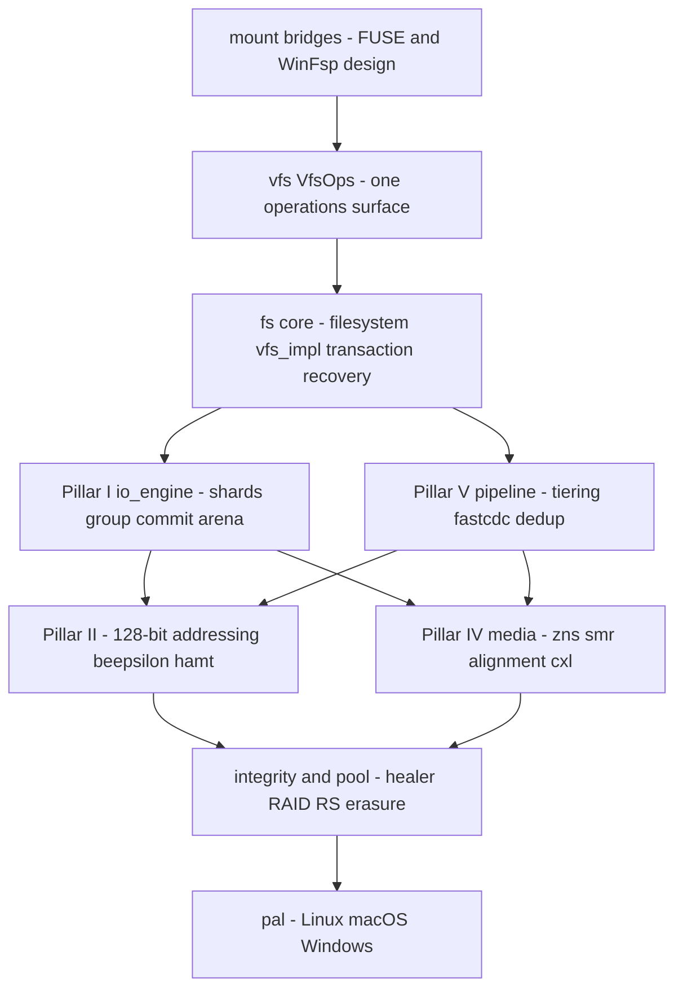
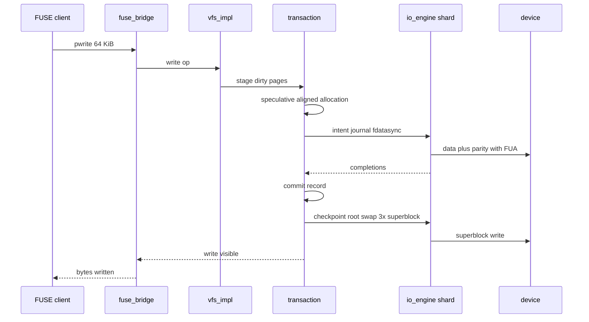

# LionFS 2.0 Architecture Overview

LionFS is a from-scratch, high-performance, self-healing universal
file system in Rust. This document is the module map; the normative
design is [LFS-RFC-002](rfc/LFS-RFC-002.md) and the platform strategy
is [LFS-RFC-003](rfc/LFS-RFC-003-cross-platform.md). Per-subsystem
specifications live in [`specifications/`](../specifications/).

## The layer stack

```text
┌────────────────────────────────────────────────────────────────┐
│ mount bridges:  FUSE (linux/macOS)  │  WinFsp (design, RFC-003) │
├────────────────────────────────────────────────────────────────┤
│            vfs::VfsOps  —  one operations surface              │
├────────────────────────────────────────────────────────────────┤
│  fs core: filesystem.rs (mount/recovery)  vfs_impl.rs (ops)    │
│  transaction (journal+commit)   recovery (state machine)        │
│  file (cluster/read/write)      inode, directory, path          │
├───────────────────────────────┬────────────────────────────────┤
│  io_engine (Pillar I)         │  pipeline (Pillar V)            │
│   uring / threaded, shards,   │   tiering, punch-through,       │
│   group commit, arena         │   fastcdc, dedup, offload       │
├───────────────────────────────┼────────────────────────────────┤
│  addressing (128-bit)         │  media (Pillar IV)              │
│  beepsilon + hamt (Pillar II) │   zns, smr, alignment, cxl      │
├───────────────────────────────┴────────────────────────────────┤
│  integrity (dual-speed + healer)   pool (RAID + RS erasure)     │
├────────────────────────────────────────────────────────────────┤
│                     pal — platform abstraction                 │
│        Linux            macOS              Windows              │
└────────────────────────────────────────────────────────────────┘
```

## Module map

| Path | What lives there |
|---|---|
| `src/pal/` | The only OS surface: positioned I/O, fsync flavors, geometry probes, CSPRNG, wakers, errno/mode constants. Windows pulls zero crates. |
| `src/vfs/` | `VfsOps` (the operations contract) + `fuse_bridge` (fuser translation). Bridges translate; they never make policy. |
| `src/fs/` | The core: `filesystem.rs` (mount, superblock selection, recovery invocation), `vfs_impl.rs` (all ops, ported 1:1 from the 1.x FUSE impl), compression/dedupe/snapshots/stat. |
| `src/io_engine/` | Pillar I: `IoOp`/`Completion`, Vyukov MPMC, `ThreadedEngine`, `UringEngine`, `EngineBuilder` (graceful selection), `Shard`/`ShardTable`, `GroupCommitBatcher`, `RegisteredBufArena`. |
| `src/addressing/` | Pillar II: `VolumeAddr` (u128 field layout) and `Extent16` (packed 16-byte records). |
| `src/beepsilon/`, `src/hamt/` | Pillar II indexes: write-optimized extent tree and persistent namespace trie. |
| `src/rcu/` | `RcuPtr` (crossbeam-epoch publish/reclaim), `Seqlock`, `RcuCache`. |
| `src/media/` | Pillar IV: ZNS zone table, SMR bands, alignment classes + counters, CXL tier placement. |
| `src/pipeline/` | Pillar V: codec tiering, punch-through, FastCDC, dedup index, accelerator selection. |
| `src/recovery/` | The five-state mount machine + the 1.x replay/verify. |
| `src/integrity/` | Checksum algorithms, checksum tree, **dual-speed policy**, **autonomous healer**, bad blocks, refcounts. |
| `src/pool/` | RAID 0/1/5/6/10 + GF(256) + **generalized RS(n,k) erasure**. |
| `src/ondisk/` | Wire formats: superblock, inode, extents, block groups, **inode v3 (inline payloads)**, serialization, validation, upgrade. |
| `src/transaction/` | Journal, commit, checkpoint, rollback — the RoW pipeline. |
| `src/allocator/`, `src/cache/`, `src/worker/` | Free space (bitmap + policies + locality), moka caches (RCU migration target), background workers (flusher, scrubber, GC, rebalancer). |
| `src/security/`, `src/telemetry/`, `src/optimizer/`, `src/debug/` | AEAD + keys + ACLs; metrics; adaptive policy engine; dump/inspect/tracing. |

## The read path (warm, compressed pool)

`pread` → VFS bridge → `vfs_impl::read` → cipher-context resolve →
`FileManager::read_file` (cluster tree + checksum verify) → PAL
positioned read (io_uring ring on Linux) → decompress (tier codec) →
copy-out. The 2.0 direction (RFC-002 §9.1): RCU cache probe → extent
resolution on the shard → device DMA into registered buffers →
deferred xxHash64 verify on completion.

## The write path (transactional)

`pwrite` → shard stages dirty pages → speculative aligned allocation
→ intent journal (fdatasync) → data + parity (FUA on final ring
submission) → commit record → background checkpoint (root swap,
3× superblock) → old extents released. Group commit batches fsyncers:
64 writers cost one device flush per batch window.

## Crash recovery

Five states, one obligation each (PROBE → REPLAY → CHECKPOINT →
RECONCILE → WRITABLE); O(journal), never a full scan; fault-injection
tests prove convergence after kills at every boundary.

## Pillar dependency view (diagram)

The text stack above shows containment. This graph shows the order the
pillars impose on an operation -- the write path's dependency chain:



## A write through the layers (sequence)



## Capacity and queueing arithmetic

The 128-bit `VolumeAddr` is structured -- 16-bit volume, 24-bit
region, 24-bit device, 64-bit device LBA -- over 4 KiB units, so the
addressable volume is

$$V_{\max} = 2^{(16+24+24+64)} \times 2^{12} = 2^{140}\ \mathrm{B} \approx 2^{112}\ \mathrm{YiB}$$

with a per-device ceiling of $2^{64} \times 4\ \mathrm{KiB} = 2^{76}$
bytes and at most $2^{24} \approx 1.7 \times 10^{7}$ pool members. A
single packed `Extent16` record (16 bytes; one cache line holds eight)
caps a file's logical span at $2^{48} \times 2^{16} = 2^{64}$ bytes
(16 EiB at GRAN=1) with runs up to
$(2^{24}-1) \times 64\ \mathrm{KiB} \approx 1$ TiB per extent; larger
files chain records through the B-epsilon tree, whose leaves keep 25%
padding for in-place merges.

The QoS gate's stability condition is plain queueing: with offered
rate $\lambda$ and device service rate $\mu$,

$$\rho = \frac{\lambda}{\mu} < 1$$

and under saturation the WFQ batch picker's weights bound the service
ratio $S_i/S_j \to w_i/w_j$ (8:4:1 for RT:BE:bulk). Group commit
amortizes the durability term the same way: 64 fsyncers share one
device flush per batch window, a per-writer cost of
$t_{\mathrm{flush}}/64$ -- amortization, not elimination.
