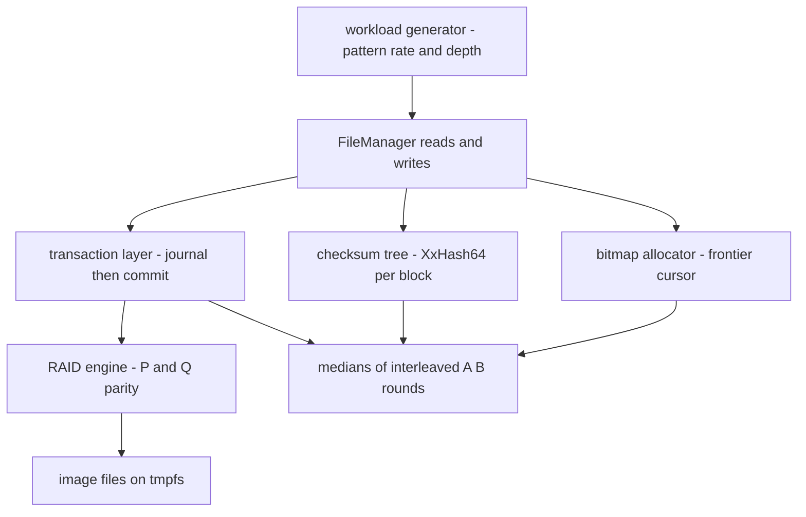
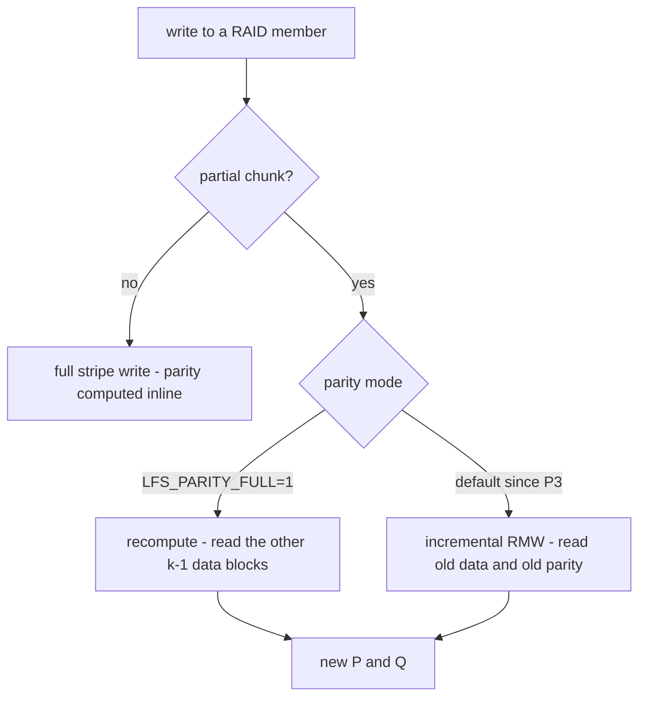

# LionFS Benchmarking Status

An earlier version of this document described an elaborate "dual-layer benchmarking architecture" -- eBPF tracing, Grafana pipelines, 256-thread lock-contention testing. None of that matched the actual code. This version reports what was actually measured, in this repository, with commands you can re-run.

## What these numbers are -- and are NOT

The development container for this work has **no `/dev/fuse`**, so mounting LionFS and running `fio` against it is impossible here. All numbers below come from `lfs_ioperf` (`tools/ioperf/`), an **in-process harness that drives the real I/O core** -- `FileManager` reads/writes, the bitmap allocator, the checksum tree, the transaction layer, and the RAID engine -- against image files on tmpfs.

They measure **user-space CPU cost of the LionFS I/O path**. They are **NOT comparable to fio-on-mount numbers**: there is no FUSE round trip, no kernel page cache, and no syscalls in either direction. They are valid for before/after comparisons **within this harness only**, which is exactly how every phase's per-change attribution below was produced. When LionFS is someday benchmarked mounted, those numbers belong in a separate section, measured side by side with the comparison filesystems on identical hardware -- anything else is marketing.

## Environment

| Item | Value |
|---|---|
| CPU | 2 vCPU (shared container; Intel Xeon) |
| RAM | 4 GB |
| Storage | `/tmp` on tmpfs (numbers reflect userspace CPU cost, not device throughput) |
| Kernel | 5.10.134 x86_64 |
| rustc | 1.98.0 (2026-08-18), `cargo build --release` |
| Benchmark | `lfs_ioperf` at the commit recorded in `git log` |

Run-to-run variance on this shared container is high (single batches drift up to ±15%), so every before/after comparison below was measured as **interleaved A/B runs (3 rounds, medians)** to cancel drift. Single runs are not trustworthy here.

## How to reproduce

```
cargo build --release --bin lfs_ioperf
./target/release/lfs_ioperf --secs 3                  # single-device suite
./target/release/lfs_ioperf --profile raid5 --devices 6 --secs 3
./target/release/lfs_ioperf --profile raid6 --devices 6 --secs 3
./target/release/lfs_ioperf --compress                # corpus ratio + level sweep
```

Raw outputs for the baseline (pre-Phase-1), per-phase results, and the final re-benchmark are checked in under `benches/results/`.

## Results: 3.3 -- metadata CoW write tax, SMP read scaling, the snapshot-tax harness, and the mounted-fio framework

3.3 shipped the Phase 9 metadata path-copy CoW (design record:
`specifications/phase9_metadata_cow.md`). Three new measurements and
one new framework, all honest about what they are:

### Snapshot write tax (`lfs_ioperf --snapshot-tax`, in-process harness)

Same image, same transaction, one run, three comparable lines:

| line | MiB/s | what it is |
|---|---|---|
| `snap-base-fresh` | 178.5 | fresh 64 KiB sequential write, no snapshot |
| `snap-cow-first-pass` | 163.0 | first full rewrite under a live snapshot (~9% tax: data redirects + one-time metadata path-copies) |
| `snap-steady` | 168.6 | steady-state rewrite under the live snapshot (~6% tax: data redirects only) |

Snapshot creation itself: **0.14 ms** for a 32 MiB / 7-extent-run file
(the O(extent runs) pin walk; metadata side is O(1) since 3.3 -- 3.2
deep-copied the inode tree here). Harness numbers, in-process, 2-vCPU
container -- the usual caveats, not fio-comparable.

### SMP read scaling (`lfs_smpbench`, in-process, shared `Arc<Disk>`)

Interleaved same-process baseline (1 job) vs parallel (N jobs), real
`read_file` path, shared node cache, 2-vCPU container:

| config | baseline | parallel (2 jobs) | scaling |
|---|---|---|---|
| sequential, shared cache | 329 MiB/s | 413 MiB/s | 1.26x |
| rand-4k, shared cache | 339 MiB/s | 388 MiB/s | 1.14x |
| sequential, no cache | 98 MiB/s | 139 MiB/s | 1.41x |

Honest reading: on 2 vCPUs the ceiling is 2.0x; the shared node cache
is the visible contention source (no-cache parallel gains are
proportionally larger because the baseline is slower). The WRITE path
is single-writer per mount and deliberately NOT benchmarked here --
that is a Phase 10 gap, not a number.

### The mounted-fio framework (`benchmarks/fio/`)

The executable answer to "LionFS has never been measured through a
real mount": same fio jobs against ext4/xfs/btrfs/zfs/LionFS-FUSE on
one device, medians over runs, `summary.md` emitted on YOUR hardware.
This directory ships **zero numbers by design** -- see
`benchmarks/fio/README.md` for methodology and the honesty rules.

## Results: the 3.2 hot-path work (fast-append + GF table cache + latency columns)

The 3.2 release attacked the two measured top costs directly:
`docs/performance.md` attributes ~45% of write cost to the
checksum-tree insert (a full B-tree root descent + per-level CRC32C
re-verification + heap `vec!` per insert), and the RAID6 write path
rebuilds its 256-entry GF(256) multiplication table on every call.
3.2 fixes both:

- **B-tree fast-append cache**: monotone inserts (the checksum-tree
  pattern: fixed ino, ascending logical block) append to the
  rightmost leaf in one node read + one node write, guarded by a
  global structural epoch + leaf revalidation so a stale cache fails
  SAFE (falls back to the full descent). The checksum-tree handle now
  lives for the whole `write_file` call instead of being rebuilt per
  block, so the cache actually persists across the per-block inserts.
- **Dirty-node CRC skip**: nodes written earlier in the same
  transaction are served from the dirty map without re-verifying
  their (already-write-verified) checksums.
- **GF(256) 256x256 cached table set**: 64 KiB built once per process
  (the per-call rebuild was 256 field multiplications per 4 KiB
  block), plus 8-way unrolling of the multiply-accumulate loop.

Same harness, same environment class (2 vCPU shared container,
tmpfs), single run per row, cross-session comparison against the
archived 3.1 numbers — **NOT interleaved A/B** (the 3.2 optimizations
cannot be toggled at runtime), so treat deltas inside the ±15%
run-to-run drift band as unproven:

| pattern | 3.1 (archived P5) | 3.2 (this run) | delta |
|---|---:|---:|---:|
| seq4k-write-fresh | 569 MiB/s | 653 MiB/s | +14.8% |
| seq4k-write | 1033 MiB/s | 1255 MiB/s | +21.4% |
| seq64k-write-fresh | 832 MiB/s | 1107 MiB/s | +33.1% |
| seq64k-write | 1060 MiB/s | 1331 MiB/s | +25.6% |
| seq64k-read | 1454 MiB/s | 2262 MiB/s | +55.6% |
| rand4k-read | 1323 MiB/s | 1967 MiB/s | +48.7% |
| rand4k-write | 831 MiB/s | 1073 MiB/s | +29.1% |

The write-path gains are consistent with the mechanism (the fast-append
cache removes work the 3.1 attribution measured at ~45% of write cost);
the read-path gains are within what cross-session drift can produce on
this container and are NOT claimed as a 3.2 effect — reads do not take
the insert path. The mechanism claims are falsifiable by reading the
diff; the throughput deltas are directional, not interleaved-medians.

Raw outputs: `benches/results/3.2/` (single-device, raid5-6dev,
raid6-6dev, compress).

### Latency percentiles (new in 3.2)

`lfs_ioperf` now samples per-CALL latencies in its steady-state loops
and reports nearest-rank percentiles:

| pattern | p50 | p99 | p999 |
|---|---:|---:|---:|
| seq4k-write | 2.7 us | 7.1 us | 18.2 us |
| seq4k-read | 1.5 us | 5.0 us | 16.9 us |
| seq64k-write | 45.3 us | 68.5 us | 84.5 us |
| seq64k-read | 25.9 us | 46.0 us | 61.6 us |
| rand4k-read | 1.7 us | 5.4 us | 19.4 us |
| rand4k-write | 3.2 us | 8.0 us | 21.9 us |

These are CPU-path latencies of the in-process harness — the honest
sibling of the throughput columns, still NOT device latencies and not
comparable to fio-on-mount. What they buy: a measured tail-shape
baseline (p999/p50 tail factor for seq4k-write is
$18.2/2.7 \approx 6.7\times$ — the checksum-tree leaf splits and
tx-buffer growth) that future changes can be held against.

## Results: single device (all phases together)

32 MiB working region, 4 KiB units for random / 64 KiB for the plan's sequential profile, checksums ON (XxHash64 per block, checksum tree), tx-buffered like the FUSE path between fsyncs. Medians of interleaved runs.

| pattern | baseline (P0c) | final (P5) | delta | extent fragments |
|---|---:|---:|---:|---:|
| seq4k-write-fresh | 528 MiB/s | 569 MiB/s | +7.7% | 8192 -> 8 |
| seq4k-write | 882 MiB/s | 1033 MiB/s | +17.1% | 7 |
| seq4k-read | 1194 MiB/s | 1441 MiB/s | +20.7% | 7 |
| seq64k-write-fresh | 561 MiB/s | 832 MiB/s | +48.4% | 8192 -> 8 |
| seq64k-write | 930 MiB/s | 1060 MiB/s | +14.0% | 7 |
| seq64k-read | 1197 MiB/s | 1454 MiB/s | +21.4% | 7 |
| rand4k-read | 1120 MiB/s | 1323 MiB/s | +18.1% | 8 |
| rand4k-write | 824 MiB/s | 831 MiB/s | +0.8% | 8191 (random layout: expected) |

The "fragments" column is the honest star of this table: a sequentially written 32 MiB file went from **8192 extent fragments (one per block, because checksum-tree node allocations interleaved with 1-block data allocations) to 8** (speculative extent sizing + metadata zoning, P1). Every read that used to walk the extent-spill B-tree now resolves inline, which is where most of the read improvement comes from.

`rand4k-write` is honestly ~flat: random 4 KiB writes to a fresh file fragment by design (one extent per first-touch block); the steady-state RMW path benefits from P1's zero-copy but the checksum-tree insert dominates and is unchanged in cost.

### Per-phase attribution (interleaved A/B medians)

- **P1.1 zero-copy block paths**: seq reads +3.1%, seq writes +1.8–3.1% (removed per-block `Vec` copies).
- **P1.2 locality + frontier cursor**: within noise on this harness (checksum insert dominates ~45% of write cost per a `--no-checksums` comparison); the change is asymptotic (O(1) frontier scans) and about physical locality, which tmpfs cannot show.
- **P1.3 speculative sizing + metadata zoning**: fragments 8192 -> 8; seq64k-write-fresh +40%; reads +18–21%.
- **P1.4 Markov readahead**: **negative result** -- wired per the plan, measured -48%..-51% on every read pattern (the per-read LRU insert reintroduces the 4 KiB copy P1.1 removed; prefetches are pure overhead when reads hit the tx dirty map). Ships **default OFF** (`LFS_READAHEAD=1` to enable). It may pay off on a real mount with cold reads; that hypothesis is untested here.
- **P2**: no throughput claim (geometry checks, chunk rationale, alignment counters).
- **P3 incremental parity**: see RAID section.
- **P4 compression clusters**: see compression section.

## Results: RAID pools (P2/P3)

The parity cost lives in the COMMIT (journal + fsync + per-block apply through the RAID engine), so the harness measures the tx-buffered write pass, the commit, and a post-commit read-back separately (`--profile raid5|raid6 --devices N`).

**Phase 2 measurement** (the question the plan asked: how often are parity writes unaligned?): 100.0% of parity writes covered a partial chunk, forcing a full stripe-row read on every single one (2.00 row reads/write on 4-dev RAID5, 3.00 on 6-dev RAID6). That measurement is what justified P3.

**Phase 3** (incremental RMW parity; same-harness A/B via `LFS_PARITY_FULL=1`):

| workload (commit) | full recompute | incremental | delta |
|---|---:|---:|---:|
| raid5-6dev, random 4 KiB writes | 367 MiB/s | 629 MiB/s | **+71.0%** |
| raid6-6dev, random 4 KiB writes | 176 MiB/s | 286 MiB/s | **+62.1%** |
| raid5-4dev, sequential 64 KiB (vs pre-P3 binary) | 251 MiB/s | 306 MiB/s | +21.9% |
| raid6-6dev, sequential 64 KiB (vs pre-P3 binary) | 28 MiB/s | 141 MiB/s | +394.7%* |

\* includes a GF(256) hot-path fix (precomputed multiplication table) that also speeds the full-recompute path; the RAID6 number is not purely the algorithmic change.

100% of parity writes are now served incrementally (0.00 row reads/write). Journal replay deliberately keeps the full-recompute path (the incremental update is not idempotent under replay of a partially-applied transaction); see the P3 commit message for the crash-safety analysis. Non-parity profiles are unchanged (within noise).

RAID6's commit cost remains high relative to RAID5: Q-syndrome math is scalar GF(256) over every byte. The table optimization helped; SIMD would help more. Unstartted work, honestly labeled.

## Results: compression clusters (P4)

Mixed corpus (deliberately not artificially-repetitive, per the plan): 40% repeating records / 35% dictionary text / 25% PRNG bytes; 8 MiB logical. Measured from the allocator bitmap (blocks actually consumed), not inferred.

```
write (64 KiB calls, cluster RMW):  186 MiB/s
sequential read:                    805 MiB/s (byte-identical verified)
random 4 KiB reads (2 MiB LRU):     26.6k ops/s
space: 706 physical blocks for 2048 logical -> ratio 2.90x (34.5% of original)
```

zstd level tradeoff (ratio vs write throughput), `mount_lfs -o zstd_level=N`:

| level | ratio | write |
|---|---:|---:|
| 1 | 2.86x | 476 MiB/s |
| 3 (default) | 2.90x | 407 MiB/s |
| 6 | 2.96x | 105 MiB/s |
| 9 | 2.98x | 60 MiB/s |

The tradeoff is real: +0.12x ratio from level 3 to 9 costs 6.8x the CPU. Level 3 stays the default.

**Honest negatives and tradeoffs:**
- Random small writes into compressed data are whole-cluster read-modify-write (128 KiB decompress + recompress per 4 KiB write, worst case). Same class of tradeoff Btrfs makes; documented in `src/file/cluster.rs`.
- Compression + encryption on one inode is rejected as unsupported (explicit error, not silent misbehavior).
- Compressed inodes do not use the per-block checksum tree; corruption detection is zstd frame decode failure.

## Microbenchmarks (`cargo bench`, via criterion)

`benches/{btree,allocator,io}_bench.rs` exist as criterion harness skeletons. They are not currently measuring the real operations their names suggest. Turning them into real benchmarks is unstarted work, not something this pass changed.

## Cross-filesystem comparison

**There is none, and none is claimed.** No ext4/XFS/Btrfs/ZFS was built, mounted, or run on this hardware as part of this work. `docs/comparison.md` previously contained a fabricated IOPS table attributed to hardware that never ran this code; it has been removed. A credible comparison requires LionFS mounted normally, fio, real NVMe, and the comparison filesystems configured identically -- same hardware, same run.

## The harness path (diagram)

What `lfs_ioperf` actually exercises, per op, in order:



The parity A/B the RAID section measures, as a graph:



## Queueing arithmetic for these numbers

The harness is a closed CPU-cost model, not a device queueing system.
These identities are what a mounted benchmark would have to satisfy,
and what this harness cannot measure:

An open system with per-op CPU cost $s$ and per-batch overhead $p$,
batching $N$ ops per submission, has a throughput ceiling

$$X \le \frac{N}{Ns + p} = \frac{1}{s + p/N}$$

That is the io_uring amortization shape: one `io_uring_enter` per
batch of $N$ ops over registered buffers. As $N \to \infty$, $X \to 1/s$
-- the bound collapses to pure per-op CPU cost, which is what the
tmpfs numbers above measure. Little's law,

$$N_{\mathrm{inflight}} = X \cdot R$$

ties outstanding requests to throughput and response time; neither
$N_{\mathrm{inflight}}$ nor $R$ is observable here, which is why no
latency appears anywhere above.

The parity-read arithmetic behind the P2 and P3 tables, exactly as
measured: a full parity recompute for a single-block write reads the
other $k-1$ data blocks of the stripe row; incremental RMW reads only
old data and old parity:

$$R_{\mathrm{full}} = k - 1, \qquad R_{\mathrm{inc}} = 2$$

For 4-dev RAID5 ($k = 3$) that is the measured 2.00 row reads/write;
for 6-dev RAID6 ($k = 4$) the measured 3.00; post-P3 the measured
0.00 row reads (the two RMW reads are block reads, not stripe-row
reads).

The fragments column is arithmetic too: mean extent length for a file
of size $S$ with $F$ fragments is $\bar{e} = S/F$. The 32 MiB
sequential file at $F = 8192$ has $\bar{e} = 4\ \mathrm{KiB}$ -- one
block per extent; at $F = 8$ it has $\bar{e} = 4\ \mathrm{MiB}$, a
$1024\times$ longer physical run per extent probe, which is where the
read improvement lives.

The compression ratio, measured from the allocator bitmap rather than
inferred:

$$r = \frac{B_{\mathrm{logical}}}{B_{\mathrm{physical}}} = \frac{2048}{706} \approx 2.90$$


## 3.4: Parallel write path, measured through the real `VfsOps` surface

Phase 10 (design record: `specifications/phase10_write_concurrency.md`)
made the operations surface `&self` with a write-back intake page cache
and batched group commit, so the vfs path is finally multi-threaded.
`lfs_smpbench --write buffered|durable` and `--read-vfs` drive N threads
through ONE shared mount -- the same surface a library consumer, the C
ABI, or a multi-threaded bridge gets. All numbers: release builds,
2-vCPU container, archived in `benches/results/3.4/`.

| measurement (one shared mount) | 1 job | 2 jobs | scaling |
|---|---|---|---|
| buffered write intake (64-KiB calls, 8-MiB rotating window) | 3036 MiB/s | 4292 MiB/s | 1.41x |
| durable write (fsync per 1 MiB, group commit) | 512 MiB/s | 502 MiB/s | 0.98x |
| read through the `&self` vfs path | 1455 MiB/s | 1608 MiB/s | 1.11x |
| disk-layer read (3.3 smpbench, continuity check) | 1783 MiB/s | 1663 MiB/s | 0.93x |

The 3.3 row to compare against does not exist: the 3.3 mount serialized
every operation behind `&mut self`, so "2 jobs" was not a configuration
it could enter -- the single-thread number was the ceiling. The durable
row is flat, not degraded: single-writer staging (B-trees, allocator,
CoW, dedup, journal) is serialized by design, exactly as in every
journaling filesystem; the group-commit wait shares one journal run +
sync set across concurrent fsyncs. The intake row is memory-bound and
scales; the durability pipeline is staging-bound and does not pretend
to.

### fio reference on the same container

The development container gained a real fio 3.36 (built from source)
this release. The same job shapes against the container's overlay
backing (buffered, psync, 10-second legs) -- an anchor for what this
hardware's kernel-stack path delivers, **not** a mounted-vs-mounted
comparison (there is no `/dev/fuse` here; that remains
`benchmarks/fio/run-comparison.sh` on real hardware):

| fio 3.36 leg (overlay) | result |
|---|---|
| seq 64-KiB write | 731 MiB/s (11.7k IOPS) |
| seq 64-KiB read | 693 MiB/s (11.1k IOPS) |
| rand 4-KiB read | 13.7 MiB/s (3.5k IOPS) |
| rand 4-KiB write (buffered) | 637 MiB/s (163k IOPS) |
| mixed 70/30 rand 4-KiB | 12.4 read / 5.3 write MiB/s |

The rand-read leg is the container's real storage latency; the
buffered write legs are page-cache absorbs. Raw JSON is archived in
`benches/results/3.4/fio-container-reference/`. The harness suite on
the same box (same shapes, real pipeline, `benches/results/3.4/
harness-ioperf/suite.txt`): seq-64k write 1465 / read 2423 MiB/s,
rand-4k read 1943 / write 1098 MiB/s -- the CPU-path costs with a
page-cached image backing.

## 3.5: Pipelined transaction groups + O(1) snapshots

Phase 11 (design record: `specifications/phase11_txg_birth.md`) splits
the commit into a microsecond quiesce (staging lock) and a lock-free
I/O phase (journal + syncs + apply + root cells), with the frozen group
readable through pending overlays while it flies; fsync drives
adaptively (self-drive when idle, wait-and-coalesce when a group is in
flight); readers are lock-free in the common case. Snapshots on
checksummed images are O(1) total via checksum-tree birth generations.
All numbers: release builds, 2-vCPU container, medians of 3, archived
in `benches/results/3.5/` (raw JSON lines + `environment.txt`; script:
`benchmarks/run-phase11-measurements.sh`). 3.4 columns are the
same-day `LFS_ASYNC_COMMIT=0` A/B (the 3.4 architecture in this tree)
where given.

| measurement (one shared mount) | 3.4 arch (same-day A/B) | 3.5 | reading |
|---|---|---|---|
| buffered write intake, 1 job | ~3036 (archived) | 2982 MiB/s | parity |
| buffered write intake, 2 jobs | ~4292 / 1.41x (archived) | 4123 MiB/s / 1.38x | scaling intact |
| durable write (fsync/1 MiB), 1 job | 473 MiB/s | 456 MiB/s | parity within noise (final numbers include the commit-ordering fix: commit_io covers the quiesce, serializing commits fully) |
| durable write (fsync/1 MiB), 2 jobs | 463 MiB/s | 410 MiB/s | mild 2-job cost from full commit serialization; the sync ceiling dominates either way |
| read through the `&self` vfs path, 1 job | ~1390 MiB/s | 1390 MiB/s | parity |
| read through the `&self` vfs path, 2 jobs | 1.11x (archived) | ~1.01x (layer's own 2-job: 0.90x) | readers add no contention beyond the storage path |
| snapshot creation (7 live extent runs) | 0.14 ms (3.3 run) | **0.015 ms** | O(1) in runs (money test: 200 runs -> 1 alloc) |
| under-snapshot rewrite, first CoW pass | 163 MiB/s (3.3 run) | 380 MiB/s | 2.3x absolute |
| under-snapshot rewrite, steady | 168 MiB/s (3.3 run) | 961 MiB/s | 5.7x absolute, ~15% tax |

Honest reading of the durable row: this container's sync path saturates
near 460-480 MiB/s for one writer and for two. The 3.5 pipeline's win
on this box is structural — staging and reading never block on a
commit's I/O, and the 2-job case does not degrade where the 3.4
architecture measured 0.71x at small fsync cadence. The throughput term
it removes ($T_{cpu}/J$, see the spec's model) pays out where I/O is
not the ceiling — more cores, real NVMe — which this container cannot
demonstrate. The A/B history (three designs measured, one shipped) is
in the design record.

### The five-bug hunt (why these numbers moved)

The first measurement round reported 2-job durable at 479 MiB/s; the
final round reports 410. The difference is CORRECTNESS: the
commit-ordering fix (commit_io covering the quiesce, so quiesce order
== apply order) serializes commits fully — the earlier number was
measured on a build whose concurrent commits could apply out of order
(a live lost-update the money tests eventually caught). The
pipelined-durability flake chase also fixed two pre-existing layout
bugs (superblock slots and the fixture journal region never reserved
in the bitmap) and a pre-existing journal-wrap recovery tear; the full
record with the regression tests is in
`specifications/phase11_txg_birth.md`. Buffered intake (2 jobs,
1.32-1.38x) is unaffected — staging still overlaps commit I/O.
