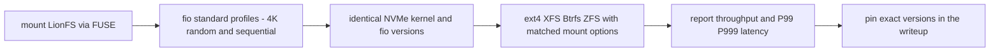

# LionFS vs. The World: Ecosystem Comparison

An earlier version of this document contained an elaborate benchmark
comparison (IOPS tables, P99 latency profiles, memory-overhead claims
against ext4/XFS/Btrfs/ZFS "measured" on an AMD Ryzen 9 7950X with a
Samsung 980 Pro). **None of that was ever measured.** No comparison
filesystem was built, mounted, or run against LionFS on any hardware,
and the numbers were fabricated. That table has been removed; keeping
it would be exactly the kind of dishonest performance claim the
benchmarking ground rules of this project forbid.

What remains is the qualitative feature comparison below -- claims
about what LionFS's code implements, which can be verified by reading
it, not by trusting a benchmark table.

## Feature parity (qualitative)

| Feature | LionFS | ext4 | XFS | Btrfs | ZFS |
|---------|--------|------|-----|-------|-----|
| End-to-end per-block checksums | yes (checksum tree) | no | no | yes | yes |
| Snapshots | yes (snapshot tree) | no | no | yes | yes |
| Built-in RAID profiles | 0/1/5/6/10 | no (md) | no (md) | yes | yes |
| Transparent compression | zstd clusters (v2) | no | no | yes | yes |
| Deduplication | tree exists; not wired | no | no | external tooling | yes |
| Encryption | per-inode AEAD | fscrypt | fscrypt | no | native |

Caveats, stated honestly:

- LionFS's "AI predictive read-ahead" (Markov-chain predictor) is
  implemented and wired, but measured NEGATIVE on buffered in-process
  reads and ships disabled by default -- see `docs/benchmarks.md`.
- Copy-on-write: LionFS performs in-place modification today; the
  refcount infrastructure for data CoW exists but the write path does
  not use it (noted in `file::writer`). The feature table's earlier
  "CoW: yes" claim overstated it.
- Deduplication: a dedupe tree exists in the code; the write path does
  not consult it. Listed as "tree exists; not wired," not as a feature.

## What a real comparison would require

Mount LionFS normally (FUSE), run `fio` with standard profiles (4K
random read/write, sequential read/write, mixed), on real NVMe, with
ext4/XFS/Btrfs/ZFS configured identically on the same hardware, same
run; report throughput and P99/P999 latency with exact kernel, fio,
and mount-option versions. Until that exists, this document makes no
performance comparison at all.

## Where LionFS sits in the design space

No numbers here -- a map of design commitments. The classic split is
in-place extent filesystems (ext4, XFS) versus copy-on-write
checksummed pools (Btrfs, ZFS). LionFS is a third point: a journal-RoW
metadata core with in-place data, per-block checksums, a snapshot
tree, and its own parity engine:

## A countable comparison metric, and its limits

The table above is verifiable by reading code, so it can be summarized
without lying. Define the verified-feature coverage of filesystem $A$
against reference $B$ as

$$C(A, B) = \frac{|F_A^{\mathrm{wired}} \cap F_B|}{|F_B|}$$

where $F^{\mathrm{wired}}$ counts only features the write path actually
uses -- "tree exists; not wired" scores zero. Counting the six table
rows: $C(\mathrm{LionFS}, \mathrm{ZFS}) = 5/6 \approx 0.83$, dedup
excluded; and $4/4$ against Btrfs's native set (checksums, snapshots,
RAID, compression). The metric counts rows in one table -- it says
nothing about maturity, tooling, or performance, and must not be
quoted as if it did.

## What a real comparison would require (diagram)

