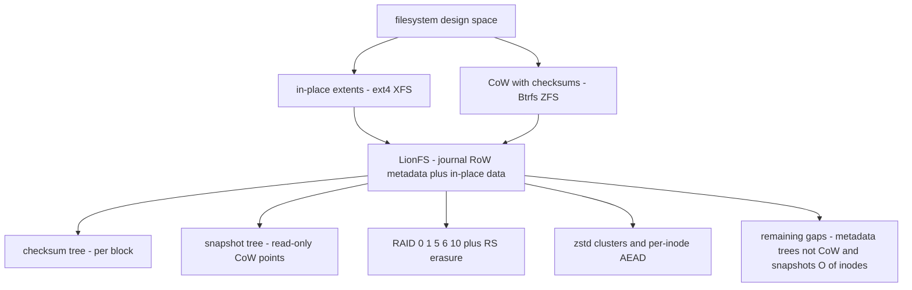
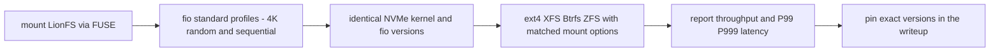

# LionFS vs. The World: Ecosystem Comparison

An earlier version of this document contained an elaborate benchmark
comparison (IOPS tables, P99 latency profiles, memory-overhead claims
against ext4/XFS/Btrfs/ZFS "measured" on an AMD Ryzen 9 7950X with a
Samsung 980 Pro). **None of that was ever measured.** No comparison
filesystem was built, mounted, or run against LionFS on any hardware,
and the numbers were fabricated. That table has been removed; keeping
it would be exactly the kind of dishonest performance claim the
benchmarking ground rules of this project forbid.

What remains is the qualitative feature comparison below -- claims
about what LionFS's code implements, which can be verified by reading
it, not by trusting a benchmark table.

## Feature parity (qualitative)

| Feature | LionFS | ext4 | XFS | Btrfs | ZFS |
|---------|--------|------|-----|-------|-----|
| End-to-end per-block checksums | yes (checksum tree) | no | no | yes | yes |
| Snapshots | yes (snapshot tree) | no | no | yes | yes |
| Built-in RAID profiles | 0/1/5/6/10 | no (md) | no (md) | yes | yes |
| Transparent compression | zstd clusters (v2) | no | no | yes | yes |
| Deduplication | wired (3.2), LFS_DEDUP=1, verify-on-share | no | no | external tooling | yes |
| Encryption | per-inode AEAD | fscrypt | fscrypt | no | native |

Caveats, stated honestly:

- LionFS's "AI predictive read-ahead" (Markov-chain predictor) is
  implemented and wired, but measured NEGATIVE on buffered in-process
  reads and ships disabled by default -- see `docs/benchmarks.md`.
- Copy-on-write: LIVE since 3.2 for data (the coverage tree pins blocks
  and the write path redirects instead of modifying pinned blocks), and
  since 3.3 for METADATA too: node-stamped path-copy CoW freezes the
  inode / dir-name / spill-extent / checksum trees while snapshots are
  live (design record: `specifications/phase9_metadata_cow.md`).
  Snapshot creation is O(1) in metadata and O(extent runs) in data --
  still not Btrfs's O(1)-total (that needs per-extent birth stamps,
  a format-v3 change), but the 3.2 inode deep-copy is gone, and the
  dir and checksum views are frozen (snapshot reads can VERIFY their
  data: `lfs_snapshot verify`).
- Deduplication: wired in 3.2 (BLAKE3 index + verify-on-share +
  shared-block pinning), OFF by default -- ZFS's own posture. The
  coverage metric below now counts it.

## What a real comparison would require

Mount LionFS normally (FUSE), run `fio` with standard profiles (4K
random read/write, sequential read/write, mixed), on real NVMe, with
ext4/XFS/Btrfs/ZFS configured identically on the same hardware, same
run; report throughput and P99/P999 latency with exact kernel, fio,
and mount-option versions. Until that exists, this document makes no
performance comparison at all.

## Where LionFS sits in the design space

No numbers here -- a map of design commitments. The classic split is
in-place extent filesystems (ext4, XFS) versus copy-on-write
checksummed pools (Btrfs, ZFS). LionFS is a third point: a journal-RoW
metadata core with in-place data, per-block checksums, a snapshot
tree, and its own parity engine:

## A countable comparison metric, and its limits

The table above is verifiable by reading code, so it can be summarized
without lying. Define the verified-feature coverage of filesystem $A$
against reference $B$ as

$$C(A, B) = \frac{|F_A^{\mathrm{wired}} \cap F_B|}{|F_B|}$$

where $F^{\mathrm{wired}}$ counts only features the write path actually
uses -- "tree exists; not wired" scores zero. Counting the six table
rows, with dedup wired as of 3.2:
$C(\mathrm{LionFS}, \mathrm{ZFS}) = 6/6$, and $4/4$ against Btrfs's
native set (checksums, snapshots, RAID, compression). The metric counts rows in one table -- it says
nothing about maturity, tooling, or performance, and must not be
quoted as if it did.

## What a real comparison would require (diagram)

## 3.4 update: the write-concurrency row moves

The scoreboard row that said LionFS serialized every mount behind one
writer is retired: `VfsOps` is `&self`, buffered writes land in a
write-back intake page cache behind per-inode gates, staging is
serialized by design (like every journaling filesystem's log), and
commits coalesce (group commit). Measured on the 2-vCPU dev container
(`benches/results/3.4/`): buffered intake 3036 -> 4292 MiB/s at 2 jobs
(1.41x), durable writes flat at ~510 MiB/s (staging-bound, honestly
labeled), vfs reads 1.11x. What remains behind, and stays on the
roadmap honestly: parallel *staging* (node latches), multi-threaded
FUSE dispatch (fuser 0.12 is single-loop), and the real-hardware
mounted fio legs. Design record:
`specifications/phase10_write_concurrency.md`.

## 3.5 update: the snapshot row reaches parity; the durability row holds

Against the reference filesystems' scoreboard rows this phase moves:

* **Snapshot creation cost**: ZFS/Btrfs create snapshots in O(1).
  LionFS 3.3/3.4 was O(1) metadata + O(extent runs) data pinning.
  3.5 is O(1) total on checksummed images (the mkfs default) via
  birth generations — 0.015 ms measured, N-independent by money test.
  The trade is honest: rewrites under a live snapshot pay a per-block
  birth lookup (~15% steady-state tax, zero without snapshots), and
  reclaim is generation-coarse (no per-snapshot deadlist) — space
  returns when the last snapshot at-or-above a block's birth dies.
* **Concurrent-write architecture**: ZFS (multi-txg), Btrfs/XFS
  (per-inode locks) overlap writer CPU with commit I/O. LionFS 3.5
  does exactly this (staging never waits on commit I/O; readers
  neither), with staging itself still single-writer — the remaining
  honest gap versus per-inode-lock filesystems, next architecture
  step (node latches).
* **fsync latency vs group scaling**: 3.5's adaptive policy keeps
  single-stream fsync at parity while concurrent fsyncs coalesce —
  the WAFL/PostgreSQL shape — measured flat at this container's sync
  ceiling with no 2-job degradation.
