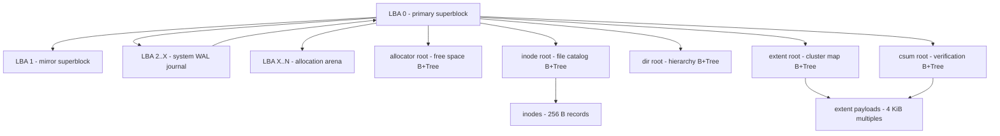
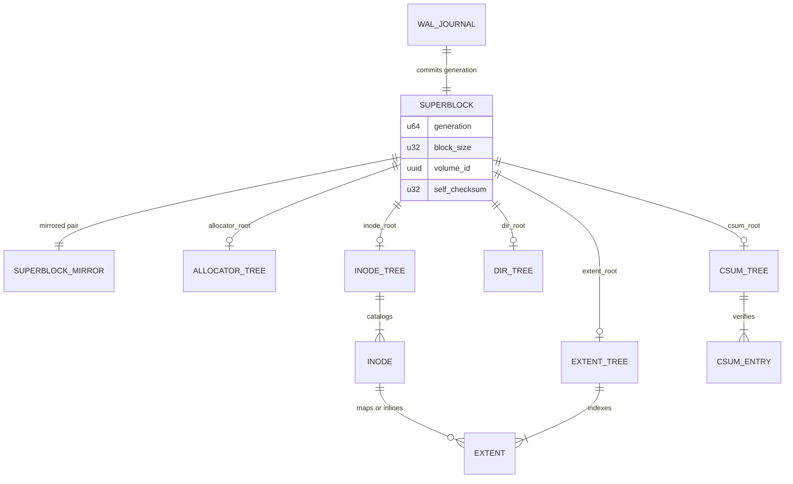

# LionFS 1.0 Disk Format Specification

The LionFS disk structure is rigorously designed around the standard `4096-byte` cluster block size. The format is explicitly crash-resistant, fully verifiable, and self-describing.

## 1. Global Layout
```
[ LBA 0 ] - Primary Superblock
[ LBA 1 ] - Secondary Superblock (Mirrored Redundancy)
[ LBA 2..X ] - System WAL Journal (Metadata + Data Journaling)
[ LBA X..N ] - Global Block Allocation Arena (B+Trees, Inodes, Extents)
```

## 2. Superblock (LBA 0 & 1)
Size: 4096 bytes. All fields are stored in Little Endian format.
* **Magic Signature**: `0x4C494F4E46533031` ("LIONFS01")
* **Generation (u64)**: Monotonically increasing Transaction ID.
* **Block Size (u32)**: Fixed at `4096`.
* **UUID (16 bytes)**: Volume identification.
* **Root Pointers (u64)**:
  - `allocator_root`: Points to the free-space B+Tree.
  - `inode_root`: Points to the primary file catalog B+Tree.
  - `dir_root`: Points to the directory hierarchy B+Tree.
  - `extent_root`: Points to the data clusters mapping B+Tree.
  - `csum_root`: Points to the independent checksum verification B+Tree.
* **Security & RAID (u8 / 32 bytes)**:
  - RAID Profile indicator (Single, Mirror, Stripe, Parity).
  - AES Encryption Key Hash.
* **Feature Flags (u64)**: 
  - `compat_flags`, `ro_compat_flags`, `incompat_flags` (Compression, RAID, Encryption status).
* **Self-Checksum (u32)**: CRC32C over the entirety of the 4096-byte Superblock, ensuring structural integrity during boot.

## 3. B+Tree Nodes
Size: 4096 bytes. Memory aligned for rapid 64-byte payload scans.
* **Node Header (64 bytes)**:
  - `magic` ("BTREE100")
  - `node_type`, `level`, `item_count`
  - `checksum` (CRC32C)
  - `generation`, `parent_block`, `next_leaf`, `prev_leaf`
* **Payload (4032 bytes)**:
  - Dynamically sized key-value pairs depending on tree type (Inode metadata, Extent pairs, Directory listings).

## 4. Inode Structure
Size: 256 bytes `repr(C)`.
* **Metadata**: POSIX standards (`uid`, `gid`, `mode`, `size`, `mtime`, `ctime`, `atime`).
* **Links**: Hardlink counts.
* **Extents**: Internal mappings for small files or root block pointers for massive files.
* **Checksum**: Internal self-contained CRC32 validation.

## 5. Extent Payload
Size: Multiples of 4096 bytes.
* Contains raw user data, optionally compressed via Zstd/LZ4.
* If encrypted, block data is padded and appended with AES-GCM Auth Tags.
* Verified by the `Checksum Tree` using `CRC32C` or `BLAKE3`.

## 6. On-Disk Structure Map

The global layout as a graph -- every arrow is a pointer the mount
path follows, in this order:



The same structures as entity relationships:



## 7. Capacity and Slot Arithmetic

The format's fixed numbers compose into bounds worth stating
explicitly. With u64 root pointers counting 4096-byte clusters, the
addressable volume is

$$V_{\max} = 2^{64} \times 4096 = 2^{76}\ \mathrm{B} \approx 75.5\ \mathrm{ZiB}$$

Inode density: at 256 bytes per inode, one cluster block holds

$$\frac{4096}{256} = 16\ \mathrm{inodes}$$

so a dedicated inode block costs 256 bytes of metadata per file -- the
trade `mkfs_lfs` makes against expected file count when sizing the
catalog tree.

B+Tree fanout: the 64-byte node header leaves a 4032-byte payload. At
the 2.0 packed extent width (16 bytes per record, `Extent16` in
`src/addressing/`), one node holds $\frac{4032}{16} = 252$ records, so
a height-$h$ tree indexes $252^h$ extents: $252^2 \approx 6.35 \times 10^4$
at two levels, $252^3 \approx 1.6 \times 10^7$ at three -- about 61 GiB
of clusters at the 4 KiB minimum per extent. Height, not width, is
what the tree pays for.

Corruption detection: the superblock self-check is CRC32C, so an
in-place tear of one copy escapes detection with probability
$2^{-32}$; a simultaneous undetected tear of both LBA 0 and LBA 1 is
bounded by $2^{-64}$ under an independent-error assumption. The mirror
buys durability, the checksum buys detection, and neither substitutes
for the other.
