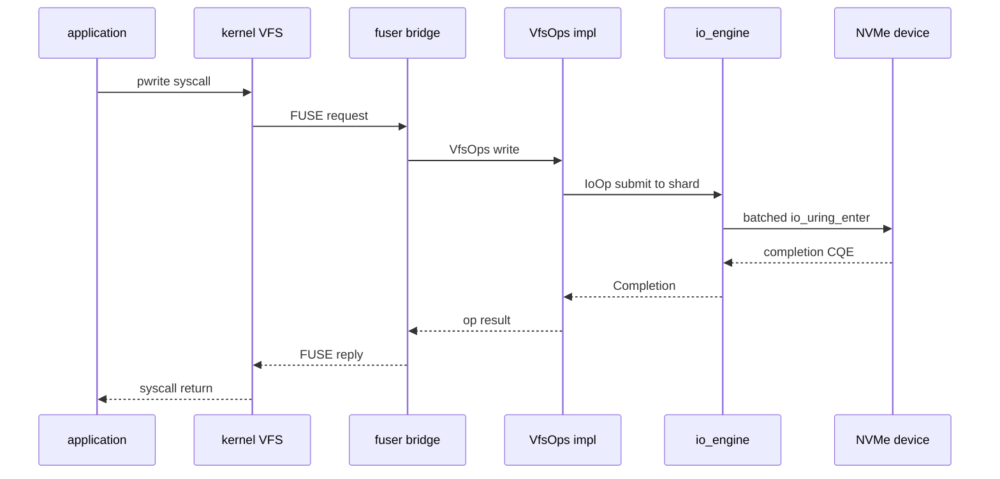
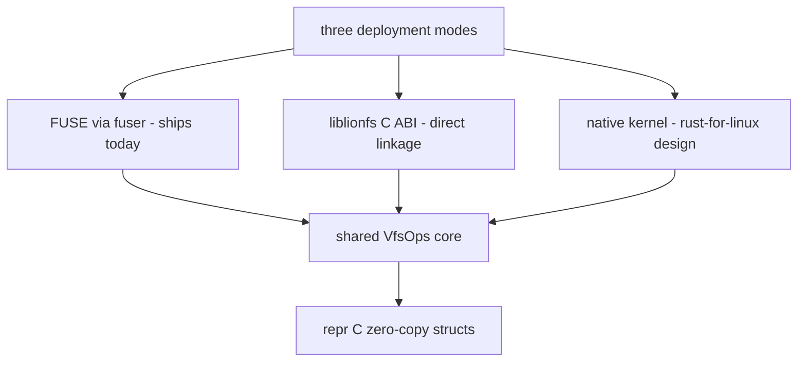

# Kernel Integration & FFI API Strategy

LionFS operates beautifully as a Userspace (FUSE) driver leveraging the `fuser` crate. However, its core is designed specifically for direct compilation into the Linux kernel using the modern `rust-for-linux` framework.

## 1. Native VFS Portability
The module `src/kernel/mod.rs` maps exactly to the C structures expected by the Linux VFS:
- `InodeOperations` maps to `struct inode_operations`
- `FileOperations` maps to `struct file_operations`
- `SuperOperations` maps to `struct super_operations`
- `AddressSpaceOperations` maps to `struct address_space_operations`

These structs are marked with `#[repr(C)]` and utilize strict manual memory padding. This guarantees **zero-copy transitions** between Rust and C data structures, allowing LionFS to be dropped directly into the Linux source tree as a native driver in the future without serialization overhead.

## 2. Lock-Free Safe ABI
Kernel concurrency requires extreme care. The LionFS Phase 11 optimizations transitioned the core engine to lock-free atomics and heavily utilizes RCU-style (Read-Copy-Update) semantics within its B+Trees. 

These properties map 1:1 with kernel-level RCU barriers and spinlocks, making LionFS inherently safe for highly contended SMP (Symmetric Multi-Processing) environments.

## 3. C-Compatible API (liblionfs)
For systems that prefer not to run FUSE but wish to access LionFS volumes, the `src/api/mod.rs` module exposes a highly stable, ABI-safe `#[no_mangle] extern "C"` interface.

```c
// Example Header Integration
struct LfsApiStatus {
    bool success;
    int32_t error_code;
};

extern const char* lfs_version();
extern LfsApiStatus lfs_mount_fuse(const char* device, const char* mount_point);
```

This ensures that storage administration GUIs, backup suites, and virtualization platforms can dynamically link to `liblionfs.so` directly, driving the filesystem at maximum performance directly from C, C++, Go, or Python.

## 4. Request Path (FUSE today, kernel tomorrow)

The same VfsOps surface serves all three deployment modes; the live
path today is FUSE:



In the rust-for-linux port, the kernel VFS calls the `#[repr(C)]`
operation structs directly and the two FUSE hops collapse into
function calls -- the ABI work in section 1 makes that a relinking,
not a redesign.

## 5. Deployment modes



## 6. Latency Budget Decomposition (model, not measurement)

No latency numbers exist in this repository; `docs/performance.md`
says so and this section does not contradict it. What can be written
honestly is the decomposition each mode must satisfy. A FUSE write
pays

$$R_{\mathrm{fuse}} = t_{\mathrm{sys}} + t_{\mathrm{kfuse}} + t_{\mathrm{bridge}} + t_{\mathrm{core}} + t_{\mathrm{engine}} + t_{\mathrm{dev}} + t_{\mathrm{reply}}$$

where $t_{\mathrm{kfuse}}$ and $t_{\mathrm{reply}}$ are the
kernel-to-daemon round trip. The native port eliminates those terms
and the userspace copy, leaving

$$R_{\mathrm{native}} \approx t_{\mathrm{sys}} + t_{\mathrm{core}} + t_{\mathrm{engine}} + t_{\mathrm{dev}}$$

The floor of both is $t_{\mathrm{dev}}$ -- the eliminated terms are
context switches and copies, never device time. Group commit amortizes
the durability term inside $t_{\mathrm{engine}}$ across a batch of $B$
concurrent fsyncers: per-writer flush cost $t_{\mathrm{flush}}/B$, and
the documented batch window seats $B = 64$.
