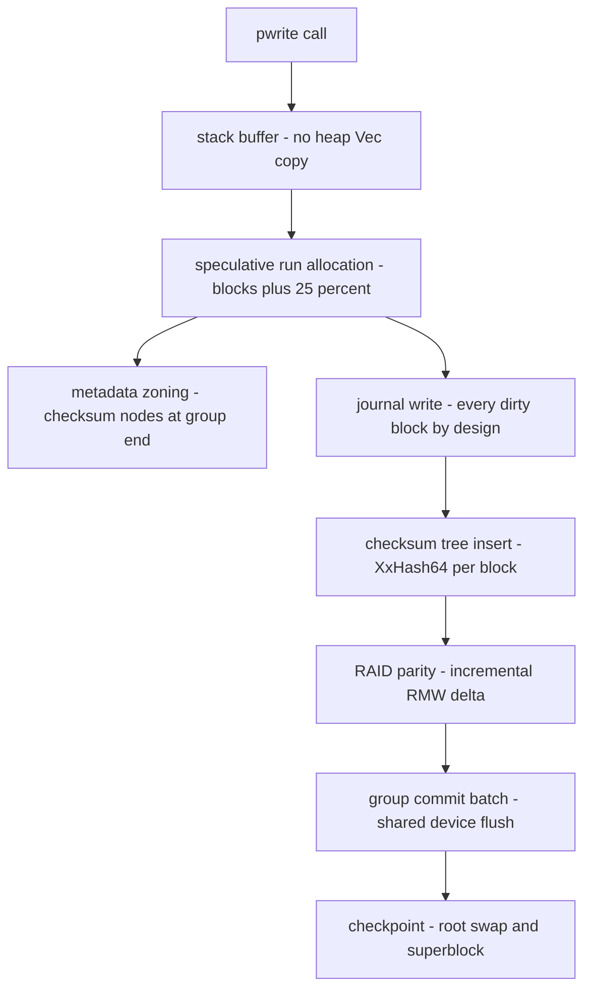

# LionFS Performance Notes

An earlier version of this document claimed "extreme throughput and
sub-millisecond latencies" from a laundry list of micro-optimizations
(lock-free transaction generations, RCU-style tree operations,
per-CPU allocator caches, cache-line-aligned nodes, SIMD/AVX-512
checksums, "less than 1% CPU overhead" integrity). **None of those
claims were measured**, several described code that does not do what
the prose said (there is no per-CPU allocator cache in the write path;
checksums are not SIMD-dispatched), and the document has been
rewritten. Measured numbers live in `docs/benchmarks.md`; this page
describes what the code actually does on the hot paths after the
Phase 0-5 performance work, with each claim traceable to a commit.

## What actually changed on the hot paths (measured)

**Buffer handling** (P1.1): the read/write paths no longer materialize
a heap `Vec` copy of every block. Reads copy from the stack buffer
straight into the caller's slice; holes need no copy at all (output is
pre-zeroed). Writes hand the stack buffer to the transaction layer
directly; the cipher path transfers ownership via
`TxContext::write_block_owned` instead of copying. Measured: ~3% on
sequential read/write.

**Allocation** (P1.2/P1.3): the bitmap scan starts at a persistent
frontier cursor (`TxContext::alloc_cursor`, porting
`allocator::allocator::BlockAllocator`'s `last_allocated` tracking into
the live path) instead of rescanning all used bits. Appends allocate
one speculative run per write call (`allocator::extents::size_for_request`
semantics: blocks-needed + 25%), marking only the blocks actually
written -- the unmarked tail is a best-effort reservation that the
next append picks up, so extents merge across calls. Metadata
(checksum-tree nodes, spill-tree nodes) allocates from the END of the
block group (`allocate_extents_meta`), growing downward, so metadata
allocations do not puncture sequential data runs. Measured: a fresh
32 MiB sequential file went from 8192 extent fragments to 8; reads
+18-21%.

**RAID parity** (P3): RAID5/6 writes update parity incrementally
(read old data + old parity, XOR the delta into P; for Q, scale the
delta by the column's GF(256) coefficient) instead of re-reading the
whole stripe row. The GF hot path uses a precomputed 256-byte
multiplication table per coefficient. Journal replay keeps the full
recompute (idempotency requirement). Measured: random-write commit
+71% (RAID5-6dev) / +62% (RAID6-6dev); see benchmarks.md.

**Compression** (P4): zstd at the 128 KiB cluster granularity with
variable-length physical extents -- compression actually saves space
(ratio 2.90x on a mixed corpus) instead of padding each compressed
block back to 4 KiB. Level is a mount option.

## 3.3: the measured cost of snapshot safety (metadata CoW)

CoW is not free, and 3.3 measured what it costs in this codebase
(`lfs_ioperf --snapshot-tax`, in-process harness, 2-vCPU container):

$$
T_{\text{first-pass}} = T_{\text{base}} + C_{\text{redirect}} + C_{\text{path-copy}},
\qquad T_{\text{steady}} = T_{\text{base}} + C_{\text{redirect}}
$$

| phase | MiB/s | tax vs base |
|---|---|---|
| fresh write, no snapshot | 178.5 | -- |
| first rewrite under snapshot | 163.0 | ~9% ($C_{\text{redirect}} + C_{\text{path-copy}}$, copies once per epoch) |
| steady rewrite under snapshot | 168.6 | ~6% ($C_{\text{redirect}}$ only) |

The metadata copy term is transient by construction: every node is
path-copied at most once per snapshot epoch (stamp above barrier), so
the first-pass tax decays into the steady tax. Snapshot creation:
0.14 ms for a 7-run 32 MiB file (O(extent runs) pin walk; the metadata
side is O(1) since the 3.2 deep-copy was removed).

SMP reads (same environment, `lfs_smpbench`): 1.26x at 2 jobs with the
shared node cache, 1.41x without it -- the cache is the contention
point; writes remain single-writer per mount (Phase 10).

## What is deliberately NOT claimed

- Readahead: the Markov predictor is wired but measured negative
  (-48%..-51% on reads in the in-process harness) and ships disabled
  by default. It is not listed as a working optimization.
- "Lock-free", "RCU", "SIMD/AVX-512", "per-CPU caches": none of these
  describe the current code. The transaction layer uses atomics for
  IDs; tree operations take no locks because the FUSE path is
  single-threaded per mount today, not because of lock-free design.
  Checksums (CRC32C, XxHash64, BLAKE3) use their crates' scalar paths.
- Any latency (P99/P999) numbers: no latency measurement exists in
  this repository.

## Where the remaining costs are

Measured, not guessed (see `docs/benchmarks.md` for methodology):
the checksum-tree insert is ~45% of write cost (per a
`--no-checksums` A/B); RAID6's Q-syndrome math is scalar GF(256) and
dominates RAID6 commit cost; the journal writes every dirty block
twice (journal + final location) by design for crash safety. These
are the honest starting points for future work.

## Hot-path flow (diagram)

The measured components in one graph -- every box is a claim from the
sections above, traceable to a commit:

## The cost model behind the numbers

Per-block write cost decomposes as

$$C_{\mathrm{write}} = C_{\mathrm{base}} + C_{\mathrm{csum}} + C_{\mathrm{parity}} + C_{\mathrm{journal}}$$

with the measured checksum share $C_{\mathrm{csum}} \approx 0.45\,C_{\mathrm{write}}$
(the `--no-checksums` A/B). The journal's cost is device bytes, not
CPU: every dirty block is written twice by design, a write
amplification of

$$A = \frac{W_{\mathrm{device}}}{W_{\mathrm{logical}}} = 2$$

before parity (RAID5 adds one parity block per $k$ data blocks) and
before compression (which divides physical bytes by the measured
ratio). The checksum share also bounds the payoff of any checksum
optimization: removing it entirely buys at most
$1/(1-0.45) \approx 1.8\times$, which is why the insert -- not the
copy paths P1.1 already fixed -- tops the remaining-cost list.

Queueing identities for the mounted system, stated as constraints
because they are not measured here: throughput is bounded by per-op
CPU cost $s$ and per-batch overhead $p$,

$$X \le \frac{1}{s + p}, \qquad X_N \le \frac{N}{Ns + p} = \frac{1}{s + p/N}$$

with $N$ the batch size, and Little's law ties queue depth to latency:

$$N_{\mathrm{inflight}} = X \cdot R$$

The amortization shape is visible in the one measured engine-level
figure: `lfs_engine` reports 707 MiB/s on 4 KiB writes with io_uring
(batched `io_uring_enter`, registered buffers) against a 115 MiB/s
threaded floor on the same host -- README and
`specifications/io_engine.md`; the shared 2-vCPU container bounds the
absolute values, the $\approx 6.1\times$ ratio is the $p/N$
signature.

## 3.4: The write path splits into intake and staging

Phase 10 splits what used to be one serialized operation into a
parallel intake (write-back page cache) and a serialized staging /
commit pipeline, behind a `&self` operations surface. The cost model
gains two terms instead of one. Intake cost per byte is a page copy
plus map operations (microseconds per 4 KiB, memory-bound), so its
throughput scales with threads up to memory bandwidth. Staging cost
per byte -- checksums, B-tree inserts, journal records, allocator --
is serialized under the staging lock, and each commit pays a fixed $C$
(journal write + two device syncs + apply). With fsync batch size $B$:

$$T_{\text{durable}} \approx \frac{B}{c_s B + C} = \frac{1}{c_s + C/B}$$

The 3.4 measurements pin the constants on this container: 512 MiB/s
durable at $B = 1$ MiB, which implies $c_s \approx 1.9\ \mu
s/\mathrm{KiB}$ of serialized staging plus $C/B \approx 2\ \mu
s/\mathrm{KiB}$ of commit overhead, consistent with the 3.1 harness
figure (832 MiB/s at the 4-MiB commit threshold -- the same pipeline
with $C/B$ halved). The group-commit wait makes $k$ concurrent
fsyncs behave as one $B' = kB$ batch:

$$T_{\text{group}}(k) \approx \frac{kB}{c_s kB + C} \xrightarrow{k \to \infty} \frac{1}{c_s}$$

which is why measured durable scaling is flat (0.98x at 2 jobs) rather
than negative: the serialized section does the necessary work exactly
once per batch. Buffered intake scaling follows the usual
lock-contention shape

$$S_{\text{intake}}(N) = \frac{N\,T_1}{T_1 + (N-1)\,\ell_{\text{map}}}$$

measured 1.41x at $N = 2$ on two vCPUs. The read path's lock-free
seqlock (readers retry only when a commit's apply window overlaps
their read) keeps the no-writer read path free of the staging lock
entirely: 1608 MiB/s aggregate at 2 jobs through the full vfs surface.
Design record with the lock-order discipline and the honest limits:
`specifications/phase10_write_concurrency.md`.

## 3.5: The commit pipeline and the snapshot creation constant

The 3.4 write path released the staging lock only after the whole
commit; 3.5 releases it after a microsecond quiesce. Three structural
results, measured (medians of 3, `benches/results/3.5/`):

1. **fsync latency stays at parity while the lock discipline changed.**
   Durable 1-job: 456 MiB/s vs 473 for the 3.4 architecture measured
   the same day (within run-to-run noise). The adaptive self-drive
   policy costs nothing; the final numbers include the
   commit-ordering fix that serializes commits fully (the honest cost
   of quiesce order == apply order — the bug it fixes is in the design
   record's hunt section).
2. **Staging and reading overlap a commit's I/O.** The quiesced group
   stays readable through pending overlays (`TxContext::read_block`),
   so the mount's other threads proceed while the journal + syncs +
   apply run. The money tests prove the semantics (pipelined
   durability across remount; no torn reads during concurrent
   pipeline writes); the buffered-intake scaling (1.38x at 2 jobs) is
   intact.
3. **Snapshot creation is O(1) total on checksummed images.** The
   birth generations recorded in the checksum tree replace the pin
   walk: creation 0.015 ms at 7 live extent runs (0.14 ms in 3.3 at
   the same shape), and the money test shows 200 extent runs costing
   ONE allocation. The trade: rewrites under a live snapshot pay one
   csum-tree lookup per overwritten block (first CoW pass 380 MiB/s,
   steady state 961 MiB/s vs 728 base in that run — a ~15% steady
   tax, zero tax with no snapshots).
