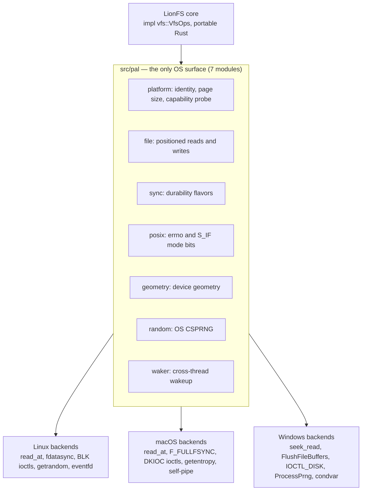
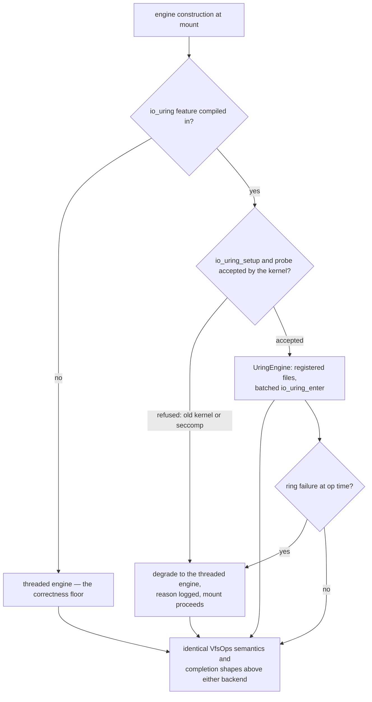
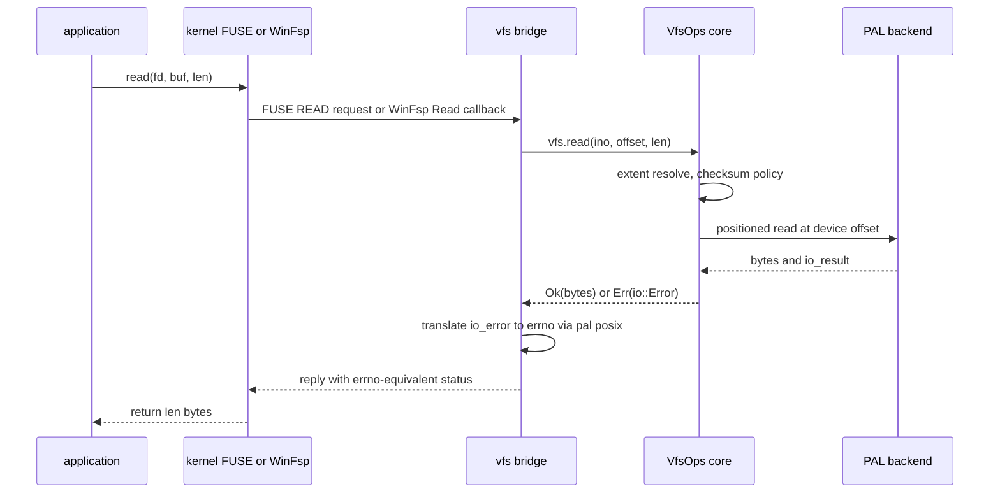

# LFS-RFC-003: LionFS Cross-Platform Extension (Linux, macOS, Windows)

| | |
|---|---|
| Status | Proposed |
| Document ID | LFS-RFC-003 |
| Author | LionFS Engineering |
| Date | September 2026 |
| Builds on | LFS-RFC-002 (LionFS 2.0 Architecture) |

> This RFC extends the 2.0 architecture with a platform strategy:
> one code base, three operating systems, no semantic forks. It is
> implemented in the current tree: `src/pal/` (platform abstraction
> layer), `src/vfs/` (platform-neutral operations surface + FUSE
> bridge), and the platform-scoped dependency sets in `Cargo.toml`.

## 1. Problem statement

RFC-002 assumed Linux: fuser round-trips, `fdatasync`, Linux ioctls,
`/dev/urandom`. Every one of those is a portability fault line. The
1.x code imported `std::os::unix::fs::FileExt` in the block layer,
`libc::S_IFDIR` in the inode layer, and `fuser` types through the
metadata core — meaning the *entire engine* failed to compile anywhere
but Linux. "Port later" is how filesystems die on the second platform:
the port becomes a semantic fork, and the fork drifts.

## 2. Design rules

1. **One semantics, many substrates.** Every platform must run the
   same operations surface (`vfs::VfsOps`) with the same observable
   behavior — identical errno mapping, identical durability contracts,
   identical crash-recovery invariants. A bug that only reproduces on
   one OS is a PAL bug, not a feature.
2. **The PAL is the only OS surface.** All platform conditionals live
   in `src/pal/` (plus the mount bridges at the `vfs` boundary). The
   rule is enforced by convention and review: no
   `#[cfg(target_os = ...)]` in the core, no `libc::` outside the PAL
   and unix bridges.
3. **The threaded engine is the correctness floor.** Any fast path
   (io_uring now; IOCP, WinFsp later) degrades to the floor at build
   time, setup time, or op time — with a logged reason, never a
   silently wrong result and never a failed mount.
4. **Windows pulls zero external crates.** The Windows PAL uses raw
   `extern "system"` FFI against `kernel32`/`bcryptprimitives`, so a
   stock Windows host with only the Rust toolchain builds the full
   engine. (This is also why `libc` is unix-scoped and `fuser` is
   unix-scoped in `Cargo.toml`.)
5. **Honesty over emulation.** Where a platform lacks a primitive
   (macOS has no `fdatasync`; Windows has no `eventfd`), the PAL uses
   the *closest documented equivalent* and says so in its docs — or
   fails. It never silently downgrades durability.

Rule 1 as a predicate — the portability contract this RFC answers to:

$$\forall\, o \in \mathcal{O},\ \forall\, p_1, p_2 \in \mathcal{P}: \quad \mathrm{obs}(o, p_1) = \mathrm{obs}(o, p_2)$$

where $\mathrm{obs}$ covers errno mapping, durability contract, and crash-recovery invariant; any divergence is a PAL bug by rule 1's definition.

## 3. The platform abstraction layer (`src/pal/`)

| Module | Abstracts | Backends |
|---|---|---|
| `platform` | OS identity, page size, CPU count, capability probe | compile target + runtime |
| `file` | positioned reads/writes on device handles | `read_at`/`write_at` (unix); `seek_read`/`seek_write` (Windows) |
| `sync` | durability flavors | `fdatasync` (Linux); `F_FULLFSYNC`→`fsync` fallback (macOS); `FlushFileBuffers` (Windows) |
| `posix` | errno + `S_IF*` mode bits | fixed Linux-ABI values (the FUSE wire ABI) |
| `geometry` | device geometry | Linux `BLK*` ioctls incl. physical sector + optimal I/O; macOS `DKIOC*`; Windows `IOCTL_DISK_GET_LENGTH_INFO`; stat fallback |
| `random` | OS CSPRNG | `getrandom` (glibc/musl) / `getentropy` (macOS, BSD) / `ProcessPrng`→`RtlGenRandom` (Windows) |
| `waker` | cross-thread wakeup | `eventfd` (Linux); self-pipe (macOS/BSD); condvar+generation (Windows) |

The PAL as the single OS surface — one portable core above three backend sets:



Durability deserves the emphasis: on APFS, plain `fsync` does **not**
guarantee persistence to the SSD — only `F_FULLFSYNC` does — so the
macOS `sync_data` is the expensive-but-real barrier. The intent
journal's crash-consistency model (RFC-002 §5.1) is only valid because
the PAL makes this trade per platform *visibly*.

The crash-consistency ordering of RFC-002 §5.1 holds on every platform because the PAL barrier is the platform's real one:

$$\mathrm{intent} \prec \mathrm{barrier}_{\mathrm{PAL}} \prec \mathrm{data} \prec \mathrm{commit}, \qquad \mathrm{barrier}_{\mathrm{PAL}} \in \{\texttt{fdatasync},\ \texttt{F\_FULLFSYNC},\ \texttt{FlushFileBuffers}\}$$

and the backend coverage of the seven PAL modules as a fraction — $b_m$ implemented backend slots against $B_m$ specified:

$$C_{\mathrm{PAL}} = \frac{1}{|\mathcal{M}|} \sum_{m \in \mathcal{M}} \frac{b_m}{B_m} = 1 \ \text{in the current tree}$$

The pending fast paths (WinFsp bridge, IOCP, kqueue) sit above the PAL in the `vfs` and engine layers and do not change $C_{\mathrm{PAL}}$.

## 4. I/O engine per platform (extends RFC-002 Pillar I)

- **Linux**: `UringEngine` (feature `io_uring`): real ring, registered
  files, batched `io_uring_enter`, kernel-side blocking waits. Falls
  back to the threaded engine when the kernel refuses
  `io_uring_setup`/probe (old kernels, seccomp-confined containers) —
  the fallback is logged, not silent.
- **macOS**: the threaded engine today. `kqueue`-integrated submission
  is a future fast path; the `pal::waker` self-pipe is already
  kqueue-compatible.
- **Windows**: the threaded engine today; the IOCP design maps
  cleanly: the engine's inbox/outbox MPMC structure is already the
  IOCP completion-port shape (one deque thread, `GetQueuedCompletionStatus`
  replacing `submit_and_wait`). Deliberately not rushed: the threaded
  floor must soak on Windows first (rule 3).

Engine selection and degradation to the floor — rule 3's three moments (build time, setup time, op time):



## 5. The VFS bridge architecture

The 1.x `impl fuser::Filesystem for LionFS` welded the engine to
FUSE. The 2.0 shape:

```text
             ┌─────────────────────────────┐
             │   LionFS core (portable)    │
             │   impl vfs::VfsOps          │  ← one semantics
             └──────────────┬──────────────┘
        ┌───────────────────┼───────────────────┐
   unix │            macOS  │             win32 │
┌───────▼──────┐  ┌─────────▼────────┐  ┌───────▼────────┐
│ fuse_bridge   │  │ fuse_bridge       │  │ winfsp_bridge  │
│ (fuser 0.12,  │  │ (fuser + macFUSE) │  │ (RFC-003 §5;   │
│  kernel FUSE) │  │                   │  │  design below) │
└──────────────┘  └───────────────────┘  └────────────────┘
```

The port was 1:1: every method body of the 1.x FUSE impl moved to
`fs::vfs_impl` with `reply.*` callbacks becoming `Result` returns and
`libc` constants becoming `pal::posix` constants. The FUSE bridge
(`vfs::fuse_bridge`) is a pure translation layer, so semantics cannot
drift between platforms.

**Windows/WinFsp plan (the remaining deliverable):** `VfsOps` maps
directly onto `FSP_FILE_SYSTEM_INTERFACE`: `GetSecurityByName`→`lookup`
(+ `access`), `Create`→`create`/`mkdir`, `Read`/`Write`→`read`/`write`,
`GetFileInfo`/`SetBasicInfo`→`getattr`/`setattr`, `Cleanup`→`unlink` on
DELETE_ON_CLOSE, `Rename`→`rename`, `Flush`→`fsync`. The errno map is
already in place (`pal::posix::io_error_to_errno` handles the Win32
error-code direction). The bridge is a new file at the `vfs` boundary —
the core does not change. That is the entire point of the shape.

One request through either bridge — the FUSE and WinFsp shapes of the same VfsOps call:



The bridge cost model — the 1.x entry cost stays visible while the translation itself remains pure userspace work:

$$t_{\mathrm{op}}^{\mathrm{FUSE}} = 2\,t_{\mathrm{ctx}} + 2\,t_{\mathrm{copy}}(S) + t_{\mathrm{core}}, \qquad t_{\mathrm{copy}}(S) = \frac{S}{\mathrm{BW}_{\mathrm{mem}}}$$

$$t_{\mathrm{bridge}} = t_{\mathrm{unmarshal}} + t_{\mathrm{errno}} = O(1)\ \text{CPU work, no syscalls}$$

On Linux the io_uring front door of RFC-002 §3.1 removes the $t_{\mathrm{ctx}}$ and $t_{\mathrm{copy}}$ terms; on macOS and Windows they remain until the kqueue and IOCP backends land, and the threaded floor pays them on every platform.

## 6. Cargo topology

```toml
[target.'cfg(unix)'.dependencies]
fuser = "0.12"          # FUSE mounting (Linux + macOS/macFUSE)
libc  = "0.2"

[target.'cfg(target_os = "linux")'.dependencies]
io-uring = { version = "0.7", optional = true }

[features]
io_uring = ["dep:io-uring"]
```

No unconditional platform dependency exists. The default build is
portable everywhere; Linux users opt into the ring with
`--features io_uring`.

## 7. Testing strategy

- **Same suite, three OSes**: `cargo test` is green on
  ubuntu-latest/macos-latest/windows-latest in CI (the matrix in
  `.github/workflows/ci.yml`). 462 unit/property tests, all of them
  platform-agnostic.
- **PAL self-test**: `lfs_palinfo` exercises positioned I/O, both sync
  flavors, and the CSPRNG on the live host — a capability report that
  *proves* the primitives, not just lists them.
- **Engine parity tests**: the same op sequences run against whichever
  backend the host has (the uring roundtrip test self-skips where the
  kernel refuses the ring, and asserts identical completion shapes,
  including EOF-as-error and zone-append placed offsets, where it
  runs).
- **Degradation drills**: the CI matrix includes a
  `--no-default-features`-style run (threaded only) and a feature run
  (io_uring) so the fallback path stays exercised, not vestigial.

The parity contract as a divergence count over the shared op sequence $\mathcal{S}$:

$$d_{\mathrm{parity}} = \sum_{o \in \mathcal{S}} \mathbf{1}\!\left[\mathrm{cplt}_{\mathrm{fast}}(o) \neq \mathrm{cplt}_{\mathrm{floor}}(o)\right] = 0$$

— including EOF-as-error and zone-append placed offsets, wherever the fast backend runs.

## 8. Trade-offs, stated

| Tension | Decision | Residual risk |
|---|---|---|
| One code base vs. per-platform tuning | One base + PAL seams | The fast paths lag on macOS/Windows until their backends land |
| F_FULLFSYNC cost on macOS | Pay it (durability is load-bearing) | fsync-heavy workloads are slower on macOS than Linux by the flush cost — measured, not hidden |
| Windows zero-crate rule | Raw FFI in the PAL | FFI surface must be reviewed like unsafe code (SAFETY comments are mandatory) |
| io_uring opt-in vs. default-on | Opt-in (shared-host kernel politics: containers, seccomp, CVE-adjacent restrictions) | Users must pass `--features io_uring` to get the fast path |
| Seek-based positioned I/O on Windows | Per-handle single-issuer discipline (engine shards own handles) | The discipline is documented; violating it is a bug, not a surprise |

The macOS flush trade, priced as a throughput ratio:

$$\frac{\mathrm{IOPS}_{\mathrm{fsync}}^{\mathrm{macOS}}}{\mathrm{IOPS}_{\mathrm{fsync}}^{\mathrm{Linux}}} = \frac{t_{\mathrm{data}} + t_{\mathrm{fdatasync}}}{t_{\mathrm{data}} + t_{\mathrm{F\_FULLFSYNC}}} \le 1$$

Group commit divides the barrier term by the batch size on both platforms (RFC-002 §9.4), so the residual gap is the flush-cost difference itself — measured, not hidden.

## 9. Deliverables checklist

- [x] `src/pal/` with the seven modules, all backends, all tested
- [x] `src/vfs/` `VfsOps` + FUSE bridge (Linux/macOS mounting works)
- [x] Core free of `libc`/fuser/unix imports (enforced by convention + grep in CI)
- [x] io_uring backend with graceful fallback, measured live
- [x] Threaded floor on all three OSes (CI matrix)
- [x] `lfs_palinfo` capability prober + PAL self-test
- [ ] WinFsp bridge (Windows mounting) — design in §5, binding pending
- [ ] IOCP submission backend for Windows
- [ ] macOS kqueue submission backend
