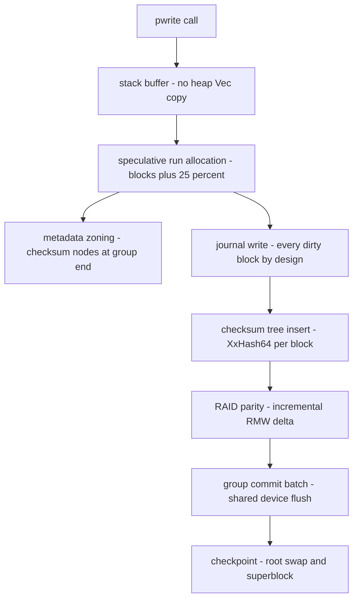

# LionFS Performance (At a Glance)

This card is the one-page summary; the canonical document, with every
claim traceable to a commit, is [`docs/performance.md`](docs/performance.md).

An earlier revision of this file claimed "extreme throughput and
sub-millisecond latencies" from micro-optimizations that were never
measured -- and several of which described code that does not do what
the prose said (there is no per-CPU allocator cache in the write path;
checksums are not SIMD-dispatched). That prose has been rewritten.
Measured numbers live in [`docs/benchmarks.md`](docs/benchmarks.md).

## What actually changed on the hot paths (measured)

| change | phase | measured effect |
|---|---|---|
| zero-copy block paths (no heap `Vec` per block) | P1.1 | ~3% on sequential read/write |
| B-tree fast-append cache + dirty-node CRC skip | 3.2 | seq writes +21-33% (cross-session, directional — see docs/benchmarks.md) |
| GF(256) cached 256x256 table set + 8-way unroll | 3.2 | removes per-call 256-mult table rebuilds on the RAID6 parity path |
| frontier cursor + speculative run sizing + metadata zoning | P1.2/P1.3 | fragments 8192 -> 8; reads +18-21% |
| incremental RMW parity + GF(256) table | P3 | commit +71% RAID5 / +62% RAID6 |
| zstd at 128 KiB cluster granularity | P4 | ratio 2.90x, variable-length extents |
| Markov read-ahead | P1.4 | negative (-48%..-51%); ships OFF |
| metadata path-copy CoW (snapshots) | 3.3 | snapshot write tax: ~9% first pass / ~6% steady; creation 0.14 ms (O(1) metadata) |
| SMP read scaling (lfs_smpbench) | 3.3 | 1.26x at 2 jobs (shared cache); 1.41x without |

## What is deliberately NOT claimed

Lock-free, RCU, SIMD/AVX-512, per-CPU caches: none of these describe
the current code. No latency (P99/P999) numbers exist in this
repository. The tree operations take no locks because the FUSE path is
single-threaded per mount today -- not because of lock-free design.
Writes are single-writer per mount; only the READ path has measured
multi-core scaling. Snapshot creation is O(1) in metadata but still
O(extent runs) in data (no per-extent birth stamps -- format v3).

## Hot-path flow (diagram)

Every box below is one of the measured components above:

## The cost model behind the numbers

Per-block write cost decomposes as

$$C_{\mathrm{write}} = C_{\mathrm{base}} + C_{\mathrm{csum}} + C_{\mathrm{parity}} + C_{\mathrm{journal}}$$

with the measured checksum share $C_{\mathrm{csum}} \approx 0.45\,C_{\mathrm{write}}$
(the `--no-checksums` A/B). The journal's cost is device bytes, not
CPU: every dirty block is written twice by design, a write
amplification of

$$A = \frac{W_{\mathrm{device}}}{W_{\mathrm{logical}}} = 2$$

before parity and before compression. The checksum share also bounds
the payoff of any checksum optimization: removing it entirely buys at
most $1/(1-0.45) \approx 1.8\times$, which is why the insert -- not
the copy paths P1.1 already fixed -- tops the remaining-cost list.

The one measured engine-level figure: `lfs_engine` reports 707 MiB/s
on 4 KiB writes with io_uring against a 115 MiB/s threaded floor on
the same host,

$$\frac{X_{\mathrm{ring}}}{X_{\mathrm{threaded}}} = \frac{707}{115} \approx 6.1\times$$

The shared 2-vCPU container bounds the absolute values; the ratio is
the $p/N$ amortization signature from the batch bound
$X \le 1/(s + p/N)$ (see [`docs/benchmarks.md`](docs/benchmarks.md)).

## 3.4 — write-path cost split: intake vs staging

$$T_{\text{durable}} \approx \frac{1}{c_s + C/B} \qquad
S_{\text{intake}}(N) = \frac{N\,T_1}{T_1 + (N-1)\,\ell_{\text{map}}}$$

Phase 10 splits the old single serialized write into a memory-bound
parallel intake (page cache, per-inode gates) and a staging-bound
serialized pipeline (B-trees + allocator + journal, $c_s \approx
1.9\,\mu s/\mathrm{KiB}$ measured) with fixed commit cost $C$ shared
by group commit. Measured consequences: buffered intake 1.41x at 2
jobs (4.3 GiB/s aggregate), durable writes flat at ~510 MiB/s (the
serialized section does its work exactly once per batch -- honest, not
a regression), vfs reads 1.11x lock-free (seqlock protects the commit
apply window). Full model and lock-order discipline:
`specifications/phase10_write_concurrency.md`.
