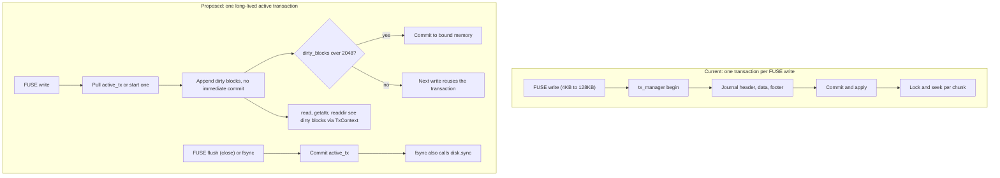
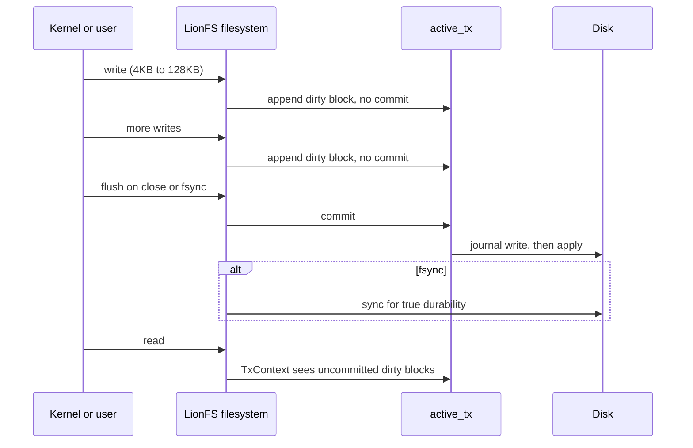

# Implementation Plan: FUSE Write Buffering and Transaction Batching

The current low write speed (~475 KB/s) is caused by the FUSE layer creating and committing a completely separate storage transaction for every single FUSE `write()` call (which are typically 4KB-128KB each). This results in extreme write amplification (journal headers, data blocks, footer) and high latency due to locking and file-seeking for every chunk of a larger file.

## Why batching helps, in numbers

The per-call cost is fixed: every `write()` pays a journal header, a
commit, and a footer. For a client write of $w$ bytes with
per-transaction overhead $h$,

$$\mathrm{WAF}(w) = \frac{w + h}{w} = 1 + \frac{h}{w}$$

which is worst exactly where FUSE hurts most: small $w$ (4 KiB
calls). Batching does not reduce $h$; it divides the number of times
$h$ is paid. With the dirty-block threshold at $n_{\max} = 2048$
blocks the commit fires at most

$$\left\lceil \frac{n}{n_{\max}} \right\rceil \ \text{times instead of} \ n$$

and since $2048 \times 4096 = 2^{23}\ \mathrm{B} = 8\ \mathrm{MiB}$, memory stays
bounded while the fixed cost amortizes across up to 2048 writes. The
amortization ceiling for the per-write fixed cost $c$ is

$$\frac{T_{\mathrm{old}}(n)}{T_{\mathrm{new}}(n)} = \frac{n\,(t_{\mathrm{io}} + c)}{n\,t_{\mathrm{io}} + \lceil n/2048 \rceil\, c} \to 1 + \frac{c}{t_{\mathrm{io}}} \quad \text{as } n \to \infty$$

Current versus proposed path:

## Proposed Changes

We will modify `src/fs/filesystem.rs` to maintain an active, long-lived transaction for data modifications.

### `LionFS` Struct
- [MODIFY] `src/fs/filesystem.rs`
  - Add `active_tx: Option<Transaction>` to the `LionFS` struct.
  - Implement a helper method to return the active transaction or start a new one.

### `write` Method
- [MODIFY] `src/fs/filesystem.rs`
  - Instead of calling `tx_manager.begin()` and `commit()` on every `write`, `write` will pull the `active_tx`.
  - It will add dirty blocks to the transaction but will NOT commit it immediately.
  - If `active_tx.dirty_blocks.len()` exceeds a threshold (e.g., 2048 blocks / 8MB), we commit it to prevent unbounded memory usage.

### `flush` and `fsync` Methods
- [MODIFY] `src/fs/filesystem.rs`
  - Implement FUSE `flush` and `fsync` methods.
  - When the OS explicitly flushes the file descriptor (on close) or syncs, we commit `active_tx` to disk.
  - For `fsync`, we also call `self.disk.sync()` to ensure true durability.

### Read Operations
- [MODIFY] `src/fs/filesystem.rs`
  - Update `read`, `getattr`, `readdir` to pass `active_tx` (if any) to `TxContext::new` so that reads can see uncommitted dirty blocks instead of falling back to disk.

## Durability semantics as a sequence

The threshold guard commits early when the buffered window would
exceed 2048 blocks, so dirty state never grows past 8 MiB.
