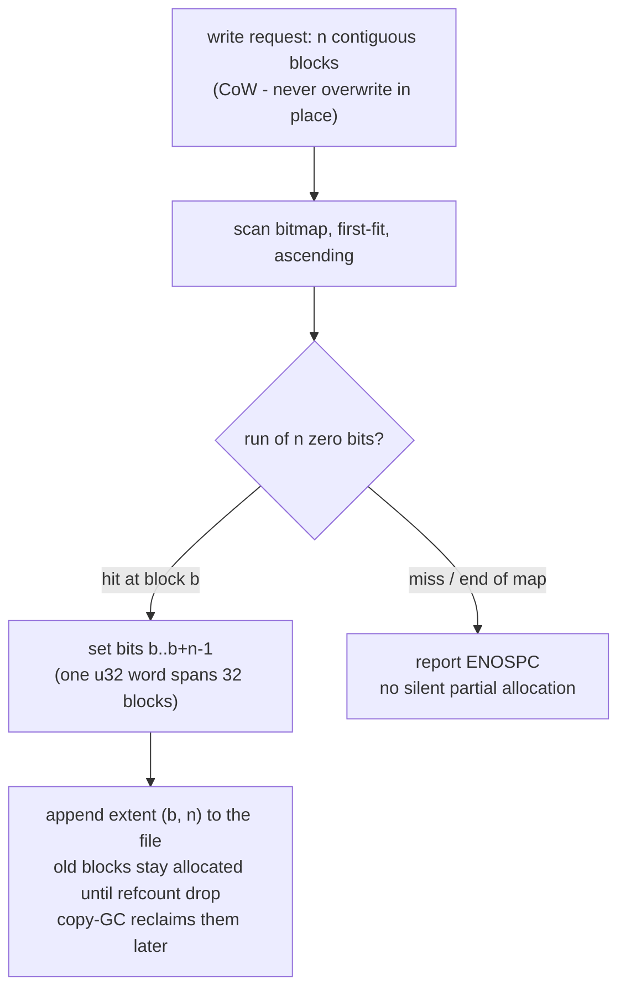

# Allocator Specification

LionFS utilizes a **bitmap-based block allocator**.

## Design
- 1 bit represents 1 block (4096 bytes).
- `0` means free, `1` means allocated.
- A 4096-byte bitmap block can track 32,768 data blocks (134 MB).
- The allocator uses first-fit, contiguous scanning to fulfill extent requests, drastically reducing fragmentation compared to random allocation schemas.

## Allocation flow (CoW)

## Bitmap math

One bit tracks one 4096-byte block, so bitmap overhead is a fixed
fraction of the volume:

$$\frac{1}{8 \times 4096} = 3.05 \times 10^{-5} \approx 0.003\%$$

A 4096-byte bitmap block tracks $4096 \times 8 = 32{,}768$ data
blocks:

$$32{,}768 \times 4096\ \mathrm{B} = 2^{27}\ \mathrm{B} = 134{,}217{,}728\ \mathrm{B} \approx 134\ \mathrm{MB}$$

and a full TiB of data costs $2^{40}/2^{15} = 2^{25}$ bits
$= 32\ \mathrm{MiB}$ of bitmap.

## First-fit bound

Address-ordered first-fit (the ascending scan above) satisfies a
request of $n$ blocks whenever total free space
$F_{\mathrm{total}} \ge 2n$ (Knuth's 50% rule):

$$\text{allocatable} \iff F_{\mathrm{total}} \ge 2n \qquad (\text{worst-case fragmentation} \le 50\%)$$

which is the precise form of the fragmentation claim above: external
fragmentation can strand at most half the free pool.
