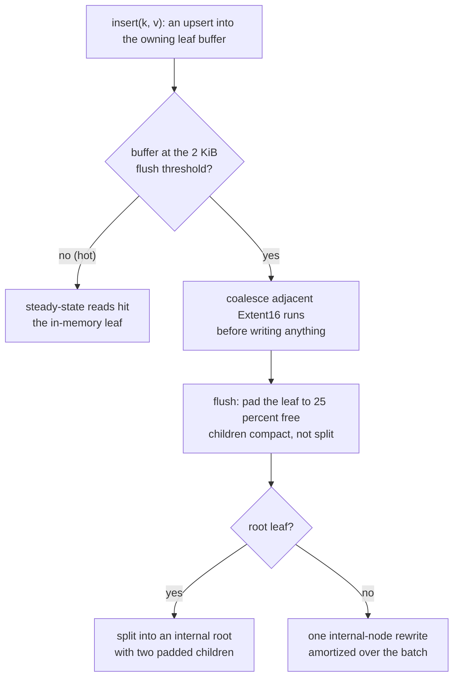
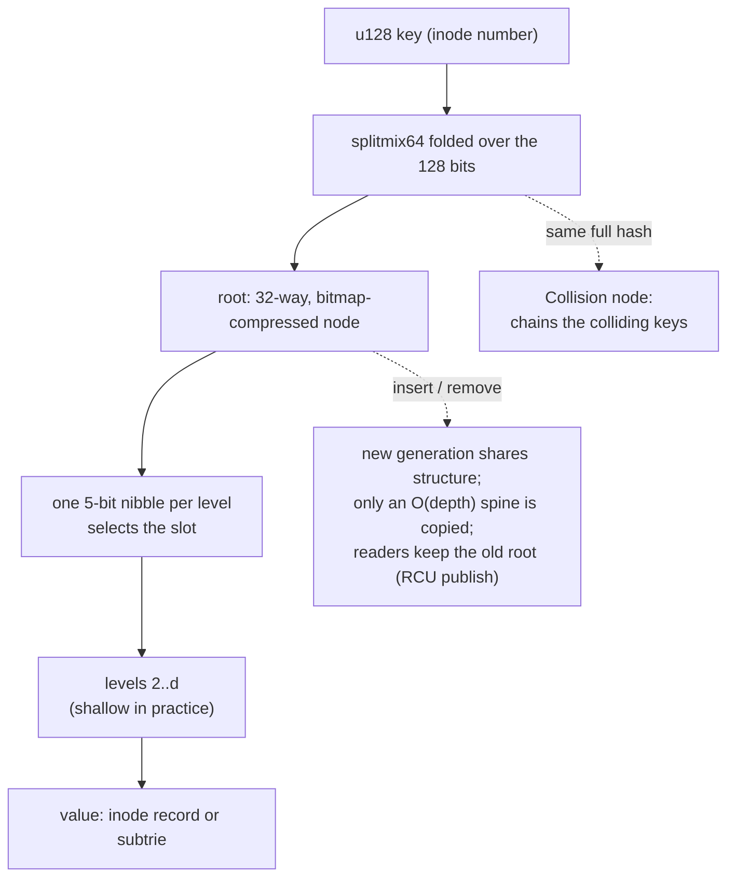

# Specification: B-epsilon Tree & HAMT (LionFS 2.0, Pillar II)

Status: implemented (`src/beepsilon/`, `src/hamt/`) | RFC: LFS-RFC-002 §4.3

## The B-epsilon tree (`src/beepsilon/`)

Write-optimized index (Bender et al.): internal nodes have large
fanout, leaves are oversized buffers that absorb writes and flush
lazily. For a filesystem this shape fits the workload precisely:

- allocations and truncations are **leaf appends** that amortize one
  internal-node rewrite across hundreds of mutations;
- steady-state reads hit the in-memory hot leaf (one comparison per
  level);
- leaves pad to 25% free space on flush, so hot files do not re-split;
- the flusher coalesces adjacent extents before writing.

Write and read paths:



Amortized insert cost (Bender et al.):
$O\!\left(\frac{\log N}{\epsilon \log B}\right)$ — or
$O(\frac{\log N}{\epsilon})$ with node size $B$ fixed by the leaf
capacity — against a B-tree's $O(\log N)$ per insert. The padding
factor sets the leaf-path write amplification, and the flush
threshold sets the amortization batch:

$$u = \frac{\text{live}}{\text{live} + \text{pad}} = 0.75, \qquad \mathrm{WA} = \frac{1}{u} = \frac{4}{3}, \qquad n_{\text{appends/flush}} \approx \frac{2048\ \mathrm{B}}{16\ \mathrm{B}} = 128$$

### Structure

```rust
BEpsilonTree<K, V> {
    root: Node<K, V>,          // Leaf | Internal
    config: BEpsilonConfig {   // flush_bytes: 2048 (RFC §4.2's 2 KiB
                               //   leaf threshold), padding_frac_256: 64 (25%)
    },
    stats: TreeStats,          // inserts, leaf_flushes, node_splits,
                               //   coalesced_entries
}
```

- `insert` is an upsert into the owning leaf's buffer; the root leaf
  splits into an internal root with two padded children at the flush
  threshold; child leaves compact (retain 25%) rather than split.
- `range(lo, hi)` serves sorted-run scans (the reason ranges stay in
  B-epsilon trees rather than HAMTs).
- `coalesce_run(run, mergeable)` is the standalone,
  property-testable merge pass: it coalesces `Extent16` runs using
  `coalescable_with` — the second half of the 8192-to-8 fragment
  story.

### Tuning

`BEpsilonConfig` is a benchmark surface (`benches/beepsilon_bench.rs`
sweeps sequential vs. shuffled inserts and lookup hit rates) — the
flush threshold is found by measurement, not by taste.

## The HAMT (`src/hamt/`)

The inode-number space (RFC-002: "the HAMT is the inode-number
space"). A **persistent** Bagwell hash trie over `u128` keys:

- 32-way branching, 5-bit nibbles per level, bitmap-compressed nodes;
- full-hash collisions chain in `Collision` nodes;
- `insert`/`remove` return new generations sharing structure with the
  old (O(depth) spine copy, ~26 levels worst case, shallow in
  practice) — the RCU publish step consumes exactly this: readers keep
  walking the old generation while a new root is published;
- hash mixing: splitmix64 folded over the 128-bit key (the same
  audited mixer the shard router uses).

Properties tested: persistence (old generations immutable), upsert
replaces, large-population roundtrips (100k keys), remove persists +
collapses branches, depth stays shallow (<8 for 100k keys), full-hash
collision chains, structural-sharing sanity.

Lookup shape:



Expected depth is logarithmic in the branching factor:

$$d = \lceil \log_{32} N \rceil, \qquad \log_{32}(10^5) \approx 3.33 \Rightarrow d = 4 \;\; (\text{tested bound: } d < 8)$$

while exhausting the full key takes $\lceil 128/5 \rceil = 26$
levels (the "~26 levels worst case" above). Persistence costs one
spine copy per mutation:

$$\text{copied nodes} \le d \approx \lceil \log_{32} N \rceil$$
