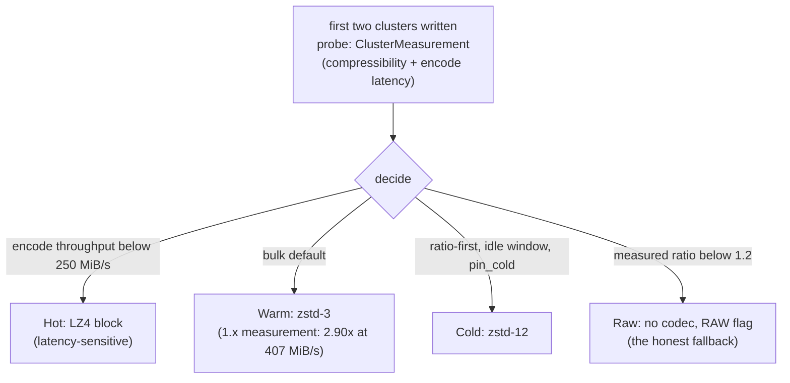

# Compression Specification

*This specification is planned for a future Phase of LionFS.*

## Codec tier policy (planned surface)

The implemented machinery is specified in
[`compression_pipeline.md`](compression_pipeline.md); this page will
codify the codec-level policy. The decision the engine makes per file:

## Ratio math

With compression ratio $\rho = s_{\mathrm{orig}} / s_{\mathrm{comp}}$,
per-file savings are:

$$\Delta = \left(1 - \frac{1}{\rho}\right) s_{\mathrm{orig}}$$

Over a workload of $n$ written bytes, fraction $p$ compressible at
mean ratio $\bar\rho$, the expected bytes saved:

$$E = p \left(1 - \frac{1}{\bar\rho}\right) n$$

The raw fallback fires when $\rho < 1.2$ — forgone saving at most
$1 - 1/1.2 \approx 16.7\%$, below which codec CPU and RMW
amplification cost more than the space.