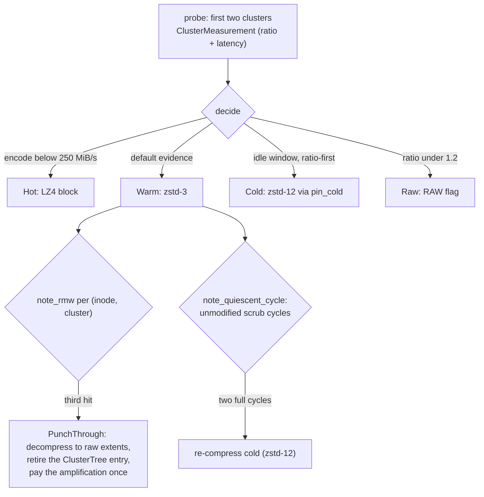
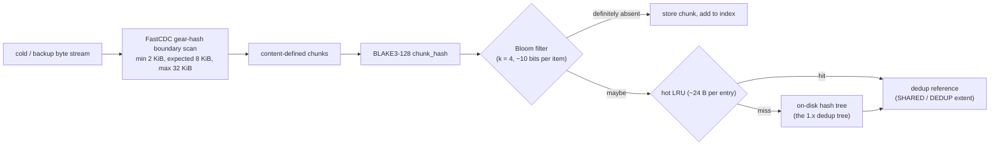

# Specification: Compression & Deduplication Pipeline (LionFS 2.0, Pillar V)

Status: implemented (`src/pipeline/`) | RFC: LFS-RFC-002 §7

## Tiered adaptive compression (`tiers.rs`)

Per-inode tiering on the 1.x 128 KiB cluster substrate:

| Tier | Codec | Trigger |
|---|---|---|
| Hot | LZ4 block | measured encode throughput below 250 MiB/s (latency-sensitive) |
| Warm | zstd-3 | the bulk default (the 1.x measurement: 2.90x at 407 MiB/s) |
| Cold | zstd-12 | ratio-first, paid in idle windows; entered via `pin_cold` |
| Raw | none | measured ratio < 1.2 (the honest fallback, RAW flag) |

The **probe protocol**: the first two clusters written measure
compressibility and latency (`ClusterMeasurement`); the engine then
pins the file's tier (`decide` → `Probe` until evidence exists).
Counters per tier plus recompressions-to-cold are health-bus visible.

Tier selection and the punch-through escape as one control flow:

Punch-through break-even: one random 4 KiB write into a compressed
128 KiB cluster costs decompress + splice + recompress — call it
$D + S + C$; the third-hit rule bounds total amplification at:

$$A_{\text{total}} \le 3\,(D + S + C) + W_{\text{raw}}$$

instead of unbounded per-write rewrites ($W_{\text{raw}}$ = the
subsequent raw-path writes at 1:1).

## Punch-through escape (`punch.rs`)

The worst 1.x behavior — random 4 KiB writes into compressed clusters
costing full 128 KiB decompress-splice-recompress — is bounded:

- `note_rmw` counts RMWs per (inode, cluster); the **third** hit
  returns `PunchThrough` — decompress to raw extents, retire the
  ClusterTree entry, pay the amplification once.
- `note_quiescent_cycle` tracks unmodified scrub cycles; two full
  cycles trigger cold re-compression (the reverse transition).
- RMW activity consumes on observation (one observed activity resets
  once, not forever).

## FastCDC chunking (`fastcdc.rs`)

Content-defined chunking for cold/backup dedup pools:

- Gear-hash boundary scan, two guard masks derived from
  `ceil(log2(avg-min))`; deterministic 256-entry gear table (splitmix64
  stream) so all instances cut identically.
- Defaults: min 2 KiB, expected 8 KiB, max 32 KiB (RFC §7.2).
- Tested properties: chunks tile the input exactly; bounds respected
  (final tail may be short); mean chunk size in family; **insertion
  shifts boundaries only locally** (prefix cut points identical before
  an edit, bounded divergence after); identical payload cuts
  converge regardless of placement.

The guard masks encode the cut probability directly (avg 8 KiB,
min 2 KiB):

$$p_{\mathrm{cut}} = 2^{-\lceil \log_2(\mathrm{avg} - \min) \rceil} = 2^{-13}, \qquad \mathbb{E}[\text{chunk size}] = \frac{1}{p_{\mathrm{cut}}} = 8\ \mathrm{KiB}$$

## Three-level dedup index (`dedup.rs`)

1. **Bloom filter** over the pool (~1% FP at k=4, ~10 bits/item,
   atomic words): definitely-absent answers are free.
2. **Hot LRU** (bounded, ~24 B/entry): the common duplicate hits RAM.
3. **On-disk hash tree** (the 1.x dedup tree): consulted only on
   "maybe" — the cost the RFC prices in Table 19.

`sized_for_pool(pool_bytes)` implements the explicit 0.1%-of-pool RAM
budget (bloom 2:1 LRU split). `chunk_hash` is BLAKE3-128. Counters:
hot hits, bloom maybes (hash-tree walks), misses.

The chunk pipeline end to end:

Bloom false positives at the stated configuration:

$$P_{\mathrm{FP}} \approx \left(1 - e^{-kn/m}\right)^{k} \approx 1.2\% \quad (k = 4,\ m/n = 10\ \text{bits})$$

— the "~1%" of maybe answers that pay a hash-tree walk. The RAM
budget is explicit and closed-form:

$$m + 24\,\left|\mathrm{LRU}\right| = 10^{-3} \cdot \mathrm{pool\_bytes} \qquad (\text{bloom : LRU} = 2 : 1)$$

## Accelerator selection (`offload.rs`)

Per-submission backend choice among QAT / SIMD / software:

- QAT wins when the device is present, its queue is under the depth
  floor (64), and the payload clears the 16 KiB amortization floor;
  rejections are **counted** (`qat_available_but_rejected`) so
  "available" stays honest.
- SIMD beats scalar when the kernels exist (CPUID-probed).
- Software is the always-correct floor.

The honesty rule (§7.3) applies to offload numbers specifically:
QAT-assisted throughput must be reported per backend, per queue depth,
against the software path on the same host in the same run.
