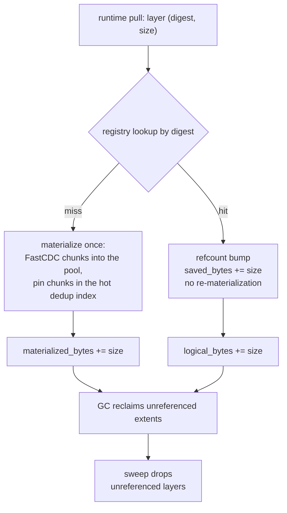
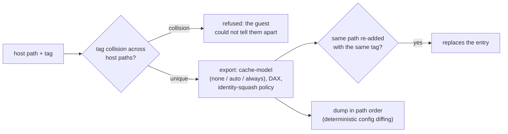

# Specification: Container & VM Awareness (LionFS 3.0)

Status: implemented (`src/container/`) | RFC: LFS-RFC-004 §10

## Layer CAS (`layers.rs`)

Container image layers are the dedup jackpot: a 50-container host
runs one copy of the base layer. Layers register by content digest
(opaque 32 bytes; runtimes pass sha256); re-pulls are refcount
bumps, not re-materializations (`saved_bytes` accounting). New
layers **pin their chunks in the hot dedup index** so sharing
actually hits — cold-index chunks miss on pull. Extent sharing rides
the existing FastCDC/three-level dedup machinery (RFC-002 §8.4);
this module is the policy hint, not a second dedup engine.

Observability: `materialized_bytes` (one copy per unique layer),
`logical_bytes` (all references), `sharing_bps`
(logical/materialized × 10^4 — 50,000 = 5x sharing). Sweep drops
unreferenced layers after the GC reclaims their extents.

Sharing accounting in closed form ($r_i$ = layer refcount, $s_i$ =
layer size):

$$B_{\text{saved}} = \sum_i (r_i - 1)\, s_i, \qquad \mathrm{sharing\_bps} = 10^{4} \cdot \frac{B_{\text{logical}}}{B_{\text{materialized}}}$$

A 50-container host over one base layer of size $s$ — 50 references,
one materialization:

$$\mathrm{sharing} = 10^{4} \cdot \frac{50\,s}{s} = 5 \times 10^{4}\ \mathrm{bps} = 5\times\ \text{sharing}$$

## Virtiofs passthrough (`virtiofs.rs`)

Host-path → tag exports with cache-model (`none`/`auto`/
`always`), DAX, and identity-squash policy. One page cache on the
host; LionFS checksum/scrub still covers every byte the guest
touches (the guest talks to a socket, not the device).

Enforcement: tag collisions across host paths are refused (the
guest could not tell them apart); same path re-adding with the same
tag replaces. Exports dump in path order (deterministic config
diffing).

## Kept fixed

- No `Box::leak` string tricks in the policy table (the first draft
  leaked on every re-add); targets own their strings.
- `LayerSpec::new` derives distinct placeholder digests from
  provenance so callers without real digests still get distinct
  keys (real runtimes supply theirs via `with_digest`).
