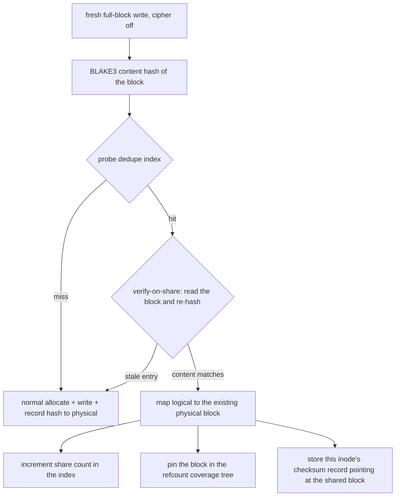

# Deduplication (Wired) — `fs::dedupe` + `file::writer` integration

Status: **wired into the write path in 3.2** (the module itself,
`fs::dedupe`, has existed with real BLAKE3 hashing and an on-disk
hash→block index since 3.0; until 3.2 the write path never consulted
it — the docs said so honestly, and the comparison table scored it
zero).

## The write-path contract

Dedup participates only when ALL of these hold:

1. `LFS_DEDUP=1` (or `set_dedup_enabled(true)`) — **off by default**,
   the same posture ZFS takes: the index costs space and every fresh
   block pays one tree descent for the probe.
2. The superblock's `dedupe_tree_root` is nonzero (an initialized
   index).
3. The write is a FRESH mapping (logical block not yet mapped), a FULL
   4 KiB block, and the cipher is inactive (an encrypted block is
   unique content by construction — its on-disk bytes are keyed).

On those writes, before allocating:

## Verify-on-share: why the probe re-reads the block

The index is on-disk state that can go stale exactly the way any
on-disk state can: a crash between recording the hash and committing
the block, or a freed block that got reallocated with new content
before the entry was reclaimed. Trusting the entry blindly would share
two DIFFERENT contents under one hash — silent corruption, the worst
failure a dedup layer can make. So every share is preceded by reading
the candidate block and re-hashing it; on mismatch the write degrades
to a normal fresh allocation. The probe costs one block read per
shared block; the correctness it buys is absolute.

$$P(\text{wrong share}) = P(\text{BLAKE3 collision}) + P(\text{stale entry AND byte-identical re-hash}) \approx 2^{-256} + 0$$

## Sharing interacts with CoW through the coverage tree

A shared block is pinned in `integrity::refcount` exactly as a
snapshot pins one: an overwrite by EITHER inode sharing the block
triggers redirect-on-write (see `specifications/snapshots.md`). The
pin is released lazily — there are no back-references from blocks to
the inodes that share them (the honest tradeoff vs. Btrfs's extent
backref trees): a deleted sharer leaves a stale pin that over-CoWs
until GC rebuilds coverage. Over-conservative, never corrupting.

## What is deliberately not claimed

- No RAM-resident dedup table: the index is a B-tree on disk, so a
  probe is one root-to-leaf descent (amortized by the fast-append
  cache when hashes arrive in order — they do not, hashes are
  content-random; the probe pays the full descent). ZFS's dedicated
  DDT RAM cache is a Phase 9-scale decision.
- No inline dedup of partial blocks or encrypted blocks (by the
  conditions above).
- No dedup statistics counters yet (`lfs_dedupe` tooling: Phase 9).
- The write amplification of dedup ON vs OFF on mixed-content
  workloads is **not measured** here; enabling it for a
  duplicate-heavy workload is the documented use case.
