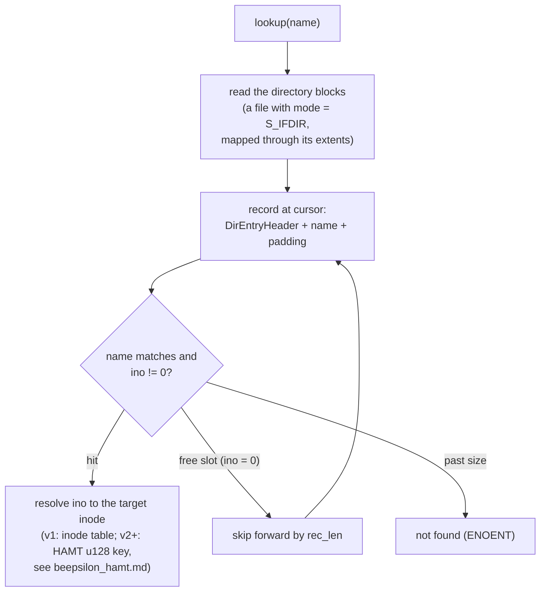

# Directory Specification

Directories in LionFS are essentially standard files (`mode` = `S_IFDIR`) containing a sequential list of `DirEntryHeader` structures followed immediately by variable-length UTF-8 file names.

## DirEntryHeader Structure (Little Endian)

| Offset | Size | Name | Description |
|---|---|---|---|
| 0x00 | 8 bytes | `ino` | Target Inode number (0 = free slot) |
| 0x08 | 2 bytes | `rec_len` | Total byte length of this record (Header + Name + Padding) |
| 0x0A | 1 byte | `name_len` | Actual byte length of the name string |
| 0x0B | 1 byte | `file_type` | Type identifier (1 = Reg, 2 = Dir) |
| 0x0C | 4 bytes | `padding` | 4-byte padding for 8-byte alignment |

Total Size: 16 Bytes.

Records are padded to ensure the next `DirEntryHeader` aligns naturally.

## Record walk

Record sizing — the padding is deterministic, so rec_len is a pure
function of the name:

$$\mathrm{rec\_len} = 16 + \left\lceil \frac{\mathrm{name\_len}}{8} \right\rceil \cdot 8 \;\equiv\; 0 \pmod 8$$

Per-entry overhead beyond the name is exactly 16 bytes, and every
header lands 8-byte aligned.

## Collision math (the inode space)

Entry lookup is linear, but the inodes those entries name live in the
u128 HAMT space ([`beepsilon_hamt.md`](beepsilon_hamt.md)) where
full-hash collisions chain in `Collision` nodes — correctness never
depends on the birthday bound, and the bound says chains are
vanishingly rare:

$$P_{\text{coll}} \approx 1 - e^{-n(n-1)/2^{129}} \;\approx\; \frac{n^2}{2^{129}}$$

At $n = 10^5$ inodes: $\approx 1.5 \times 10^{-29}$.
