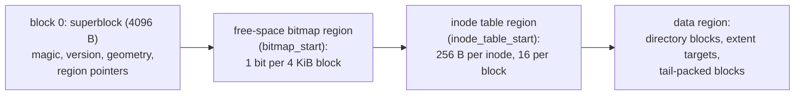

# Disk_layout Specification

*This specification is planned for a future Phase of LionFS.*

## Planned layout (grounded in [`superblock.md`](superblock.md))

Region order follows the superblock pointers — `bitmap_start` and
`inode_table_start` locate the two metadata regions; data fills the
rest:

## Metadata overhead

Per volume of $V$ bytes with $n_{\text{ino}}$ inodes:

$$B_{\text{meta}} = 4096 + \frac{V}{2^{15}} + 256\, n_{\text{ino}}$$

The bitmap term dominates the fixed costs — 1 bit per 4096-byte
block:

$$\frac{2^{40}\ \mathrm{B}}{2^{15}} = 2^{25}\ \mathrm{bits} = 32\ \mathrm{MiB}\ \text{per TiB} \approx 0.003\%\ \text{of the volume}$$

The inode table packs 16 records per block:

$$\left\lfloor \frac{4096}{256} \right\rfloor = 16 \quad\Rightarrow\quad B_{\text{inodes}} = \frac{256\, n_{\text{ino}}}{4096}\ \text{blocks}$$