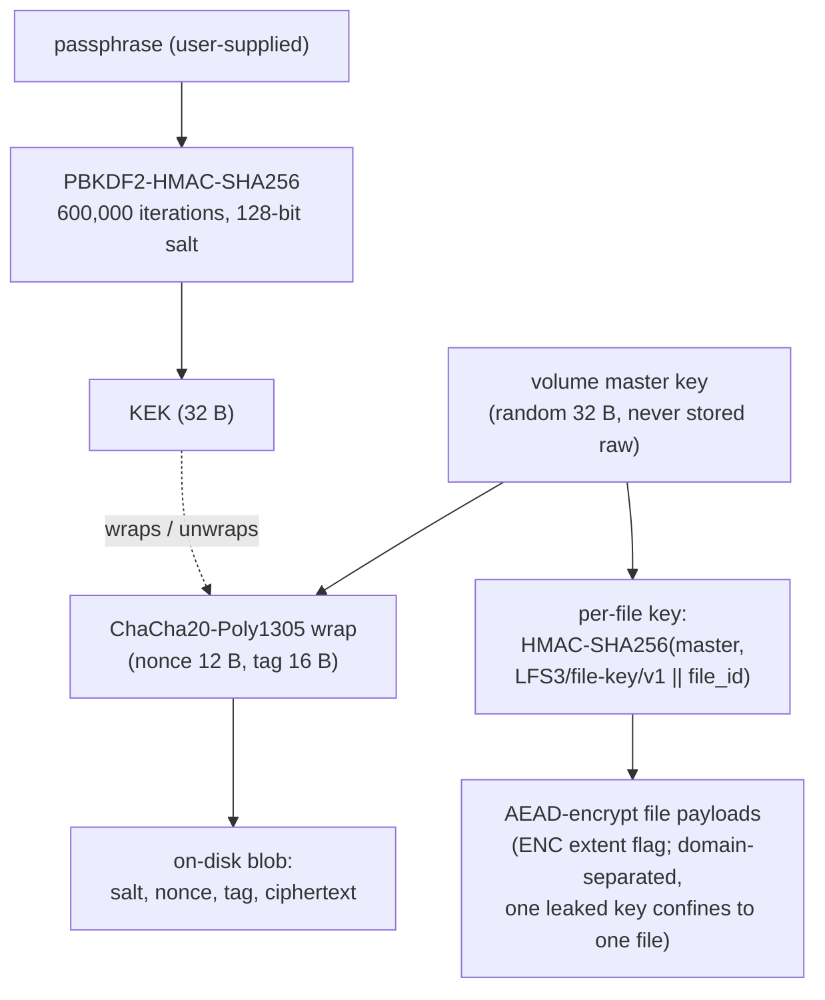

# Encryption Specification

*This specification is planned for a future Phase of LionFS.*

## Planned key hierarchy (grounded in [`key_management.md`](key_management.md))

## AEAD notation

Every encrypted unit is one AEAD message — key $K$, nonce $N$,
associated data $A$ (the extent address, say), plaintext $P$:

$$\mathcal{E}_K(N, A, P) = (C, \tau), \qquad \mathcal{D}_K(N, A, C, \tau) \in \{P, \bot\}$$

with the Poly1305 forgery advantage:

$$\mathrm{Adv}_{\mathrm{forge}} \le 2^{-128}$$

— a wrong passphrase, a torn write, or a tampered block is an audible
tag failure, never silent plaintext.

## KDF work factor

$$\mathrm{DK} = \text{PBKDF2-HMAC-SHA256}(pw, s, \mu, 32), \qquad \mu = 6 \times 10^{5}$$

Each offline guess costs $\mu$ HMAC invocations; at $10^{7}$
HMAC/s that is ~17 guesses/s per core, and mount allows 3 attempts
before lockout ([`wiring.md`](wiring.md) prices the online path).