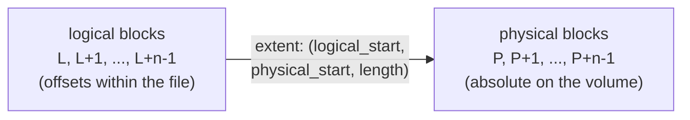
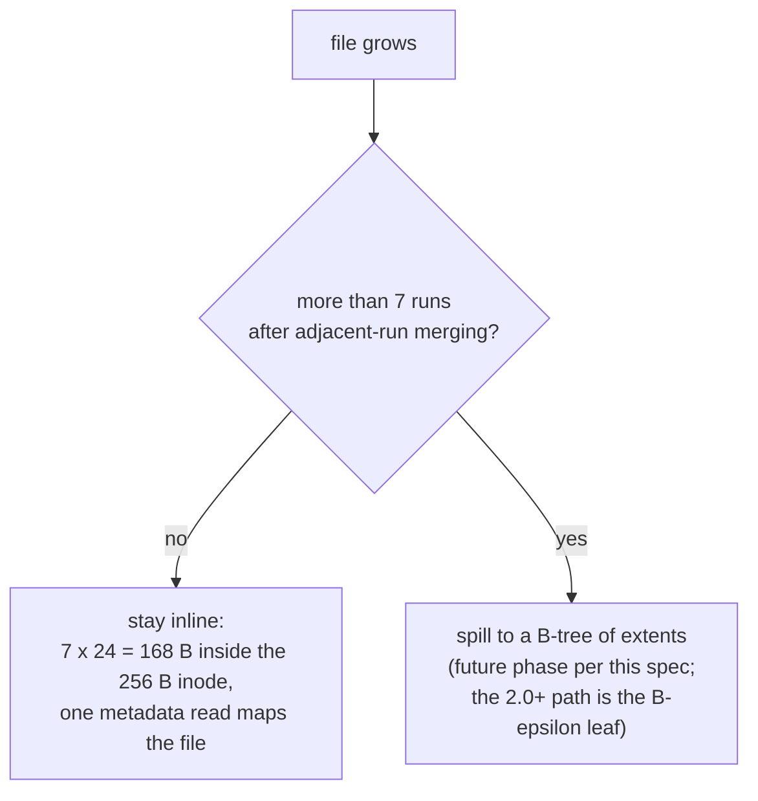

# Extent Specification

Extents map a contiguous range of logical file offsets to a contiguous range of physical blocks. 

## Structure (Little Endian)

| Offset (Hex) | Size | Name | Description |
|---|---|---|---|
| 0x00 | 8 bytes | `logical_start`| The starting block index within the file |
| 0x08 | 8 bytes | `physical_start`| The absolute starting block on disk |
| 0x10 | 8 bytes | `length` | The number of contiguous blocks in this extent |

Total Size: 24 bytes.

In Phase 1, up to 7 extents can be stored inline inside an Inode. In future phases, LionFS will support B-Tree extents.

## Mapping

The translation is one subtraction and one addition, valid on the
half-open range:

$$\mathrm{phys}(x) = x - \mathrm{logical\_start} + \mathrm{physical\_start}, \qquad x \in [\mathrm{logical\_start},\ \mathrm{logical\_start} + \mathrm{length})$$

## Inline versus spill

## Packed-extent coverage (`Extent16`)

The 16-byte packed record of [`addressing.md`](addressing.md) trades
width for count; its per-extent ceiling is the u24 `length` field
scaled by the GRAN bit:

$$\text{GRAN} = 0:\ (2^{24}-1) \times 2^{12}\ \mathrm{B} \approx 64\ \mathrm{GiB}, \qquad \text{GRAN} = 1:\ (2^{24}-1) \times 2^{16}\ \mathrm{B} \approx 1\ \mathrm{TiB}$$

The u48 `logical_start` caps the *file*, not the extent:

$$\text{GRAN} = 0:\ 2^{48} \times 2^{12}\ \mathrm{B} = 2^{60}\ \mathrm{B} = 1\ \mathrm{EiB}, \qquad \text{GRAN} = 1:\ 2^{48} \times 2^{16}\ \mathrm{B} = 2^{64}\ \mathrm{B} = 16\ \mathrm{EiB}$$

One 64-byte cache line holds eight packed records; the 24-byte record
above carries u64 fields and reaches
$2^{64} \times 2^{12}\ \mathrm{B} = 2^{76}\ \mathrm{B} = 64\ \mathrm{ZiB}$
at 1.5x the width — the trade `addressing.md` priced.
