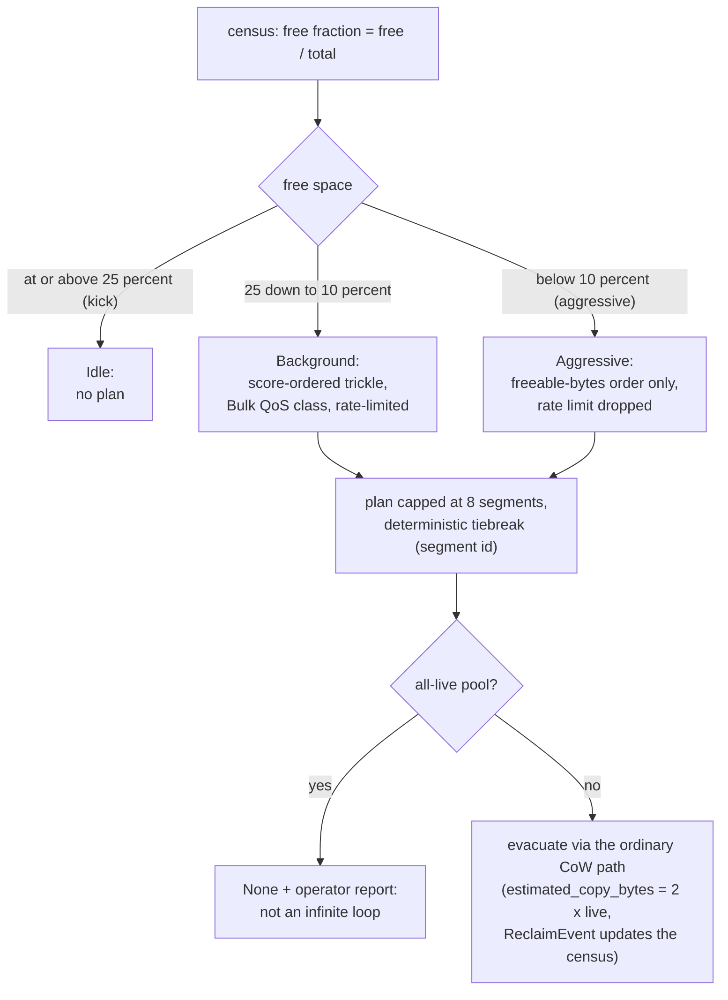

# Specification: Copy-GC & Space Reclamation (LionFS 3.0)

Status: implemented (`src/gc/`) | RFC: LFS-RFC-004 §6

## Why

CoW + snapshots leave stale extents behind until refcounts hit zero;
a filesystem that never reclaims them leaks capacity at the CoW
rate. The 1.x "the GC worker will handle it" comment was a comment.

## Cost model (Rosenblum-Ousterhout, extended)

```text
benefit = freeable × (1 + age/age_half_life)     // cold-data prior
cost    = 2 × live × (1 + wear_bps/1e4)          // + flash wear leveling
score   = benefit / cost                         // highest first
```

Defaults: age half-life 7 days (snapshot/CoW churn is daily-ish),
wear 5 bps per 100 write cycles. A fully-dead segment scores
`u64::MAX/2` (headroom keeps tiebreaks sane); zero-freeable scores
0 (never picked).

The same model in symbols ($F$ = freeable bytes, $L$ = live bytes,
$t$ = segment age, $t_{1/2}$ = age half-life, $w$ =
$\text{wear\_bps}/10^{4}$):

$$\mathrm{benefit} = F \left(1 + \frac{t}{t_{1/2}}\right), \qquad \mathrm{cost} = 2\,L\,(1 + w)$$

$$\mathrm{score} = \frac{\mathrm{benefit}}{\mathrm{cost}} = \frac{F\,(1 + t/t_{1/2})}{2\,L\,(1 + w)}$$

The edge cases fall out of the same expression: $L = 0$ (fully dead)
would divide by zero, so the score saturates at $\mathrm{u64::MAX}/2$;
$F = 0$ scores 0 and is never planned.

## Watermarks and panic mode

| Free space | Mode | Behavior |
|-----------|------|----------|
| ≥ 25% (kick) | Idle | no plan |
| 25%..10% | Background | score-ordered trickle, Bulk QoS class |
| < 10% (aggressive) | Aggressive | pure freeable-bytes ordering — at 10% free, reclaim now, don't be clever |

Plans cap at `max_segments_per_plan` (default 8) with deterministic
tiebreak (segment id). An all-live pool below the watermark returns
`None`: "full of live data" is an operator report, not an infinite
loop.



The tuned 25/10 band also widens the runway a burst with fill rate
$f > r$ (reclaim rate) needs before panic — [`wiring.md`](wiring.md)
derives it:

$$t_{\text{panic}} = \frac{\text{kick} - \text{aggressive}}{f - r} = \frac{0.15}{f - r}$$

## Execution contract

Planner output is `GcPlan { urgency, segments, estimated_copy_bytes
(= 2× live), estimated_reclaimed_bytes }`. The transaction layer
executes relocations through the ordinary CoC write path —
checksummed, journaled, crash-recovered like any user write — in
the `Bulk` QoS class. `ReclaimEvent` records (segment, freed bytes,
timestamp) update the census incrementally as refcounts drop: no
device-wide rescans.

## Tunables (`GcConfig`)

- `kick_pct` / `aggressive_pct` (25 / 10, tuned in 3.1: was 20/8; the
  background band widened from 12 to 15 points so panic mode stays
  rare — see [`wiring.md`](wiring.md) for the fill-rate math)
- `wear_bps_per_100_cycles` (5)
- `age_half_life_ns` (7 days)
- `max_segments_per_plan` (8)

## Kept fixed

- u128 intermediates everywhere (the first draft mixed u64/u32 and
  drowned in type inference).
- Panic-mode ordering degradation is *policy*, not a bug: tested
  side-by-side with background ordering.
- The 2.0 honest-failure discipline: unreclaimable + low free =
  `None` + report, never a spin.
