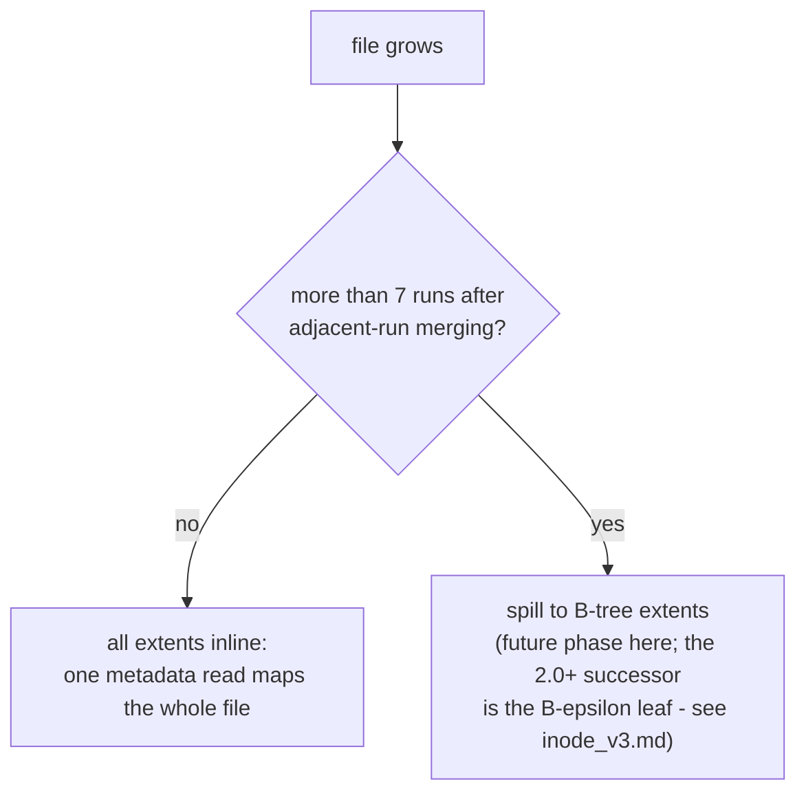

# Inode Specification

The LionFS Inode manages metadata and logical-to-physical block mappings (extents) for a single file or directory.

## Structure (Little Endian)

| Offset (Hex) | Size | Name | Description |
|---|---|---|---|
| 0x00 | 8 bytes | `ino` | Inode Number |
| 0x08 | 4 bytes | `mode` | POSIX Permissions & File Type (S_IFREG, S_IFDIR) |
| 0x0C | 4 bytes | `nlink` | Hard link count |
| 0x10 | 4 bytes | `uid` | User ID |
| 0x14 | 4 bytes | `gid` | Group ID |
| 0x18 | 8 bytes | `size` | File size in bytes |
| 0x20 | 8 bytes | `atime` | Last access time (UNIX epoch seconds) |
| 0x28 | 8 bytes | `mtime` | Last modification time (UNIX epoch seconds) |
| 0x30 | 8 bytes | `ctime` | Last inode change time (UNIX epoch seconds) |
| 0x38 | 4 bytes | `extent_count` | Number of valid extents in the `extents` array |
| 0x3C | 4 bytes | `padding` | Reserved alignment |
| 0x40 | 168 bytes| `extents` | Inline array of up to 7 `Extent` structures (24 bytes each) |
| 0xE8 | 24 bytes | `padding2` | Reserved |

## Sizing
Each inode is exactly 256 bytes. This allows exactly 16 Inodes per 4096-byte block.

Layout as a single map:

The sizing arithmetic:

$$\left\lfloor \frac{4096}{256} \right\rfloor = 16\ \text{inodes per block}, \qquad \frac{7 \times 24}{256} = 65.6\%\ \text{of the record is inline extents}$$

$$B_{\text{inode table}} = 256\, n_{\text{ino}} = \frac{n_{\text{ino}}}{16}\ \text{blocks}$$

so one 4 KiB metadata read resolves 16 inodes, and a fragmented file
stays fully inline until it needs an 8th run:

