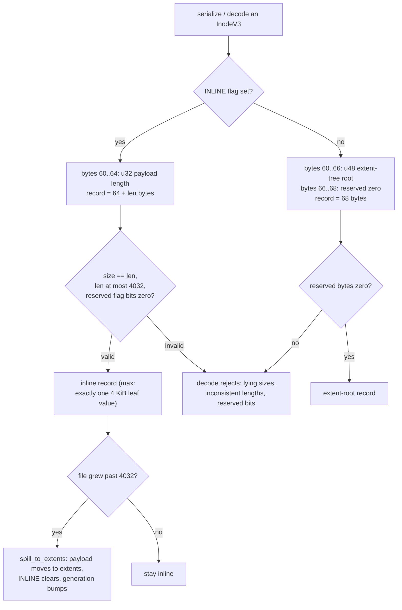
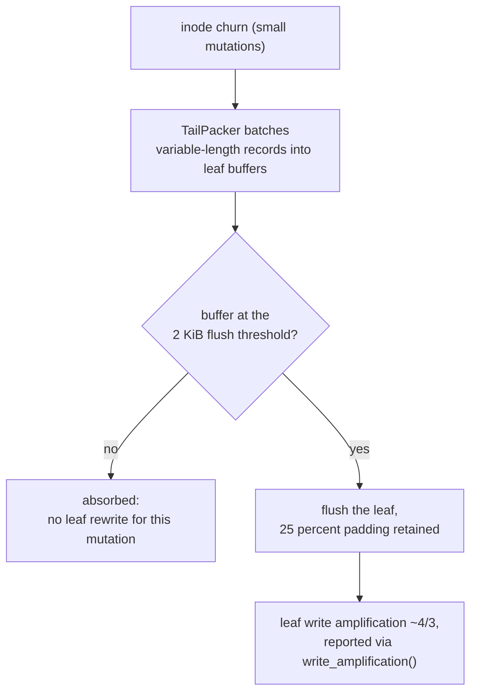

# Specification: Inode v3 — Inline Payloads & Tail Packing (LionFS 2.0, Pillar II)

Status: implemented (`src/ondisk/inode_v3.rs`) | RFC: LFS-RFC-002 §4.2, Table 9

## The 96-byte core

The 256-byte 1.x inode becomes a 64-byte core plus a variable-length
value: files smaller than 4 KiB store their payload **entirely inside
the B-epsilon leaf that holds the inode** — one metadata read, zero
data-block reads, zero data-block allocations.

| Offset | Field | Width | Notes |
|---|---|---|---|
| 0 | `ino` | 16 B | full 128-bit inode number (the HAMT key) |
| 16 | `mode`/`nlink`/`uid`/`gid` | 4×u32 | POSIX identity |
| 32 | `size` | 16 B | u128, GRAN-aware |
| 48 | `generation` | 8 B | bumped on every CoW rewrite |
| 56 | `flags` | 4 B | `INLINE`, `COMPRESSED`, `ENCRYPTED`, `DEDUP` (reserved bits must be zero) |
| 60 | branch field | 4 B or 6 B+2 | see below |
| 64+ | inline payload | 0-4032 B | only when `INLINE` |

**Branch discipline** (both branches decode unambiguously):

- `INLINE` set: bytes 60..64 are a `u32` payload length; the record is
  exactly `64 + len` bytes; `size` must equal `len` (cross-checked on
  decode).
- `INLINE` clear: bytes 60..66 are a `u48` extent-tree root, bytes
  66..68 are reserved zero bytes; the record is exactly 68 bytes.

A max-inline inode is exactly one 4 KiB leaf value.

The threshold is exactly the leaf block minus the fixed core:

$$4032 = 4096 - 64 \qquad (\text{max payload} = B_{\text{leaf}} - B_{\text{core}})$$

## Operations

- `try_store_inline(payload)`: stores if ≤ 4032 B; bumps generation;
  refuses otherwise (size never lies).
- `spill_to_extents(root)`: the file grew past the threshold — payload
  moves to extents, the pin clears, generation bumps.
- `serialize`/`deserialize`: little-endian wire form; decode rejects
  reserved flag bits, inconsistent lengths, lying sizes, nonzero
  reserved bytes — forward-format detection, structural garbage
  handling.

## Tail packing

`TailPacker` batches variable-length inode records into leaf blocks:

- 2 KiB flush threshold batches inode churn so a leaf rewrite
  amortizes over many mutations;
- flushed leaves carry 25% padding (absorbs subsequent appends without
  re-split);
- write amplification of the leaf path is ~4/3 and **reported**
  (`write_amplification()`), per the honesty rule.

Tail packing as a flow:

Packing density, amplification, and batch size for mean record size
$\bar s$:

$$u = \frac{\text{live}}{\text{live} + \text{pad}} = 0.75, \qquad \mathrm{WA} = \frac{1}{u} = \frac{4}{3}, \qquad n_{\text{records/flush}} \approx \left\lfloor \frac{0.75 \times 2048}{\bar s} \right\rfloor$$

— 68-byte extent-root records give ~22 mutations per rewrite; a
4032-byte max-inline record flushes on its own.

## Coexistence with the 1.x inode

The v2 inode (256 B, 7 inline extent slots, spill B-tree) remains the
live format for existing volumes; v3 is the format the upgrade tool
migrates to (P2/P3 roadmap). Both structs live in `ondisk`; mount
gates on the superblock's version field exactly as 1.x did.
