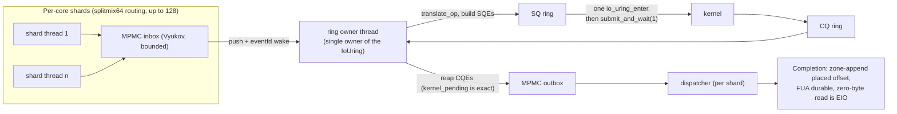
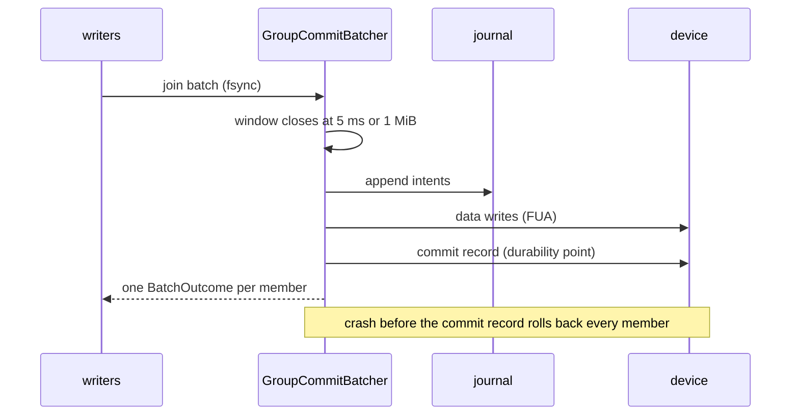

# Specification: I/O Engine & Concurrency (LionFS 2.0, Pillar I)

Status: implemented (`src/io_engine/`) | RFC: LFS-RFC-002 §3, LFS-RFC-003 §4

## Overview

The submission plane: batched, asynchronous, per-core sharded device
I/O with a Linux io_uring fast path and a portable threaded floor.

## Components

| Component | File | Role |
|---|---|---|
| `IoOp` / `Completion` | `op.rs` | The operation vocabulary: `Read`, `Write`, `WriteFua`, `FlushData`, `ZoneAppend`, `Deallocate`. POD descriptors (≤48 B) so batches are arrays, not allocations. |
| `MpmcQueue<T>` | `mpmc.rs` | Vyukov bounded MPMC queue. Lock-free, wait-free push/pop; `push` returns `false` on full = backpressure, never a drop. |
| `ThreadedEngine` | `engine.rs` | The portable floor: worker threads executing positioned I/O through the PAL. CI workhorse; FUA honored with an explicit data barrier. |
| `UringEngine` | `uring.rs` | Linux ring backend (feature `io_uring`): registered files, batched `io_uring_enter`, kernel-side blocking via `submit_and_wait(1)`, exact kernel-pending accounting, zone-append placed-offset bookkeeping. |
| `EngineBuilder` | `engine.rs` | Runtime selection: probe + ring setup attempt, graceful logged fallback to the threaded engine. |
| `Shard` / `ShardTable` | `shard.rs` | Per-core shards: local free-space runs, dirty-tx staging, splitmix64 routing over power-of-two shard counts (≤128). |
| `GroupCommitBatcher` | `group_commit.rs` | fsync coalescing: 5 ms / 1 MiB batch windows, one flush per batch, private-tx opt-out, shutdown-safe waiter wakeups. |
| `RegisteredBufArena` | `zero_copy.rs` | Zero-copy substrate: page-aligned slots, dynamic lease exclusivity, bounce-buffer slow path with counted instrumentation. |

## io_uring backend design

One **ring-owner thread** owns the `IoUring` instance (the crate
exposes submission/completion through `&mut`, so single ownership
avoids interior-mutability hazards):

```text
shard threads ──inbox (MPMC)──▶ ring owner ──SQ──▶ kernel
dispatcher   ◀──outbox (MPMC)── ring owner ◀──CQ── kernel
                 ▲ waker (eventfd)          │
                 └───────── submissions ─────┘
```

- `submit()` pushes POD ops to the inbox and wakes the owner (eventfd,
  tens of ns).
- The owner drains a batch, builds SQEs (`translate_op`), enters the
  kernel once (`ring.submit()`), then blocks **in the kernel** with
  `submit_and_wait(1)` while ops are pending.
- The kernel-pending count is the owner's own arithmetic (SQEs pushed
  − CQEs reaped). It is exact and race-free: `kernel_pending > 0`
  guarantees a CQE is coming, so the wait cannot deadlock. (The
  dispatcher's in-flight counter decrements only when completions are
  *popped*, so it is deliberately NOT used for the wait decision.)
- Completion semantics match the threaded backend exactly: a read
  returning zero bytes for a nonzero request is an error
  (`EIO`-class), zone-append completions carry the placed offset, FUA
  writes are durable at completion.
- User-data tagging: the top two bits of `user_data` encode the op kind
  so CQEs decode without side tables; 62-bit caller tags pass through
  untouched.

## Group commit

Writers join the next batch instead of forcing their own flush. The
flusher closes a batch when the time budget (5 ms) or byte budget
(1 MiB) is hit, drives the `BatchHandler` (journal append → data with
FUA → commit record), and reports one `BatchOutcome` per member.
Failed batches roll back every member (observable, per the honesty
rule); writers needing isolation take a private batch at the cost of
their own flush. Counters: `batches`, `coalesced_writers`,
`private_flushes`, `coalesced_bytes`.

## Arena contract

Slots are leased exclusively — `lease()` refuses while a lease is
outstanding, so zero-copy is enforced dynamically, not by convention.
While leased, the device (or threaded worker) writes into the slot;
the caller reads it after completion. Bounce-buffer copies are
counted (`copy_in`/`copy_out`) and visible in the health summary.

## Measured behavior (this host, `lfs_engine`, medians of interleaved runs)

| Pattern | threaded | io_uring |
|---|---|---|
| 4 KiB seq write | 115 MiB/s | 707 MiB/s |
| 4 KiB seq read | 117 MiB/s | 1,627 MiB/s |
| 64 KiB seq write | — | 1,268 MiB/s |
| 64 KiB seq read | — | 3,605 MiB/s |

Numbers are userspace engine cost against tmpfs-backed images (the
1.x `lfs_ioperf` discipline): reproducible via
`lfs_engine <block> <qdepth> <rounds>`.

## Submission pipeline (diagram)



The threaded backend is the same graph with worker threads in place of
the ring owner; completion semantics are identical by construction.

## Group commit (diagram)



## Batch amortization and Little's law

For $n$ ops of mean payload $\bar p$ against sequential bandwidth $B$,
with fixed per-submission cost $c$ (enter, wakeup, completion
bookkeeping):

$$T(n) = \frac{n\bar p}{B} + c, \qquad
T_{\text{op}}(n) = \frac{\bar p}{B} + \frac{c}{n}$$

The $c/n$ term is why batches are arrays of POD descriptors and why
the ring owner enters the kernel once per batch. At the measured
io_uring 4 KiB read rate (1,627 MiB/s), the arrival rate is

$$\lambda = \frac{1627\ \mathrm{MiB/s}}{4\ \mathrm{KiB}} \approx
4.2 \times 10^{5}\ \mathrm{ops/s}$$

and Little's law, $L = \lambda W$, converts the dispatcher's in-flight
counter $L$ into mean completion latency $W$ — the health-bus latency
series is this identity with the histogram in place of the mean.
