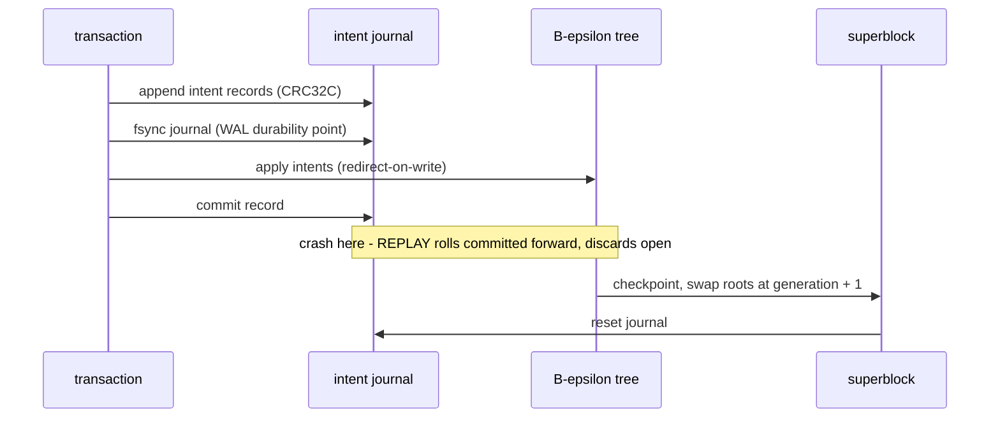

# Journal Specification

*This specification is planned for a future Phase of LionFS.*

## Write-ahead sequence (design)

The ordering and the recovery contract are specified where they are
tested — group commit's journal-append / data-FUA / commit-record
sequence in [io_engine.md](io_engine.md), the REPLAY and CHECKPOINT
states in [reliability_v2.md](reliability_v2.md):

## Crash-window loss bound

Recovery keeps the prefix property: a power cut discards an
un-committed suffix, never a committed prefix. With the group-commit
window $W$ (5 ms / 1 MiB, shared with the record journal):

$$\text{lost work} \le 1\ \mathrm{MiB}, \qquad
\text{lost age} \le 5\ \mathrm{ms}, \qquad
\Pr[\text{committed work lost}] = 0$$

Discarding an open transaction is safe because redirect-on-write
leaves its partial writes in blocks no live tree references. The
deterministic crash simulator asserts the prefix property at every
tear offset ([wiring.md](wiring.md)).