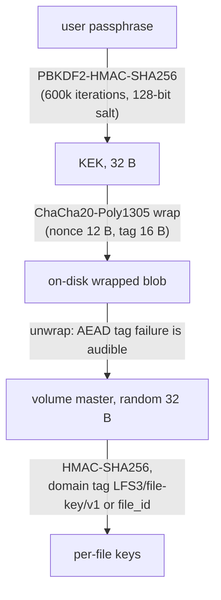

# Specification: Key Management — Passphrase Wrapping (LionFS 3.0)

Status: implemented (`src/security/kdf.rs`) | RFC: LFS-RFC-004 §11

## The hierarchy

```text
passphrase ──PBKDF2-HMAC-SHA256(600k iter, 128-bit salt)──► KEK (32 B)
volume master (random 32 B) ──ChaCha20-Poly1305(KEK)──► on-disk blob
per-file key = HMAC-SHA256(master, "LFS3/file-key/v1" || file_id)
```

This is the piece the 2.0 `security::keys` module called out as
missing ("wrapping the key tree itself with a passphrase-derived
key is a natural next step and is not implemented here").

## Properties (tested)

- **Wrong passphrase is audible**: AEAD tag failure → InvalidInput;
  every guess costs the KDF 600k HMAC-SHA256 invocations.
- **Rewrap rotates the passphrase without touching the master**:
  salt, nonce, and wrapped blob all rotate; derived file keys are
  unchanged — passphrase rotation is metadata-only.
- **Re-key is metadata-only**: rotating the master re-derives the
  whole file-key tree (HMAC-PRF) without rewriting any data block.
- **Domain separation**: file keys are HMACs under a versioned
  domain tag; a per-file key leak confines to that file.
- **Memory hygiene**: the live envelope's master zeroizes on drop
  via `write_volatile` (no `zeroize` crate — Windows keeps its
  std-only build). Secure erase = drop the envelope: the wrapped
  blob is noise. Physical block erasure is the GC's job and is not
  a microscope guarantee.
- `KeyEnvelope` is deliberately **not** `Debug` — printing an
  envelope must never print key material.

## Constants

`SALT_LEN` 16 · `KEY_LEN` 32 · `NONCE_LEN` 12 (ChaCha20-Poly1305) ·
`TAG_LEN` 16 · `DEFAULT_PBKDF2_ITERATIONS` 600,000 (OWASP 2023).
Envelope version byte 1; unknown versions refuse to unwrap.

## Known-answer vectors

PBKDF2-HMAC-SHA256("passwd","salt",1,32) =
55ac046e56e3089fec1691c22544b605f94185216dde0465e68b9d57c20dacbc;
HMAC-SHA256("key","The quick brown fox...") =
f7bc83f430538424b13298e6aa6fb143ef4d59a14946175997479dbc2d1a3cd8.

## Not here (userspace tooling, RFC-004 §11.4)

KMS clients, TPM sealing, recovery-key escrow — all attach at the
envelope layer.

## Key hierarchy (diagram)



## Online-guess economics

Every wrong passphrase pays the full KDF before the AEAD tag can reject
it. With $\mu = 600{,}000$ iterations at $t_{\text{SHA256}}$
HMAC-SHA256 compressions per second, one guess costs $\mu/t$ and the
mount-time budget of three attempts costs

$$\frac{3\mu}{t_{\text{SHA256}}} \approx
\frac{1.8 \times 10^{6}}{10^{7}/\mathrm{s}} \approx 0.18\ \mathrm{s}$$

after which the mount gate locks out ([wiring.md](wiring.md) key flow;
the audit trail records create, reject, unlock, lockout, rotation).
The off-line attacker needs the wrapped blob itself — it never leaves
the volume — and pays $\mu$ per guess per core:

$$\lambda_{\text{guess}} = \frac{t_{\text{SHA256}}}{\mu} \approx
16.7\ \mathrm{guesses/s\ per\ core}$$
