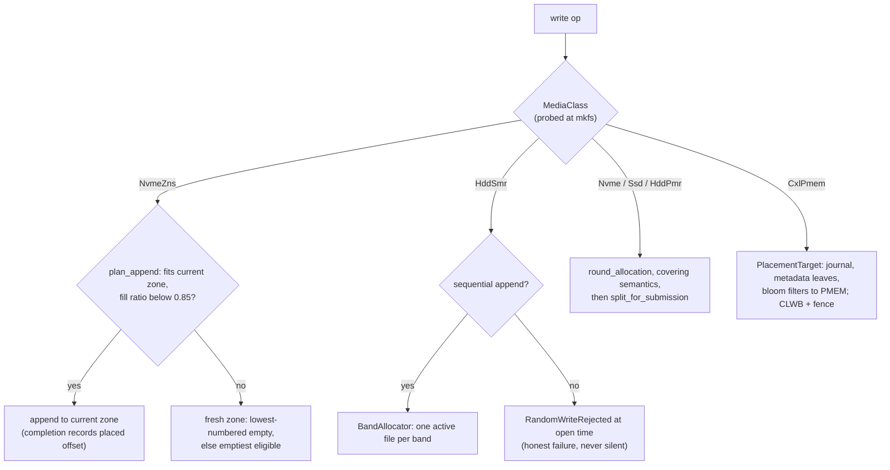

# Specification: Media Tiering — ZNS, SMR, Alignment, CXL (LionFS 2.0, Pillar IV)

Status: implemented (`src/media/`) | RFC: LFS-RFC-002 §6

## Media policy matrix

`MediaClass` (NvmeZns, Nvme, Ssd, HddSmr, HddPmr, CxlPmem, Other)
resolves to a `MediaPolicy` (placement strategy, alignment unit,
append semantics) via `policy_for(class, probed_alignment)` — geometry
overrides refine the alignment unit at mkfs time. The matrix matches
RFC-002 Table 12; `lfs_zns report` prints it as the policy engine
resolves it.

## ZNS (`src/media/zns.rs`)

The zone model for host-managed ZNS drives:

- `Zone` states (Empty/Active/Full/ReadOnly/Offline) with write
  pointers, capacity, and fill ratio in basis points.
- `ZoneTable::plan_append(zone, len)` — the placement policy: the
  file's current zone until 85% full or the append no longer fits,
  then a fresh zone (lowest-numbered empty, else the emptiest
  eligible); `None` = ENOSPC at the media layer.
- `commit_placed_offset` — the completion-time update from a real
  device report (kept monotonic; capacity-landing marks Full). The
  extent record is written at completion time, exactly the
  completion-shape a native `IORING_OP_ZONE_APPEND` produces.
- `reconcile_from_report` — the mount RECONCILE path: the device
  report is authoritative, the on-disk zone table is not trusted
  (RFC-002 Table 20's residual-risk row, managed).
- `reset_zone` / `mark_offline` — zone lifecycle; offline zones refuse
  reset.

Simulated on image files everywhere (the placement *policy* is what
P4's WAF < 1.1 exit criterion measures); `lfs_zns sim` drives 4000
appends over 512 zones and reports WAF (1.000 measured), zone
utilization, and switch counts.

## SMR (`src/media/smr.rs`)

Band-confined sequential placement:

- `BandAllocator::plan_sequential(file, len)` — one actively-written
  file per band; files spread across fresh bands; confinement holds
  until the band fills.
- `validate_write` — the honest hard failure: random (non-append)
  writes to host-managed bands are **rejected at open time** with
  `RandomWriteRejected` (an explicit `Error` type with a readable
  message), never silently degraded.
- `plan_elevator_sweep(live_bytes)` — the sweep planner: bands whose
  garbage ≥ 50% are marked read-only and emitted as `SweepStep`s for
  sequential rewrite during device-idle windows; `finish_sweep`
  resets the band.

## Universal alignment (`src/media/alignment.rs`)

Enforced at the three places misalignment can enter:

1. **mkfs**: `AlignmentClass::from_geometry` derives 4K/16K/64K from
   the probed geometry triple (optimal I/O size preferred; floored at
   the 4 KiB filesystem block size).
2. **allocation**: `round_allocation` uses covering semantics (start
   rounds down, end rounds up); the expansion is accounted as
   padding blocks, never as file size.
3. **submission**: `split_for_submission` merges contiguous aligned
   units into maximal segments; misaligned heads take the
   bounce-buffer slow path — **counted**
   (`COUNTERS.bounce_buffer_slow_path`), never silently copied.

Health summary: `alignment::health_summary()` reports aligned/split/
bounce/padding counters ("a guarantee you do not measure is a hope").

## CXL PMEM tiering (`src/media/tier.rs`)

`MemoryTier` (Dram, CxlPmem) and `PlacementTarget` (IntentJournal,
MetadataLeaves, DedupBloomFilter, RmwStaging, Transient) resolve via
`place(target, pmem_available)`: journal/leaves/filters go to PMEM
first; RMW staging steers device DMA into PMEM when present.
`barrier_for(tier)` selects CLWB+fence vs device flush.
`clwb_region` issues real `clwb`+`sfence` on x86-64 Linux after a raw
CPUID probe (leaf 7, EBX bit 24), returning `false` elsewhere so the
engine falls back to `pal::sync::sync_data` — the PAL-shaped seam.

## Placement decision (diagram)

## WAF and the zone-switch threshold

Write amplification, as the P4 exit criterion measures it (WAF < 1.1;
`lfs_zns sim` reports 1.000 over 4000 appends on 512 zones):

$$\mathrm{WAF} = \frac{\text{bytes written to media}}
{\text{logical bytes written}} = \frac{\text{logical} + \text{padding}
+ \text{rewrite}}{\text{logical}} \approx 1 + \frac{\text{padding}}
{\text{logical}}$$

The zone switch fires when the fill ratio reaches the 85% policy point
or the append no longer fits, whichever comes first — with write
pointer $\mathrm{wp}$, zone start $\mathrm{zslba}$, and zone capacity
$C_z$:

$$\text{switch} \iff
\frac{\mathrm{wp} - \mathrm{zslba}}{C_z} \ge 0.85 \ \ \text{or} \ \
\mathrm{len} > C_z - (\mathrm{wp} - \mathrm{zslba})$$

At band granularity SMR runs the same accounting with the elevator
sweep: bands with garbage $\ge 50\%$ go read-only and are rewritten in
idle windows, so cleaning at 50% live rewrites at most one byte per
written byte — band-cleaning amplification is bounded by

$$\mathrm{WAF}_{\text{clean}} \le \frac{1}{1 - 0.5} = 2$$
