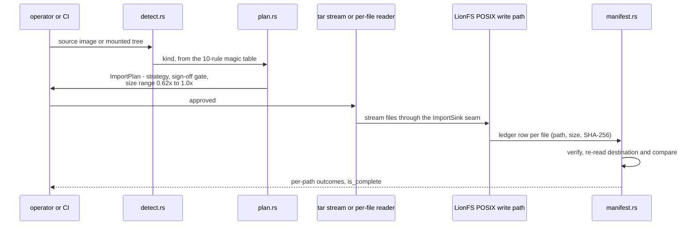

# Specification: Migration & Foreign-FS Import (LionFS 3.0)

Status: implemented (`src/migrate/`) | RFC: LFS-RFC-004 §9

## Strategy

Read through the source filesystem's own driver; write through
LionFS's POSIX path. No on-disk-format converter, no dual-format
staging, never an in-place conversion (the failure modes of
mid-flight rewrites are what LionFS exists to eliminate).

| Source | Strategy | Why |
|--------|----------|-----|
| ext4/XFS/Btrfs/F2FS/ZFS, mounted | TarStream | tar carries semantics |
| NTFS | PerFile | alternate data streams |
| HFS+ | PerFile | resource forks |
| APFS | PerFile | named forks, clonefile metadata |
| anything unmountable | RawBlock | carve; **operator sign-off required** |

## Detection (`detect.rs`)

10-rule magic table at documented offsets; first match wins in table
order; rules beyond the image length are skipped (short images can
still match XFS "XFSB"@0 or a 4-byte ZFS label magic):

ext4 0xEF53@1080 · XFS "XFSB"@0 · Btrfs "_BHRfS_M"@0xFF00 · ZFS
0x00bab10c LE@0 · F2FS 0x0FF10FF0@1024 · NTFS "NTFS    "@3 · FAT32
"FAT32   "@82 · exFAT "EXFAT   "@3 · HFS+ "H+"/"HX"@1024 · APFS
"NXSB"@32.

## The manifest protocol (`manifest.rs`)

A migration is a protocol, not a copy. Every imported file gets a
(path, size, SHA-256) ledger row; `verify()` re-checks the
destination against the manifest and reports per-path outcomes:
`NotInManifest` (extra), `Missing` (incomplete), `SizeMismatch`
(both sides reported), `DigestMismatch` (same size, different
bits). `is_complete()` requires zero failures AND
checked == entries AND entries > 0. Duplicate paths are refused at
record time (a walk bug, not a policy question).

## Plan (`plan.rs`)

`ImportPlan::new(kind, used_bytes, mounted)` derives strategy, sign-
off requirement, reason string, bounded progress steps (1 per MiB,
clamped to 1000 — a 10 PiB source still renders), and a
destination-size *range* (0.62x..1.0x: the empirical compressible-
data band, never a promise). `unattended_ok()` gates cron/CI.

## Kept fixed

- Detection is separate from driver claims: unknown-but-mounted
  still streams; the kernel's claim is the fallback, not the table.

## Import protocol (diagram)

## Verification coverage

The manifest is the contract; the migration is complete only when
every row was checked and every check passed:

$$\text{coverage} = \frac{|\text{checked}|}{|\text{entries}|}, \qquad
\text{is\_complete} \iff \text{failures} = 0 \ \wedge\
|\text{checked}| = |\text{entries}| \ \wedge\ |\text{entries}| > 0$$

SHA-256 makes a false pass negligible at any migration scale — for $m$
imported files the birthday bound is

$$\Pr[\text{false digest match}] \le \binom{m}{2} \cdot 2^{-256}$$

— and the four outcomes (`NotInManifest`, `Missing`, `SizeMismatch`,
`DigestMismatch`) localize each failure to a side, so a partial
migration is a repairable state, not a restart.
