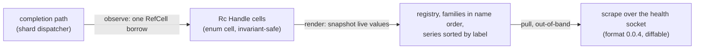

# Specification: Observability — Prometheus Export (LionFS 3.0)

Status: implemented (`src/telemetry/prometheus.rs`) | RFC: LFS-RFC-004 §8

## The registry

Dependency-free Prometheus text-exposition (format 0.0.4): families
with HELP/TYPE, label escaping (`\`, `"`, newline), deterministic
order (family name, then labels) — **a scrape must be diffable**.
Values snapshot from live `Rc<Handle>` cells at render time.

## Latency histogram

49 log-linear buckets (12/decade, 1 µs → 36 min) + implicit +Inf:
cumulative counts, `_bucket{le=...}`, `_sum`, `_count` series.
`quantile()` linearly interpolates inside the containing bucket
(for humans; the scraper computes its own). Mean is integer
(u128 sum / count).

## Handles

`counter()/gauge()/histogram()` return `Rc<Handle>`; `inc/add/set/
observe` are one RefCell borrow — the completion path touches one
cell. Wrong-type calls are no-ops that debug-assert (caller bug).
Counters/gauges use saturating arithmetic (a misconfigured 10 G
burst cannot overflow).

## The flagship series

Per-file IO latency `lfs_io_latency_us{op,tier}` fed by the shard
dispatcher on completion; quota denials, GC efficiency, Guardian
advisories, rebalance progress, and layer-sharing ratios all
export through the same registry. The exporter is pull-based over
the daemon's health socket — out-of-band, never on the IO path.

## Kept fixed

- The first draft's `Rc<RefCell<Counter>> → Rc<RefCell<MetricValue>>`
  coercion was impossible (Rc is invariant); the `Handle` enum-cell
  design replaced it.
- `[u64; 49]` has no `Default` (arrays > 32) — manual impl.
- Render refreshes from handles, so snapshots never go stale.

## Metric flow (diagram)

Nothing on the IO path renders; the scraper pulls. Phase 8 fixes the
series cardinality at construction (19 bounded series,
[wiring.md](wiring.md)) — a registry that grows mid-flight is a leak.

## Quantile error bound

The 49 log-linear buckets (12 per decade, 1 µs to 36 min) have bucket
ratio $\rho = 10^{1/12} \approx 1.21$. `quantile()` linearly
interpolates inside the containing bucket $[u, v]$ with $v = \rho u$;
both the estimate $\hat q(p)$ and the true $q(p)$ lie in that bucket:

$$\frac{|\hat q - q|}{q} \le \frac{v - u}{u} = \rho - 1 \approx 21\%$$

halved to roughly 10.6% by interpolation — the documented "for humans"
accuracy, while the scraper computes its own quantiles from the raw
`_bucket` series. The mean carries no bucket error (integer
$\mathrm{u128\ sum} / \mathrm{count}$); both are O(1) render work per
family.
