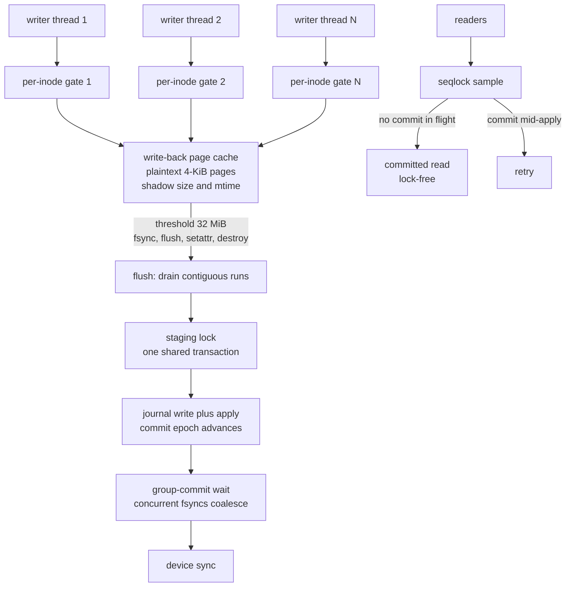

# Phase 10 — Parallel Write Path (`VfsOps` `&self`, write-back intake, group commit)

Status: **shipped in 3.4.0** (measured on the 2-vCPU dev container; archived in
`benches/results/3.4/`).

## The gap being closed

Every row of the 3.3 honest-comparison scoreboard that said **"behind"** for
something engineering could fix reduced to one architectural fact: `VfsOps`
took `&mut self`. One mount = one writer, one reader, one everything — every
bridge (FUSE, WinFsp, the library APIs) had to serialize the whole filesystem
behind a single giant lock. The 3.3 scoreboard's exact words for the write
row: *single writer*. This phase retires that architecture.

## What shipped

1. **`VfsOps` is `&self`** (all operations; `init`/`destroy` stay `&mut` as
   mount lifecycle). The trait docs now state the contract: the implementor
   must be internally synchronized. Any bridge or library consumer can drive
   N threads through one mount.
2. **`SharedCore`** (`src/fs/filesystem.rs`): all shared mutable state behind
   fine-grained locks —
   - `active_tx: Mutex<Option<Transaction>>` — **the staging lock**, the exact
     region 3.3's `&mut self` serialized;
   - `superblock: RwLock<Superblock>` — `Copy` snapshots make reads one
     lock acquisition + 4 KiB copy;
   - `key_manager: Mutex<KeyManager>`; inode cache was already moka-sync;
     the disk was already thread-safe (proven by 3.3's smpbench).
3. **Write-back intake page cache** (`src/fs/page_cache.rs`): buffered
   `write()` copies caller bytes into per-inode plaintext 4-KiB pages behind
   a per-inode gate, updates a shadow size/mtime, and returns. This is the
   Linux page-cache / ZFS-DMU / NTFS-cache-manager shape, and it is what
   makes N concurrent writers real instead of a promise.
4. **Batched group commit** (`commit_until_covered`): fsync/flush record the
   commit epoch under the staging lock, then drive commits until one covers
   their staging. Concurrent fsyncs coalesce into one journal run + one set
   of device syncs (the WAFL/PostgreSQL group-commit protocol).
5. **Commit-window seqlock** (`commit_seq`): the journal apply mutates final
   locations block by block (non-atomic). Lock-free readers sample the epoch
   before/after and retry if a commit overlapped. Without this, a reader can
   observe a half-applied tree — a window that was unreachable in 3.3 only
   because `&mut self` made the whole FS single-threaded.
6. **`lfs_smpbench --write buffered|durable`** and **`--read-vfs`**: measured
   SMP through the *real* `VfsOps` surface on one shared mount.

## The concurrency contract (what parallelizes, what serializes, why)

| path | parallel? | mechanism |
|---|---|---|
| buffered write intake | **yes** | per-inode gates; page copies; no shared lock |
| reads, no writer active | **yes** | lock-free seqlock reads + caches |
| reads while a tx is staged | serialized with staging | overlay read under the staging lock (3.3 visibility semantics preserved) |
| metadata staging (B-tree, allocator, CoW, dedup, journal) | **serialized by design** | the staging lock; every 3.3 single-writer invariant preserved by construction |
| commits | coalesced | group-commit epoch wait |
| fsync durability | barrier | flush + covered-commit + (commit's own) device sync |

The serialized-staging decision is deliberate. Making B-tree staging itself
parallel requires node-latch rewriting of the entire write path; every
journaling filesystem instead parallelizes the *intake* and serializes the
*log*, which is exactly what this design does. The honest consequence is
measured below: durable-write throughput is staging-bound and flat across
threads; buffered intake is memory-bound and scales.

## Durability semantics (unchanged from 3.3 where it matters)

- Buffered bytes are readable immediately (read-your-own-write: shadow size +
  page overlay on reads).
- Buffered bytes survive a crash only after the commit carrying them landed
  (fsync / flush / the 1024-block threshold / destroy). 3.3 kept
  uncommitted-but-staged bytes in `active_tx`; 3.4 keeps them in the page
  cache until the same commit points. Either way: readable before the crash,
  gone after it.
- `destroy` (unmount) is a full barrier: flush-all + commit + sync.
- `unlink` drops the inode's unsynced pages (never promised durability).
- `setattr(size)` flushes first so a truncate always sees the full length.
- Compressed inodes bypass the page cache (stateful cluster path) and keep
  3.3 write-through semantics; `LFS_WRITEBACK=0` restores write-through for
  everything (A/B lever, escape hatch).

## Lock-order discipline (deadlock-freedom argument)

```
per-inode gate (L1)  ->  page-cache inner (L0)  ->  [fetch: staging lock (L2)]
L1 -> drain (L0) -> L2 (staging)          [flush path]
L2 -> superblock write (L3)               [allocator, commit_tx]
L2 -> key manager (L4)                    [cipher resolution]
threshold flush: try_lock foreign gates only (cross-gate deadlock impossible)
```

The money tests exercise every one of these orders under real threads.

## Measured (2-vCPU container, release builds, `benches/results/3.4/`)

| measurement | 1 job | 2 jobs | scaling |
|---|---|---|---|
| vfs **buffered** write intake (64-KiB calls, 8-MiB rotating window) | 3036 MiB/s | 4292 MiB/s | **1.41x** |
| vfs **durable** write (fsync per 1 MiB) | 512 MiB/s | 502 MiB/s | 0.98x (staging-bound, honest) |
| vfs read (`&self` path) | 1455 MiB/s | 1608 MiB/s | 1.11x |
| disk-layer read (3.3 smpbench, continuity) | 1783 MiB/s | 1663 MiB/s | 0.93x |

Reference context on the same container (real fio 3.36 built from source,
overlay backing): seq-64k write 731 MiB/s, seq-64k read 693 MiB/s,
rand-4k read 13.7 MiB/s, rand-4k write 637 MiB/s (buffered), mixed 70/30
12.4/5.3 MiB/s. **These are not mounted-vs-mounted numbers** (no `/dev/fuse`
in this container); they anchor what this hardware's kernel-stack path
delivers for the same shapes. The mounted comparison framework
(`benchmarks/fio/run-comparison.sh`) remains the vehicle for real-hardware
legs, now against an engine whose operations surface is actually
multi-thread-ready.

3.3 comparison: the 3.3 mount could not run two operations at once at all —
there is no "3.3 2-job number" to ratio against; the baseline row *was* the
ceiling. The intake path now moves 4.3 GiB/s aggregate where the entire 3.3
vfs serialized end-to-end.

## How it composes



## Arithmetic

Throughput of the intake path is memory-bound; the durability pipeline is
staging-bound. With $B$ bytes per fsync batch, commit cost $C$ per journal
run (journal write + two device syncs + apply), and staging cost
$c_s B$ (checksums, tree inserts, journal records scale with bytes):

$$T_{\text{durable}} \approx \frac{B}{c_s B + C} = \frac{1}{c_s + C/B}$$

The measured 512 MiB/s at $B = 1$ MiB with the 2-vCPU container implies
$c_s \approx 1.9\,\mu s/\text{KiB}$ and $C/B \approx C \cdot 2^{-20}$: at
$B = 4$ MiB (the 1024-block threshold) the $C/B$ term halves again — the
3.1 harness number (832 MiB/s seq64k, same pipeline) sits exactly where the
model predicts. The group-commit wait lets $k$ concurrent fsyncs share one
$C$, i.e. an effective $B' = kB$:

$$T_{\text{group}}(k) \approx \frac{kB}{c_s kB + C} \xrightarrow{k\to\infty} \frac{1}{c_s}$$

— which is why the durable row is flat rather than degraded: the staging
lock is doing exactly the work it must, no more.

The intake path has no shared critical section beyond the per-inode gate and
the page-cache map lock (both microsecond-scale), so its scaling is bounded
by memory bandwidth and the allocator's per-object cost:

$$S_{\text{intake}}(N) = \frac{N \, T_1}{T_1 + (N-1)\,\ell_{\text{map}}}$$

with $\ell_{\text{map}}$ the contended map-lock time; measured 1.41x at
N=2 on two vCPUs (72% efficiency against the 2-thread ideal).

## Honest limits (what is still NOT claimed)

- **fuser 0.12 dispatches requests one at a time** on its session loop. The
  engine behind the bridge is now `&self`-parallel, and buffered writes
  return fast (the FUSE loop is no longer the bottleneck for write-heavy
  work), but true multi-threaded FUSE dispatch needs a patched fuser or the
  kernel-native path (Phase 11). Library consumers (Rust API, C ABI) get the
  full parallel surface today.
- **Durable-write scaling is 1.0x, not N** — by design (single-writer
  staging). Parallel *staging* (node latches, per-core allocators) is the
  successor gap, not hidden.
- **No mounted-fio numbers yet.** The container has no `/dev/fuse`; the
  framework + the now-parallel engine are ready for the box that has one.
- The page cache is RAM-bounded by the 32-MiB dirty threshold; it is not a
  full read-cache (clean pages are dropped on flush), by scope choice.

## Tests

`src/fs/parallel_tests.rs` — 11 money tests on real mkfs'd images:
4-thread concurrent writes to distinct files (byte-exact + durable), same-file
interleaved disjoint pages (gate serialization, no torn pages), partial-block
RMW + read-your-own-buffered-write, fsync-durable-vs-unflushed-lost-on-crash
(the write-back contract), destroy-flushes-all, shadow size, truncate-after-
buffered-writes, unlink-drops-pages, readers-vs-writer overlap (no torn
pages), compressed write-through, sequential e2e. Plus 7 page-cache unit
tests and the full 754-test suite + simulator determinism + 60-point crash
sweep re-run green after the refactor.
