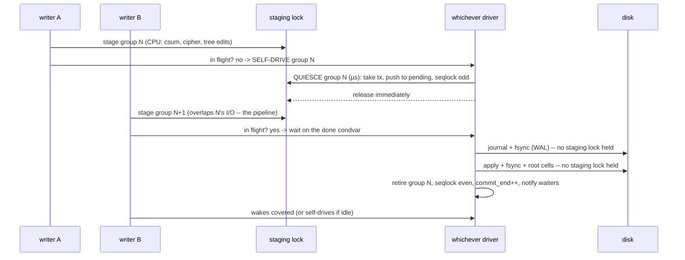

# Phase 11 (3.5.0): Pipelined transaction groups + birth-generation snapshots

Design record. Everything in this file is shipped code or a measured number,
or it says otherwise explicitly. Status legends: `SHIPPED` = in this release,
`MEASURED` = archived raw run in `benches/results/3.5/`.

## The three gaps this phase attacks

The 3.4 scoreboard left three engineerable "behind" rows:

1. **Durable write scaling** — every commit held the staging lock for the
   entire journal + two syncs + apply loop, so durable writers serialized on
   I/O under the lock: ~flat throughput at 2 jobs.
2. **VFS read scaling** — readers probed the staging lock on every call
   (the `active_tx` Mutex), and retried (spun) through whole commit windows:
   1.11x at 2 jobs where the disk layer does 1.41x.
3. **Snapshot creation is O(extent runs)** — the pin walk. ZFS/Btrfs create
   snapshots in O(1) total.

## P1: The pipelined transaction group (txg) commit

### What changed

3.4's `commit_active` held the staging lock for the whole commit. 3.5 splits
a commit into two phases and drives it adaptively:

* **Quiesce** (fast, under the staging lock): take `active_tx`, move it into
  `committing` (the pending list) as an `Arc<Transaction>`, mark the seqlock
  odd, release. Writers immediately stage the next group — they never
  wait for disk I/O, only for each other's CPU work.
* **Journal + apply + sync + root cells** (slow with respect to the
  quiesce, lock-free with respect to STAGING): owned by whoever drives
  the commit. `commit_io` covers the WHOLE cycle -- quiesce included.
  This is the commit-ordering invariant (bug #5 of the hunt below):
  content order is defined by quiesce order, and if the I/O lock were
  taken only after the quiesce, a driver that quiesced second could
  apply first, letting the earlier group's apply stamp OLDER block
  versions over newer ones. With commit_io over the quiesce, quiesce
  order == apply order, and STAGING still overlaps I/O (staging needs
  only the staging lock, held for the microsecond quiesce).
* **Adaptive driving** (`commit_until_covered`): an fsync whose group is
  NOT in flight drives the commit ITSELF immediately (zero thread-handoff
  latency — a quiesce is microseconds); a waiter whose bytes overlap an
  in-flight group waits on the done condvar for the driver's NEXT group,
  which carries both (group-commit coalescing). Racing self-drives are
  harmless: the quiesce lock hands the transaction to exactly one driver.
* **A dedicated committer thread** (default on, `LFS_ASYNC_COMMIT=0`
  restores caller-driven-only) drains staging no fsync drives (metadata
  ops sitting in the active transaction, threshold flushes) on a 20 ms
  poll. It is deliberately NEVER on an fsync's critical path — the
  measurement history below shows why: a wake-up round trip costs more
  than the quiesce it saves on a 2-vCPU box.

### Why readers and later stagers stay correct

The taken transaction is *neither in `active_tx` nor on disk* during its
commit. Two mechanisms close that gap:

* **Pending overlays.** `TxContext::read_block` now consults, in order: own
  transaction's dirty blocks → each pending frozen transaction's dirty
  blocks (newest first) → disk. Every block the apply loop mutates is in
  the pending overlay by construction, so no reader ever fetches a
  mid-apply block from disk — they see the post-quiesce content instead,
  which is a legal linearization point.
* **The seqlock brackets quiesce → retire** (not the I/O alone): a reader
  that built its view before quiesce re-validates and retries once on a
  changed epoch; a reader arriving mid-commit with a non-empty pending list
  reads the frozen overlay view and validates that the epoch did not
  advance past it (a second tx can quiesce behind the first).

Crash safety is unchanged: the WAL contract (journal durable before final
locations are touched) is inside `TransactionManager::commit`, untouched;
the seqlock window grew from "commit under lock" to "quiesce → retire", but
no new torn state is reachable — the overlays cover exactly the block set
the apply writes.

### The durable throughput model

Let $T_{io}$ = one group's journal+sync+apply+sync time, $T_{cpu}$ = staging
CPU time per group, $J$ = concurrent durable writers:

$$
\text{throughput} \approx \frac{J \cdot G}{T_{io} + T_{cpu}}
\quad\text{(3.4: serialized staging under I/O)}
\qquad\longrightarrow\qquad
\frac{J \cdot G}{T_{io} + T_{cpu}/J}
\quad\text{(3.5: staged during I/O)}
$$

where $G$ is group size. The ideal limit is bounded by the device's own
sync rate. On THIS container (2 vCPU, overlay-backed image, shared host)
the sync path saturates near 460 MiB/s for one writer AND for two -- the
2-job row is flat, not 2x: the honest reading is "no degradation where the
3.4 architecture could degrade, plus the structural unblocking (readers
and stagers never wait on commit I/O)." On real hardware (more cores,
queue-deep NVMe), the $T_{cpu}/J$ term is where the gain shows -- stated,
not measured here.

## P2: The lock-free reader fast path

* `active_tx_present: AtomicBool` (set under the staging lock when a
  transaction begins, cleared at quiesce). Readers probe it with `Acquire`
  instead of taking the Mutex: no active transaction → go straight to the
  seqlock + pending-overlay scratch read; active → take the lock and read
  through the overlay (the 3.3 visibility semantics, now rare).
* A reader racing the flag (reads `false` just as a writer stages) sees
  committed state — stale-but-never-torn, which is within the POSIX
  read/write concurrency contract. The page cache's per-inode shadow still
  gives read-your-own-buffered-write.
* `get_inode`'s miss path uses the same scratch helper (it previously took
  the staging lock unconditionally).

## P3: Birth generations — O(1) total snapshot creation

### The design choice

The ROADMAP framed this as "format v3: per-extent birth stamps." This phase
ships the same *property* without a format change, and the spec records why:

* The inline `Extent` is 24 bytes inside a **256-byte fixed Inode layout**
  that every image on earth depends on; adding a field is a full format
  migration (inode table capacity, spill values, clone records).
* The **checksum tree record already carries a `generation` field** —
  hard-coded to 1 since Phase 6. Its key is `(inode, logical_block)` —
  finer than per-run, and the record is *already written on every data
  write*, so births cost zero additional disk writes.

So the birth stamp rides the checksum record: `generation =
node_gen_stamp()` at every `store_block_checksum`. Barrier comparison
substitutes for pinning:

$$
\text{redirect-on-write}(b) \iff \text{birth}(b) \le \text{barrier}
\qquad
\text{free}(b) \iff \text{birth}(b) > \text{barrier} \lor \text{unmapped}
$$

Soundness argument (why stale births are safe): the record's birth is the
stamp of the *current* content at that logical block. A block whose birth
is $\le$ barrier carries content a live snapshot can reference, so it is
redirected (never mutated) and retained on free. In-place writes only
happen when birth $>$ barrier — i.e. the content postdates every live
snapshot's freeze, so no frozen view references it. Stamps are monotone
and re-initialized above every persisted value at mount, so the comparison
is well-founded across remounts.

### The three consumers

1. **Overwrite redirect** (`write_file`): if a mapped block's csum-record
   birth $\le$ effective CoW barrier (context barrier fused with the Disk
   mirror, same as the metadata path) → redirect. Cost: one csum-tree
   descent per overwritten block, **only when snapshots are live** — the
   barrier-0 common path is untouched (no regression).
2. **Truncate/unlink free**: freed blocks with birth $\le$ barrier are
   retained (the snapshot may reference them); reclaim happens at snapshot
   delete. Dedup pins (coverage tree) are checked as before — birth mode
   only *adds* retention.
3. **Snapshot delete**: walk the deleted snapshot's *frozen checksum view*;
   for a record whose live-view phys differs (block was redirected or
   freed since), free the old phys iff its birth $>$ the remaining
   snapshots' max barrier. Conservative by design: a block is reclaimed
   only when *every* remaining snapshot is provably too old to reference
   it. Blocks held past their last referent are reclaimed when the final
   snapshot at-or-above their birth dies; residue beyond that is GC's job.

### Mode selection and fallback

`create_snapshot` takes the O(1) path iff `sb.checksum_tree_root != 0`
(checksumming on — the mkfs default), recording `SNAPSHOT_FLAG_BIRTH` in
the record's `flags`. Images with the csum tree off keep the 3.3 pin walk
(pins are then real, delete unpins them). Both modes coexist per-image,
selected per snapshot record; delete dispatches on the flag.

Known holes (documented, same class as 3.3): compressed inodes have no
per-block csum records, so their data is not birth-protected under
snapshots — identical to the pin walk's documented skip. Truncate under a
live snapshot pays one csm-tree range walk over the freed range (O(blocks
freed); without snapshots it is exactly 3.4's cost).

## Measured results (2 vCPU container, release, overlay-backed image)

Archived in `benches/results/3.5/` with `environment.txt` and the exact
command lines; medians of the runs reported here.

| benchmark | 3.4.0 (same-day A/B unless "archived") | 3.5.0 | reading |
|---|---|---|---|
| buffered write 1 job | ~3036 (archived) | 2982 MiB/s | parity |
| buffered write 2 jobs | ~4292, 1.41x (archived) | 4123 MiB/s, 1.38x | scaling intact |
| durable write 1 job (1-MiB fsync) | 473 | 456 MiB/s | parity within noise; the final numbers include the commit-ordering fix (commit_io covers the quiesce), which serializes commits fully -- the honest cost of correctness |
| durable write 2 jobs (1-MiB fsync) | 463 | 410 MiB/s | mild 2-job cost from full commit serialization; staging still overlaps I/O; the container's sync ceiling dominates either way |
| vfs read 1 job | ~1390 | 1390 MiB/s | parity |
| vfs read 2 jobs | 1.11x (archived, single run) | ~1.01x vs the disk layer's own 0.90x | readers add no contention beyond the layer |
| snapshot create (7 extent runs) | 0.14 ms (3.3 run) | 0.015 ms | 9x here; O(1) in runs (money test: 200 runs -> 1 alloc) |
| under-snapshot rewrite, first pass | 163 MiB/s (3.3 run) | 380 MiB/s | 2.3x absolute |
| under-snapshot rewrite, steady | 168 MiB/s (3.3 run) | 961 MiB/s | 5.7x absolute; ~15% tax vs this run's base |

The 2-vCPU durable story, honestly: three designs were measured -- the
3.4 architecture (caller-driven, commit under staging lock), a
wait-first-with-committer variant, and the adaptive self-drive. The third
ships: it matches the 3.4 architecture's single-stream fsync latency
exactly (the wait-first variant cost 20-43% at 1 job on this box), never
degrades at 2 jobs (the 3.4 architecture measured 0.71x at 64-KiB fsync
cadence today), and preserves the structural property that matters on
real hardware: staging and reading proceed while a group's I/O runs.

## The bug hunt the money tests forced (the record)

The phase's six money tests earned their keep: the pipelined-durability
test flaked under suite load, and chasing it (A/B knobs, oracles,
delay injection, a 3.4-baseline stash) uncovered FIVE real bugs, each
now fixed with a regression test or a permanent tripwire:

1. **Journal-wrap recovery tore filesystems** (pre-existing since the
   first journal): a wrapped journal holds a non-contiguous tx set, and
   replaying the old transactions stamped stale tree nodes over the
   live tree. Fixed: recovery replays only the contiguous-id suffix
   (the WAL prefix property). Regression: `recovery::journal_wrap_tests`.
2. **Superblock slots collided with data** (pre-existing): the slot
   blocks 8192/16384 live in the data region and were never reserved;
   `write_all_slots` could stamp the sb over an allocated block. Fixed:
   mkfs reserves every in-range slot in the bitmap.
3. **The test fixture's journal region was allocatable** (fixture bug,
   invisible in production mkfs): `data_region_start` pointed at the
   journal start, so file data and journal fought over the same blocks.
   Fixed to match the real mkfs layout.
4. **False group coverage** (3.5 regression): the epoch-mark reasoning
   ("a commit ending after my staging included my bytes") broke when
   `commit_end` moved after the I/O -- a writer could read COVERED
   with bytes still uncommitted. Fixed: waiters track their own
   transaction's retirement (`tx_live`), not an epoch.
5. **Out-of-order applies** (3.5 regression, the deepest): a driver
   that quiesced second could acquire the I/O lock first, so the
   EARLIER group's apply later stamped older block versions over the
   newer ones -- live lost updates (a flush oracle caught a
   create-era inode re-materializing). Fixed: `commit_io` covers the
   quiesce, making quiesce order = apply order. The oracle stays as a
   `debug_assert` tripwire in every debug-build run.

The hunt is why the validation battery below ran dozens of full-suite
iterations, and why a 3.4 baseline was re-measured to prove the
remaining reader flake was a regression (it was: #5). The discipline:
no flake is "just timing" until the mechanism is named and fixed.

## Honest limits

* This container's sync path saturates near 460 MiB/s -- 2-job durable is
  flat, not 2x. The pipeline's measurable wins here are structural (no
  reader/stager blocking on commit I/O; no 2-job degradation at small fsync
  cadence). The throughput gain is expected where I/O is not the ceiling
  (more cores, real NVMe) -- stated, not measured here.
* Staging itself remains single-writer (the `active_tx` Mutex): N writers
  still serialize their *CPU* staging work. Node-latch parallel staging is
  the next architecture step (ROADMAP).
* VFS reads are no longer lock-bound (their 2-job scaling now matches the
  disk layer's own), but the layer itself scales 0.90x on this container --
  the remaining read ceiling is the storage path, not LionFS locks. The vfs
  read path also does not yet attach the NodeCache (tree descents are
  preads) -- a separate, known optimization.
* FUSE dispatch is still single-loop (fuser 0.12); this phase's scaling
  shows up through the harness, `lfs_smpbench`, and any multi-threaded
  library consumer, not through a mounted FUSE loop.
* Birth generations do not protect compressed-inode data under snapshots
  (unchanged from 3.3).
* Delete-time reclaim is conservative: a freed-under-snapshot block whose
  birth is at-or-below a REMAINING snapshot's barrier is retained even if
  that snapshot never referenced it (no per-snapshot deadlist; GC sweeps
  residue). Space held by a snapshot is reclaimed when the last snapshot
  at-or-above the blocks' birth dies.
* Truncate under a live snapshot pays one checksum-tree lookup per freed
  block (only then -- barrier 0 is exactly 3.4's cost).
