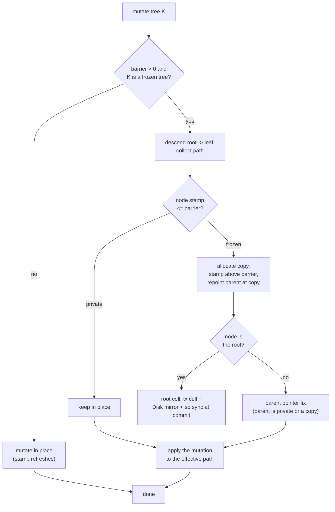

# Phase 9 (3.3): Metadata Path-Copy CoW -- the design record

Status: **shipped in 3.3.0**. This document records what was built, why
it is sound, what it costs (measured), and what it deliberately does
not claim.

## The problem it closes

Until 3.2, a LionFS snapshot froze **data** correctly (pin coverage +
redirect-on-write) but froze **metadata** by brute force: snapshot
creation deep-copied the entire inode tree -- O(inodes) per snapshot --
and left the directory-name tree and the checksum tree **shared and
mutable**, so a snapshot's readdir could see post-snapshot names and
snapshot reads had to disable checksum verification
(`checksum_tree_root = 0`). Two of the three Phase 9 gaps named in the
3.2 assessment were exactly these.

## The mechanism

Every B-tree node write is stamped with a global monotone counter
(`NODE_GEN`). A snapshot records the counter value at its creation as
its **barrier**. The invariant that makes everything work:

> A node whose stamp is **above** every live snapshot's barrier was
> written after every live snapshot was created, so **no frozen view
> can contain it** -- it is private, and mutating it in place is safe.
> A node at or below the barrier **may** be reachable from a snapshot's
> recorded root, so it must be **path-copied** before any mutation.

Frozen trees are exactly those whose roots a snapshot RECORDS:
inode (type 1), dir-name (2), per-inode spill-extent (3), checksum (5).
Every other tree (freespace, refcount, snapshot registry, clone,
subvolume, dedup, cluster) is not recorded by snapshots, so CoW-ing it
would be pure write amplification with zero correctness benefit.

### Where the truth lives

A moved root is recorded in **three places**, with a strict precedence:

1. the transaction's **root cell** (in-flight bookkeeping),
2. the **Disk mirror** (`Disk::frozen_roots`) -- this is the source of
   truth for every reader between a move and the superblock sync, so a
   handle built from a stale superblock value still finds the live tree,
   and so *bare-context* writers (tools, library callers) are protected
   by the same mechanism;
3. the **superblock** itself, synced and persisted to all three
   superblock slots at commit (`LionFS::commit_tx`).

Snapshot reads are the one case that must NOT follow the live root: a
frozen view handle (`BTree::new_frozen`) honors its recorded root
verbatim. Without this, snapshot reads would chase the live root and
silently read post-snapshot state into a "frozen" view -- the exact bug
class the test suite pins down (`metadata_cow_tests.rs`).

### Barrier maintenance

The barrier is the **max** stamp over all live snapshot records --
kept in `sb.last_snapshot_generation` and mirrored on the Disk. It is
recomputed on every delete from the *remaining* records, never inferred.
Keeping it at the max (not "the newest") is what makes multi-snapshot
deletion sound: deleting the newest snapshot must not un-freeze nodes
that an older snapshot can still reach, and lowering the barrier only
ever un-freezes nodes stamped after every *remaining* snapshot.

### Crash consistency

The commit order is: journal (fsync) -> apply blocks -> superblock slot
write (all 3 slots, generation = the committing tx id) -> fsync. A
crash between apply and the slot write costs exactly the root move: the
replayed blocks exist but the old superblock roots an older, consistent
tree; the moved blocks are unreachable and become GC reclaim. A torn
slot write is outvoted by `pick_best` (highest-generation valid copy).
The stamp counter high-water mark is persisted in
`sb.node_generation` (carved from former padding -- old images read 0,
which conservatively means "every existing node predates every
snapshot") and re-initialized above every persisted value at mount.

## What it buys (measured, in-process harness)

| capability | 3.2 | 3.3 |
|---|---|---|
| snapshot creation, metadata | O(inodes) deep copy | **O(1)** -- record roots |
| creation, data | O(extent runs) pin walk | O(extent runs) (unchanged) |
| inode view frozen | yes (deep copy) | yes (path-copy CoW) |
| dir-name view frozen | **no** | **yes** |
| checksum view frozen | **no** (verify off) | **yes** (verify on) |
| spill-extent views frozen | **no** (shared tree) | **yes** |
| creation cost (7-run file, harness) | (not comparable: full walk x2) | **0.14 ms** |
| write tax, first pass after snapshot | n/a | **~9%** (163.0 vs 178.5 MiB/s) |
| write tax, steady state | n/a | **~6%** (168.6 vs 178.5 MiB/s) |

The tax numbers are `lfs_ioperf --snapshot-tax` on the development
container (2 vCPU, tmpfs-backed image): in-process harness numbers,
**not** fio-on-mount numbers, and labeled as such everywhere they
appear. Each node is copied **once per snapshot epoch** (pinned by
`cow_copies_once_per_epoch`), which is why steady-state tax contains
only the data-block redirect, not metadata copying.

## Soundness notes (the fine print)

- Conservative by construction: "stamp <= barrier MAY be frozen" can
  over-copy (a pre-snapshot node no snapshot actually reaches), never
  under-copy. Over-copying costs blocks; under-copying costs data.
- The `parent_block` bookkeeping field of a frozen child may be
  updated by stable-root-split reparenting. Nothing navigates via
  parent pointers; key/value/child-pointer payloads of frozen nodes
  are never mutated.
- Tree iteration (`iter_all`) walks internal child pointers, not the
  `next_leaf` sibling chain: under CoW a copied leaf is reachable only
  through the repointed parent, while the old chain still threads the
  frozen originals.
- The fast-append cache refuses a cached leaf whose stamp is at or
  below the barrier (falls to the descent, which copies it), and
  refreshes onto the copy afterwards.

## What it does NOT claim

- **Not O(1)-total creation.** Btrfs and ZFS create snapshots in O(1)
  *including data* because they carry per-extent birth stamps
  (ZFS blkptr birth txg; Btrfs extent backrefs). LionFS's inline
  `Extent` (24 bytes x 7 in a 256-byte inode) has no room for a birth
  stamp without a format change, so creation still walks every extent
  run to pin it. Metadata is O(1); data is O(runs). For
  many-small-file workloads that walk is proportional to the snapshot
  itself; for large sequential files (7 runs in the harness image) it
  is 0.14 ms. A format-v3 per-extent birth stamp is the successor gap,
  named in ROADMAP.
- **No write concurrency.** The CoW machinery is single-writer per
  mount, exactly like the rest of the write path. SMP read scaling is
  measured separately (`lfs_smpbench`: 1.26-1.41x at 2 jobs on the
  development container); write concurrency needs per-file locking
  (Phase 10).
- **Compressed inodes remain outside** snapshot pin coverage (cluster
  bookkeeping is not pin-aware) -- unchanged, documented limitation.
- Path-copied nodes are not reclaimed at snapshot delete; they are
  unreachable from both the live tree and remaining snapshots, and
  metadata-node reclamation is the garbage collector's job.

## The money tests

`src/fs/metadata_cow_tests.rs` (6 tests):

- `metadata_cow_freezes_inode_view` -- live update through a **bare**
  fresh context (worst case: no vfs barrier plumb, stale superblock
  root) still path-copies; the snapshot's recorded root returns the
  pre-snapshot inode; a stale-root handle finds the moved root through
  the Disk mirror.
- `cow_copies_once_per_epoch` -- first post-snapshot mutation copies
  the frozen leaf, the second allocates zero metadata blocks.
- `barrier_recompute_on_delete` -- deleting the newest snapshot
  un-freezes only what it alone could reach; the older snapshot's view
  survives intact.
- `checksum_tree_frozen_by_snapshot` -- the snapshot's csum entry keeps
  the pre-snapshot value after the live entry is updated.
- `dir_tree_frozen_by_snapshot` -- post-snapshot names do not resolve
  in the snapshot's view.
- `fast_append_respects_cow` -- 120 sequential inserts across the
  snapshot boundary all land; the frozen view ends exactly at the
  pre-snapshot key range.

And the end-to-end surface: `lfs_snapshot create|delete|list|verify`
-- the real CLI (the 3.2 tool was a placeholder that printed success
without touching the device), with `verify` reading a snapshot's data
against its **frozen checksum view**, the capability this phase
unlocked.
