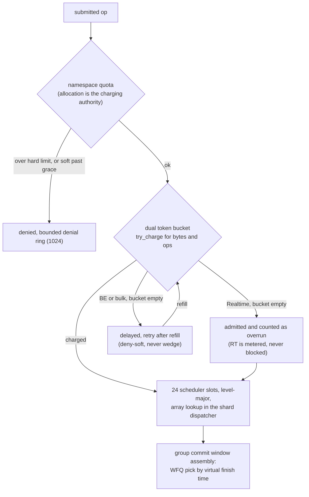

# Specification: QoS & Multi-Tenancy (LionFS 3.0)

Status: implemented (`src/qos/`) | RFC: LFS-RFC-004 §4

## The four control points

| Layer | File | Question it answers |
|-------|------|---------------------|
| IO classes | `classes.rs` | *who waits?* (latency) |
| Token buckets | `classes.rs` | *how much?* (throughput) |
| Quota table | `quota.rs` | *how much space?* (capacity) |
| WFQ scheduler | `wfq.rs` | *who next?* (fairness) |

## IO classes

`IoLevel::Realtime / BestEffort / Bulk`, each with 8 sub-levels
(0 = highest within class), folded into 24 scheduler slots
(`slot()`, level-major). Journal commits and fsync barriers ride
Realtime; scrub, GC, rebalance, and migration ride Bulk. Slot
indexing is a direct array lookup in the shard dispatcher.

## Dual token buckets

`TokenBucket::new(rate_bytes, rate_ops, burst_bytes, burst_ops)`:
lazy refill against a caller-supplied `now_ns` (no wall clock —
deterministic under test), integer arithmetic (whole-seconds +
fractional-ns split), saturating. Zero rates are rejected at
construction (a ban belongs to the quota layer where it is visible).
`try_charge(now, bytes, ops)` consumes or denies atomically;
`headroom(now)` is the observability probe. Failed charges consume
nothing.

## Quota table

Per-namespace envelopes (`QuotaSpec`): soft/hard space and inode
limits + grace window. Soft trips are warnings until grace elapses,
then escalate to refusal; hard limits refuse immediately.
Validation rejects soft > hard and zero hard limits. Charge/release
are explicit so the transaction layer can replay them; the denial
ring is bounded at 1024 with oldest-eviction. Checked at
**allocation**, never at submission.

## WFQ (weighted fair queuing)

```rust
WfqScheduler::<N>::new(weights);      // 0 saturates to 1
set_pending(q, cost);                 // finish = vt + cost/weight
pick() -> Option<usize>               // earliest finish; ties by index
```

The anti-laundering rule: declaring a cost for a pending head is
idempotent — finish times are computed once at first declaration.
Virtual time never regresses. `stats()` returns per-queue (requests,
cost units) for export.

Fairness properties (tested):
- equal weights alternate exactly (10 rounds → [10, 10]);
- a 64 KiB head is served only after ~16 × 4 KiB services amortize
  its virtual cost (`[1, 15]` over 16 rounds);
- weights 1:3 divide service ~3:1 (2.6..3.5 tolerance band, integer
  rounding accounted);
- zero-cost requests pay one unit (no free lunch);
- cleared queues are never picked.

## Integration points (Phase 8)

- Admission: `try_charge` before `shard.submit` (two integer
  compares + token math ≈ 30 ns).
- Batch pick: WFQ `pick()` in group commit's window assembly.
- Allocation: `evaluate`/`charge` in the allocator's extent
  reservation path.
- Export: bucket headroom, quota denials, and WFQ stats as
  `lfs_qos_*` series in the Prometheus registry.

## Kept fixed

- The ref-by-mis-in-burst bug from the first implementation (score
  bounded by actual declared cost, not weight).
- Rate-limit keys in the *agent* are per (kind, band, device) —
  escalation is never suppressed (see Guardian spec).
- Integer-only math everywhere; the simulator and production share
  bit-for-bit behavior.

## Admission and scheduling path (diagram)



## Token bucket refill

Lazy refill against the caller-supplied `now_ns`, so the simulator and
production share bit-for-bit behavior:

$$T(t) = \min\bigl(b,\ T(t_0) + r\,(t - t_0)\bigr), \qquad
t_0 = \text{last refill time}$$

with burst capacity $b$ and sustained rate $r$ (integer whole-seconds
plus fractional-ns arithmetic, saturating). Failed charges consume
nothing.

## WFQ convergence and the tuned profile

Finish times are computed once at first declaration and virtual time
never regresses, so under sustained saturation the service split
converges to the weight ratio:

$$\text{finish}_i = v_{\text{now}} + \frac{c_i}{w_i}, \qquad
\frac{S_i}{S_j} \to \frac{w_i}{w_j}$$

Phase 8 ([wiring.md](wiring.md)) places the gate on the live shard path
(`qos_gate.rs`: quota check, then dual bucket, roughly 30 ns) and the
WFQ picker in group commit's window assembly. Tuned profile (3.1):

$$\begin{aligned}
r_{\text{RT}} &= 16\ \mathrm{GiB/s} & b_{\text{RT}} &= 1\ \mathrm{GiB} \\
r_{\text{BE}} &= 4\ \mathrm{GiB/s} & b_{\text{BE}} &= 256\ \mathrm{MiB} \\
r_{\text{bulk}} &= 1\ \mathrm{GiB/s} & b_{\text{bulk}} &= 64\ \mathrm{MiB}
\end{aligned}$$

with weights $w = (8, 4, 1)$: a bulk byte costs its queue $8 \times$
the virtual time of a realtime byte, so RT:bulk service converges to
8:1 regardless of arrival pattern; property tests pin
$7.4 < S_0/S_2 < 8.6$ over 8,000 rounds.
