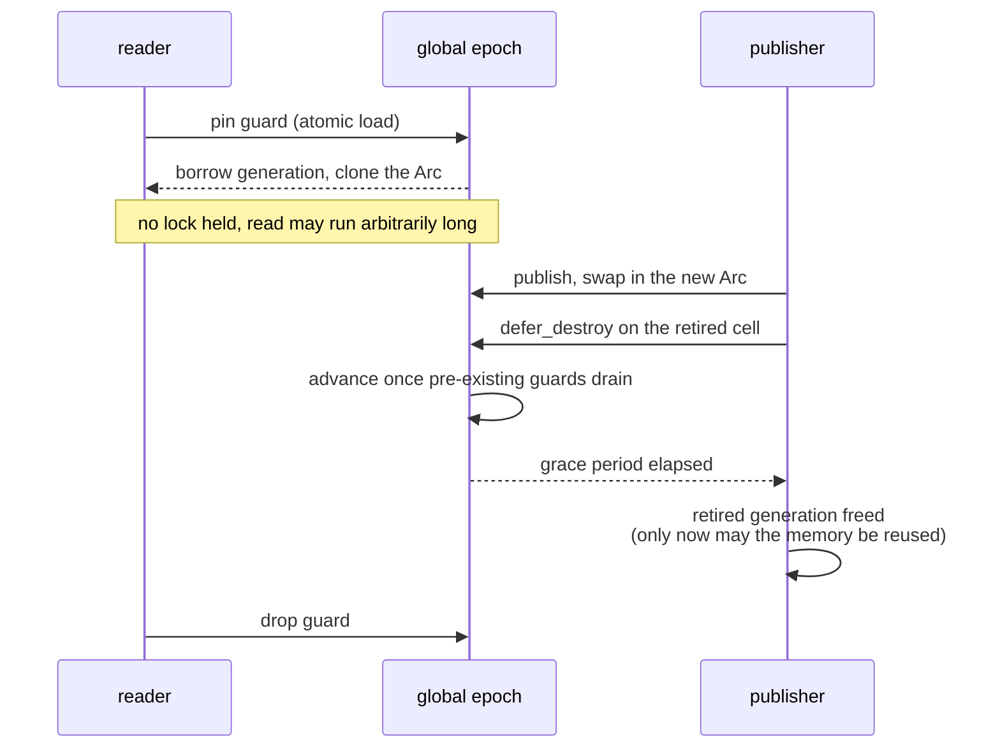

# Specification: RCU & Lock-Free Concurrency (LionFS 2.0, Pillar I)

Status: implemented (`src/rcu/`, `src/io_engine/shard.rs`, `src/io_engine/mpmc.rs`) |
RFC: LFS-RFC-002 §3.3

## The lock-free core

The engine is sharded by an injective hash of the file identity, so a
request's entire path — cache probe, extent resolution, allocation,
submission — executes on one shard with structures that shard alone
owns. Cross-shard interaction is confined to bounded MPMC queues.
`ShardTable::for_cpus(n)` sizes `next_pow2(n)` shards (≤128);
`shard_of(fd, ino)` routes via splitmix64.

## RcuPtr — publish-and-reclaim

`RcuPtr<T>` holds the current generation in a
`crossbeam::epoch::Atomic<Arc<T>>`:

- `read()` pins the epoch, borrows the cell's `Arc<T>` under the
  guard, and clones it — the clone keeps the value alive however long
  the reader needs. One atomic load + one refcount increment on the
  hot path, no lock.
- `publish(next)` swaps a fresh `Arc` in and retires the old cell with
  `guard.defer_destroy` — the old generation's memory is reclaimed
  only after every guard that could be borrowing it has been
  released: the textbook epoch-based grace period.

Soundness note (kept in the code comments): an earlier draft used
manual `Arc::from_raw` obligation arithmetic, which double-decremented
the refcount on the publish path. The crossbeam-epoch construction is
the sound form; the mistake is documented so it stays fixed.

## Seqlock — writer serialization

`Seqlock<T: Copy>`: writers serialize through a mutex and bump an
even/odd sequence counter around the write; readers retry when a
writer interleaved. Tested with 4 concurrent readers asserting the
writer's invariant (torn-read detection) across 10k writes, plus
8-writer lost-update accounting (16k increments, exactly 16k).

## RcuCache — the sharded publish/subscribe map

Per shard: an `RcuPtr<Vec<(K, V)>>` plus a writer mutex. Reads stay
lock-free RCU (atomic load + binary search of a small immutable
snapshot); the read-modify-publish is serialized per shard because
last-writer-wins would silently lose concurrent updates to the same
shard, and a CAS loop costs more than the mutex at the writer rates
the RFC assumes ("writers are rare because transactions batch").

## Vyukov MPMC queue

Bounded, fixed power-of-two capacity, lock-free and wait-free for
successful push/pop. Sequence-number slot protocol with
acquire/release fences; `push` returns `false` when full —
backpressure the submission path batches on, never a drop. Tested
FIFO order, wraparound, 2P×2C no-loss (sum-of-values property), and
bounded racy `len`.

## What is deliberately NOT here

- No per-read thread registration (epochs are global, trading a
  slightly longer grace period for zero per-read cost — the same trade
  the kernel's scalable RCU makes on large machines).
- No spinlocks on any path.
- No sharding of the transaction manager (journal appends serialize
  by design; group commit batches across shards through the shared
  engine flush).

## Grace period (diagram)

## Reclamation delay bound

A retired generation waits for every guard pinned before the publish:

$$D_{\text{reclaim}} \le \max_{i \in \text{cores}} R_i$$

where $R_i$ is the longest read-side critical section outstanding at
publish time. Epochs are global — no per-read thread registration — so
the max runs over all cores: the same trade kernel RCU makes on large
machines, buying a per-read cost of one atomic load plus one refcount
increment and never a spin. On the writer side the seqlock makes torn
reads impossible to accept (4 readers across 10k writes) and lost
updates structurally absent (8 writers, 16k increments, exactly 16k
accounted).
