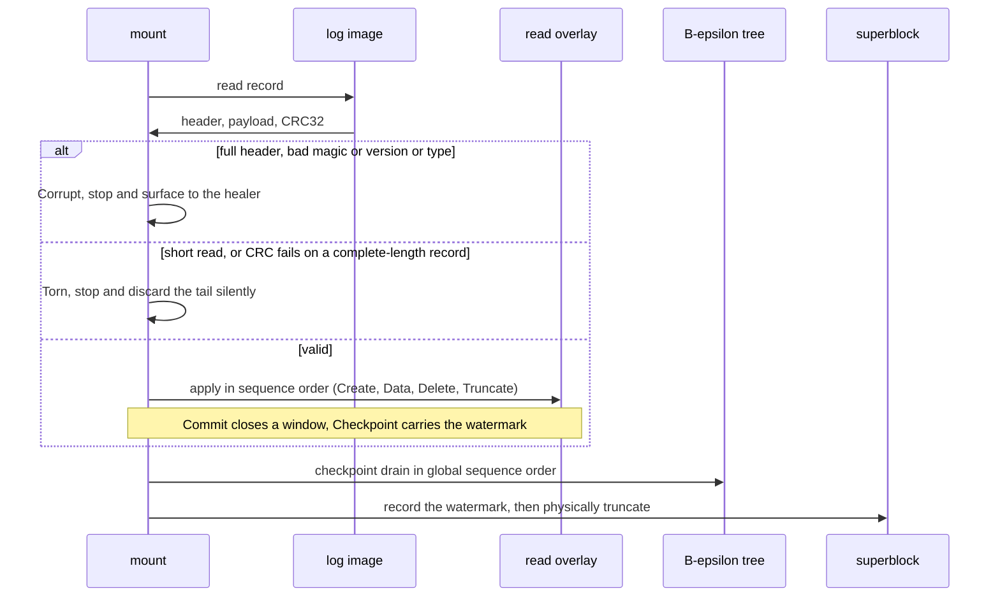

# Specification: Small-File Record Journal (LionFS 3.0)

Status: implemented (`src/recordlog/`) | RFC: LFS-RFC-004 §5

## The problem it exists for

A 4 KiB write to a new file costs inode-insert + extent-insert +
data-block write: three scattered device ops per tiny payload.
B-epsilon amortizes *index* writes; this module amortizes *small
data* writes — the oldest trick in database engines (LMDB's
freelist, RocksDB's WAL, F2FS's log structure).

## Record format (44 + payload bytes on the wire)

```text
magic "LFSR"(4) | version(1) | type(1) | flags(2) | reserved(4)
file_id(8) | offset(8) | sequence(8) | payload_len(4)   -- 40-byte header
payload(payload_len)
CRC32(crc32fast, over header+payload)(4)
```

Types: `Create(1) Data(2) Delete(3) Truncate(4) Commit(5)
Checkpoint(6)`. Unknown tags are corruption, not tearing.

## Crash safety

The log is write-before-tree (same discipline as the metadata
journal). Replay walks forward: stops at the first record that is
torn (short — a partial window write, *normal* after a crash
mid-batch, silently discarded) or corrupt (full header, bad
magic/version/type — surfaced to the healer). CRC failure on a
complete-length record is treated as torn: the tail stops and
nothing after it is trusted.

`Commit` closes a group-commit window (flush = durability point).
`Checkpoint` carries the drained-through sequence watermark in its
`offset` field; physical truncation happens after the superblock
records the watermark.

## Enforcement (hard invariants, tested)

- `Data`/`Create` payloads ≤ `SMALL_FILE_MAX` (4032 B — the v3
  inode's inline threshold): refused *before* bytes touch the sink.
- Control records (`Delete`/`Truncate`) carry no payload.
- Sequences are dense and monotonic.

## Checkpoint policy

`checkpoint_due(byte_budget, record_budget)`: byte budget (default
4 MiB), record budget, or chatty-burst (log ends in `Commit` with
more than one record since the last checkpoint — the small-file
workload signature). `mark_checkpoint` resets counters and flushes.

## The path

```text
small write ──► append (CRC'd)
                 │ group-commit window (5 ms / 1 MiB, shared with io_engine)
                 ▼
        one sequential device write, N records
                 │ readers: overlay lookup hits the log first, tree on miss
                 ▼
        checkpoint: drain into B-ε tree, advance superblock watermark
```

## Kept fixed

- Header field offsets (the first draft mis-read file_id at 16; the
  layout table above is the tested one).
- Torn vs. corrupt distinction survives in `ReplayStats.tail` —
  mount-time reporting distinguishes "normal crash" from "call the
  healer".
- `replay_stream` (any `Read`) and `replay` (buffer) must agree
  bit-for-bit (tested).

## Replay path (diagram)



Torn-vs-corrupt survives in `ReplayStats.tail`: mount-time reporting
separates "normal crash" from "call the healer".

## Window amortization

$n$ records of mean payload $\bar p$ share one sequential device write
and one flush per window, against scattered per-op cost $c$:

$$T_{\text{window}} = \frac{n\bar p}{B} + c, \qquad
T_{\text{scattered}} = \frac{n\bar p}{B} + nc, \qquad
\Delta T = (n-1)\,c$$

At $n = 64$ records and 20 µs NVMe per-op cost the win is 1.26 ms per
window — the reason a small write costs one device op, not three.

The 3.1 wiring ([wiring.md](wiring.md), `small_write.rs`) routes
payloads $\le 4032$ B here with a single comparison, closes windows at
the 1 MiB byte budget or 256 records (the engine adds the time side),
serves reads from the overlay with fall-through to the tree, and drains
checkpoints through the transaction layer in sequence order — the tree
observes exactly the order a post-crash replay would apply, and
`sim::crash` asserts the writer view and replay view converge.
