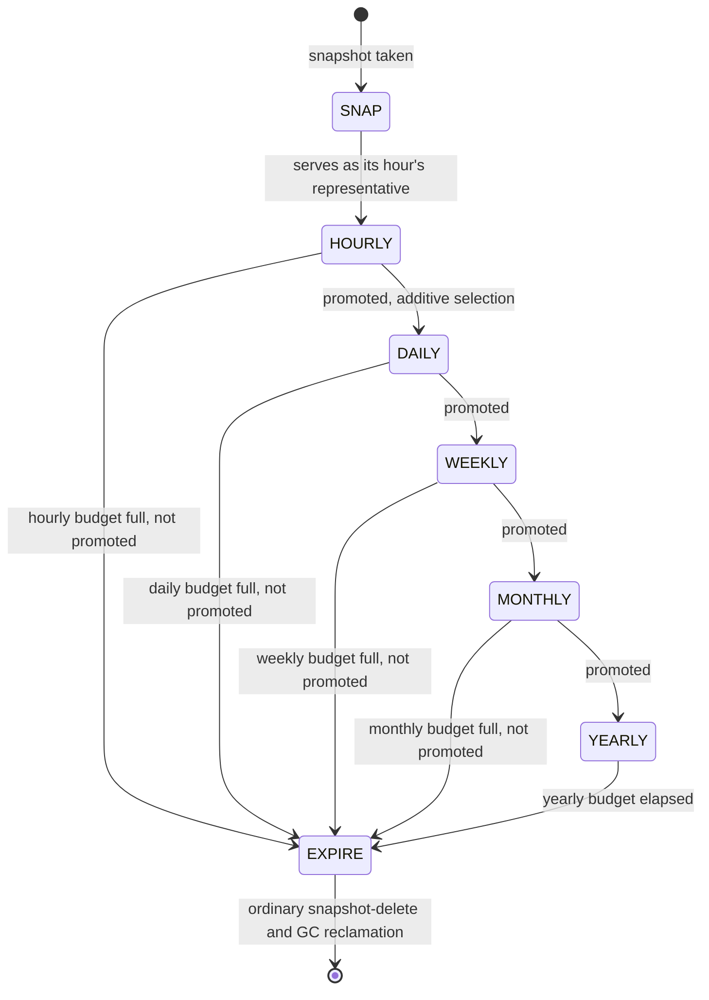
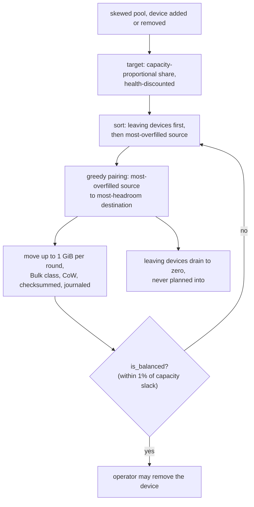

# Specification: Snapshot Retention & Pool Rebalance (LionFS 3.0)

Status: implemented (`src/fs/retention.rs`, `src/pool/rebalance.rs`)
RFC: LFS-RFC-004 §12

## Retention (GFS, §12.1)

Tier budgets (defaults 24/14/8/12/3 hourly/daily/weekly/monthly/
yearly) with **additive** selection: a snapshot serving as a day's
representative is never also consumed by the hourly budget. Output
is a keep-set; everything else rides the ordinary snapshot-delete +
GC reclamation path.

Calendar math is integer Hinnant (civil-from-days; the
`y + (m <= 2)` adjustment is load-bearing — Jan/Feb belong to the
next civil year relative to March-based era arithmetic) with
ISO-8601 week keys (Monday start, week 1 contains the first
Thursday; 2021-01-01 → 2020-W53 is the canonical edge case, tested).

## Online rebalance (§12.2)

Device add/remove without mkfs. Targets converge to the
**capacity-proportional share** of pool usage (16 TiB device holds
4× a 4 TiB device's share — never equal *bytes*), discounted by
health: Watch −25%, Degraded −50%, Failing −100% (drain) —
rebalance doubles as the evacuation path Guardian's advisories
request. `leaving` devices drain to zero and are never planned
*into*; drain completion is reported per round.

Moves are budget-sized (default 1 GiB/round), paired greedily
(most-overfilled source, most-headroom destination), and execute
through the ordinary CoW path in the Bulk QoS class — each move is
checksummed, journaled, and crash-recoverable like any write, which
is the only sane way to move petabytes under live traffic.
`is_balanced()` (±1% of capacity slack) is the operator's "can I
remove the device now" check; the convergence property is tested
by driving a skewed pool to balance.

## Kept fixed

- The rebalance sort comparator inversion (leaving devices must
  sort *first*; the first draft had a/b reversed).
- Retention never mutates snapshot state — it computes verdicts;
  the delete path applies them.

## GFS tier timeline (diagram)

## Rebalance round (diagram)

## Tier budgets (3.1 tuning)

The 3.0 defaults (24/14/8/12/3 hourly-to-yearly) were tuned in 3.1 to
48/14/8/12/7 — the 48 h-to-7 y retention window, validated with the
full 713-test suite green:

$$|\text{keep-set}| \le b_h + b_d + b_w + b_m + b_y
= 48 + 14 + 8 + 12 + 7 = 89$$

Additive selection keeps a snapshot serving as a day's representative
out of the hourly budget, so the sum is a true ceiling, not overlapping
counts.

## Target share

Capacity-proportional, never equal bytes, discounted by health
(Watch −25%, Degraded −50%, Failing −100% = drain):

$$\text{target}_d = \mathrm{cap}_d \cdot \frac{\mathrm{used}}
{\mathrm{pool}} \cdot (1 - \delta_d)$$

`is_balanced`, the operator's removal gate, is the per-device check

$$|x_d - \text{target}_d| \le 0.01 \cdot \mathrm{cap}_d \quad \forall d$$

and each move is an ordinary crash-recoverable write, which is the only
sane way to move petabytes under live traffic.
