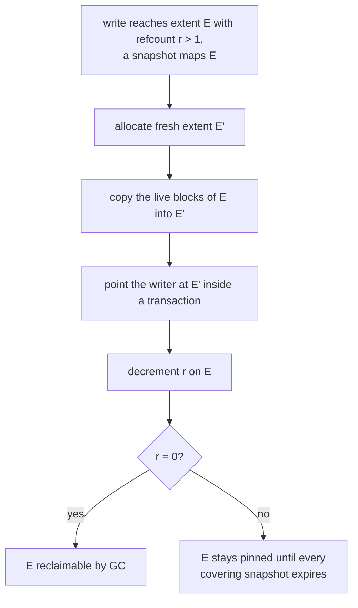

# Snapshots Specification

*This specification is planned for a future Phase of LionFS.*

## Copy-on-write fork (design)

Snapshots ride the same redirect-on-write discipline the GC, healer,
and rebalance mover use ([reliability_v2.md](reliability_v2.md)):

Retention decides which snapshots expire and the delete path applies
the verdicts ([retention_rebalance.md](retention_rebalance.md));
reclamation of the unpinned remains is the GC's ordinary job.

## Extent pinning cost

A snapshot of live size $L(s)$ pins that space against reclamation for
its lifetime; in the worst case (no shared extents between snapshots):

$$H(t) = \sum_{s \le t} L(s), \qquad
\text{free}_{\text{eff}}(t) = \text{free}(t) - H(t)$$

— the operator-visible number, since pinned space is capacity the pool
cannot allocate. Bandwidth cost is the fork copy: block-granular
redirect copies only the blocks being written, while an extent-granular
fork would copy $E$ bytes on the first touch of $w \ll E$ bytes:

$$\mathrm{WAF}_{\text{first touch}} = \frac{E}{w} \ \ \text{(extent-granular)},
\qquad \approx 1 \ \ \text{(block-granular)}$$

so the fork is block-granular and pinning is paid in space, not in
write amplification.