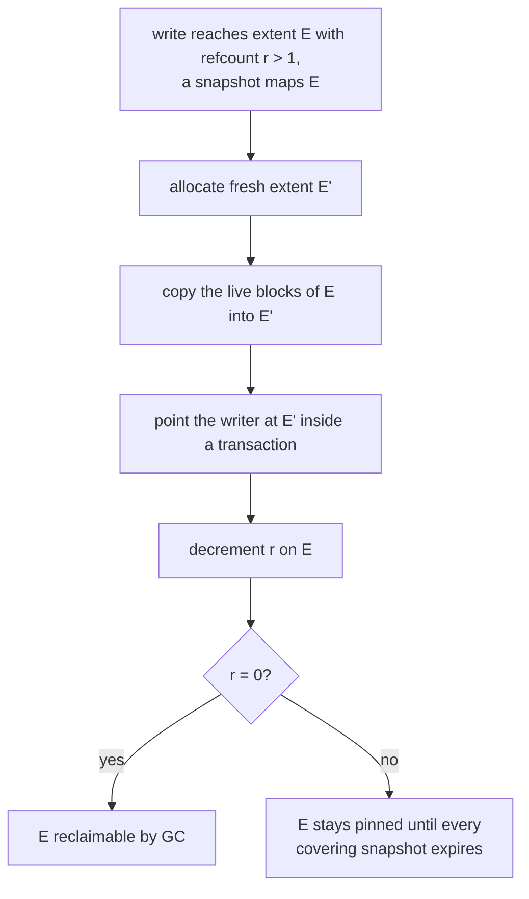
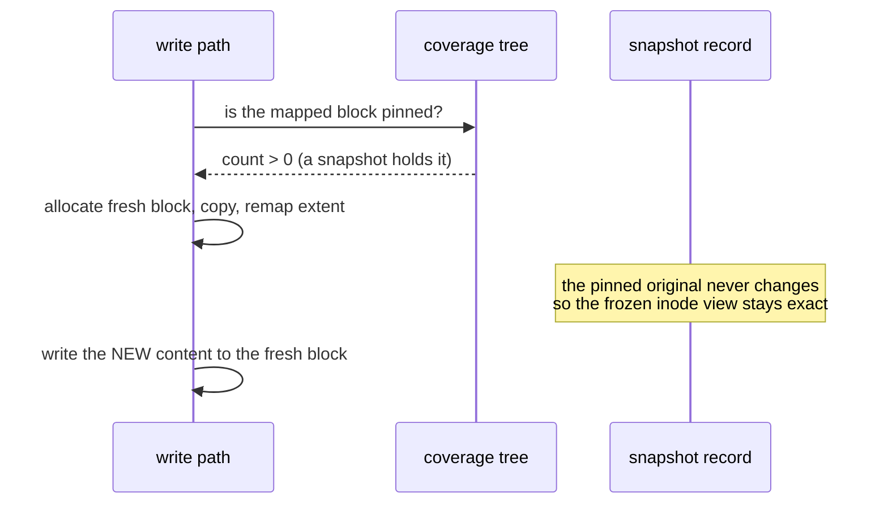
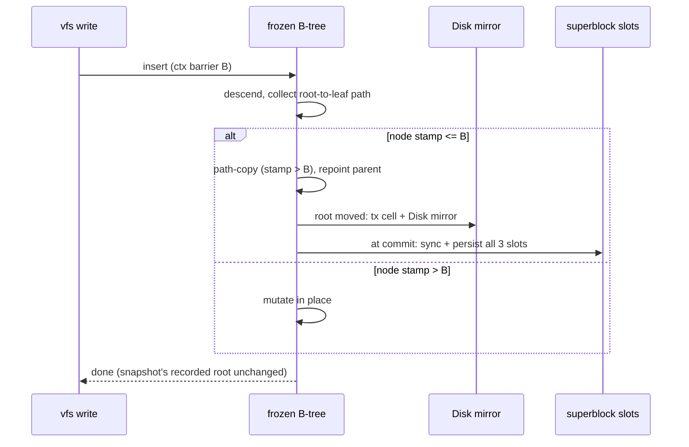

# Snapshots Specification

*The design below was implemented in 3.2 — see the "Implementation
status" section at the end for what shipped, what differs, and what
remains.*

## Copy-on-write fork (design)

Snapshots ride the same redirect-on-write discipline the GC, healer,
and rebalance mover use ([reliability_v2.md](reliability_v2.md)):

Retention decides which snapshots expire and the delete path applies
the verdicts ([retention_rebalance.md](retention_rebalance.md));
reclamation of the unpinned remains is the GC's ordinary job.

## Extent pinning cost

A snapshot of live size $L(s)$ pins that space against reclamation for
its lifetime; in the worst case (no shared extents between snapshots):

$$H(t) = \sum_{s \le t} L(s), \qquad
\text{free}_{\text{eff}}(t) = \text{free}(t) - H(t)$$

— the operator-visible number, since pinned space is capacity the pool
cannot allocate. Bandwidth cost is the fork copy: block-granular
redirect copies only the blocks being written, while an extent-granular
fork would copy $E$ bytes on the first touch of $w \ll E$ bytes:

$$\mathrm{WAF}_{\text{first touch}} = \frac{E}{w} \ \ \text{(extent-granular)},
\qquad \approx 1 \ \ \text{(block-granular)}$$

so the fork is block-granular and pinning is paid in space, not in
write amplification.

---

## Implementation status (3.2, superseded in part by 3.3)

The block-granular fork above is live code now:

| design element | 3.2 implementation | where |
|---|---|---|
| "refcount r > 1" | coverage runs `[physical_start, length, count]` in a B-tree; ANY covering run (not a threshold) forces redirect | `integrity::refcount` |
| fork on write | fresh block + copy + extent remap, before the in-place branch | `file::writer::write_file` |
| "decrement r on E" | not done on redirect — the pin stays until the snapshot is deleted (coverage counting, not backrefs) | documented limitation |
| pin creation | `create_snapshot` walks every inode (inline + spilled extents) and pins each run | `fs::snapshots` |
| pin release | `delete_snapshot` walks the snapshot's OWN frozen inode tree and unpins exactly what it pinned | `fs::snapshots` |
| snapshot read view | data pinned + inode tree deep-copied at snapshot time (3.3: deep copy replaced by metadata path-copy CoW) | `fs::snapshots` |

Differences from the design text, stated honestly:

- **No back-references.** The design's "decrement r on E" at redirect
  time requires knowing WHICH mappings reference E. 3.2 counts pins
  without remembering who: a redirect leaves the pin in place, so the
  block is protected until the pinning snapshot is deleted. Cost:
  over-conservative pinning (more CoW than strictly necessary).
  Benefit: no backref maintenance on the write hot path.
- **Inode views are deep-copied**, not CoW-tree-shared. Creation is
  $O(\text{inodes})$ — not Btrfs's $O(1)$. This is the price of a
  journal-RoW core without CoW metadata trees.
- **Not frozen:** directory entries (dir tree is shared with the live
  tree) and the checksum tree (in-place updated by key) — snapshot
  data reads must pass `checksum_tree_root = 0` until metadata-tree CoW
  (Phase 9). Compressed inodes are skipped by the pin walk.
- The money test (`fs::cow_tests::snapshot_write_isolation`) proves
  the property the 3.1 comments only claimed: what a snapshot read
  sees does not change when the live file is overwritten afterwards.

## Implementation status (3.3): metadata path-copy CoW

Phase 9 landed in 3.3 and rewrote the metadata half of the story; see
`specifications/phase9_metadata_cow.md` for the full design record.
The deltas against the 3.2 table above:

| design element | 3.3 implementation |
|---|---|
| inode views | **frozen by path-copy CoW**, no deep copy: creation records the current root (O(1) metadata) |
| dir-name tree | **frozen** (was shared + mutable): snapshot name resolution returns pre-snapshot state |
| checksum tree | **frozen** (was in-place updated): snapshot reads can VERIFY data -- `lfs_snapshot verify` |
| spill-extent trees | **frozen** (was shared): spilled files' snapshot views are exact |
| creation cost | $O(1)$ metadata + $O(\text{extent runs})$ data pinning (measured 0.14 ms for a 7-run, 32 MiB harness file) |
| write tax | first pass after a snapshot ~9%, steady state ~6% (harness, 2-vCPU container) |
| barrier | $B = \max_k g_k$ over live snapshot records $k$; recomputed on delete |
| node privacy | stamp $> B$ $\Rightarrow$ written after every live snapshot $\Rightarrow$ provably private |

$$
P(\text{frozen} \mid \text{stamp} \le B) \le 1 \text{ (conservative copy, never miss)}, \quad
P(\text{frozen} \mid \text{stamp} > B) = 0
$$

Still true (honest limits, updated 3.5): compressed inodes stay
outside birth/pin coverage, and the write path is single-writer per
mount. **The O(1)-total and write-concurrency limits are closed** —
see the 3.5 status table below.

## Implementation status (3.5): birth generations

Phase 11 (`specifications/phase11_txg_birth.md`) removed the last walk:
creation on a checksummed image (the mkfs default) records the roots
and NOTHING else. Data protection derives from per-block birth stamps
the write path records in the checksum tree's `generation` field:

| design element | 3.5 implementation |
|---|---|
| creation cost | $O(1)$ **total**: no pin walk (measured 0.015 ms at 7 runs; money test: 200 runs -> 1 allocation) |
| data protection | $\text{redirect}(b) \iff \text{birth}(b) \le B$ (per-block, from the csum record's generation) |
| truncate/free | blocks with birth $\le B$ are retained; reclaimed at delete |
| delete reclaim | walk the frozen csum view; free old-phys blocks with birth $>$ remaining barrier and no live extent mapping (conservative; no per-snapshot deadlist) |
| pin-mode fallback | images with the checksum tree off keep the 3.3 pin walk, flagged per record (`SNAPSHOT_FLAG_BIRTH`) |
| write tax under a snapshot | first CoW pass 380 MiB/s, steady 961 MiB/s vs 728 base (harness, 2-vCPU container) — ~15% steady tax, zero with no snapshots |

Why not format v3 (per-extent birth stamps): the 256-byte fixed Inode
layout is load-bearing for every existing image; the csum record
already carries a `generation` field, is written on every data block
write anyway (births cost zero additional disk writes), and its
$(\text{inode}, \text{logical})$ key is FINER than per-run. The
ROADMAP's format-v3 question is thereby answered without a format
change.
