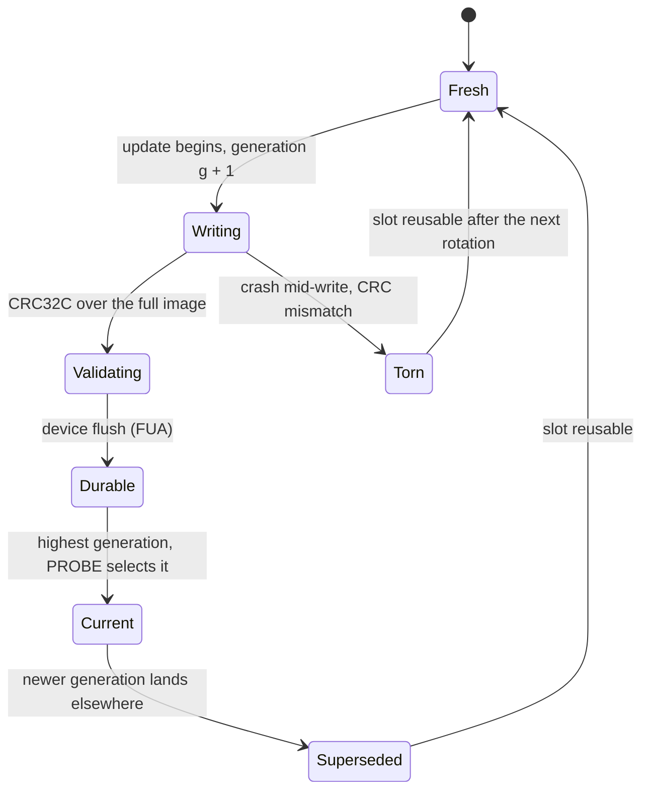
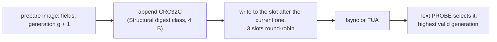

# Superblock Specification

The LionFS Superblock is located at physical block 0 (offset 0x00) and describes the global parameters of the filesystem.

## Structure (Little Endian)

| Offset (Hex) | Size | Name | Description |
|---|---|---|---|
| 0x00 | 4 bytes | `magic` | LionFS Magic Number (`0x4C494F4E` / "NOIL") |
| 0x04 | 4 bytes | `version` | Filesystem Version (currently 1) |
| 0x08 | 8 bytes | `total_blocks` | Total number of blocks in the volume |
| 0x10 | 8 bytes | `free_blocks` | Number of currently free blocks |
| 0x18 | 8 bytes | `inode_count` | Total number of pre-allocated inodes |
| 0x20 | 8 bytes | `free_inodes` | Number of currently free inodes |
| 0x28 | 8 bytes | `bitmap_start` | Starting block for the free space bitmap |
| 0x30 | 8 bytes | `inode_table_start` | Starting block for the inode array |
| 0x38 | 8 bytes | `root_inode` | Inode number of the root directory |
| 0x40 | 3904 bytes| `padding` | Reserved for future expansions |

## Alignment
The superblock spans exactly 4096 bytes (1 Block).

## Rotating copies (A/B/C)

The single-copy layout above is the 1.x image. Live volumes rotate
three superblock slots (SB0/SB1/SB2) so a torn write is always
survivable: mount PROBE selects the highest-generation CRC-valid copy
([reliability_v2.md](reliability_v2.md)).

## Update atomicity

A slot image is either wholly the old generation or wholly the new one:
the Structural CRC32C detects the tear and generations are monotonic,

$$g_{\text{new}} = g_{\text{old}} + 1, \qquad
\text{valid} \iff \mathrm{CRC32C}(\text{image}) = \text{stored tag}$$

Round-robin over three slots means an in-flight update never overwrites
the live copy, so committed metadata loss across the window is zero
(the pre-update generation stays valid until the replacement is
durable), and a failed mount requires all three slots invalid at once:

$$\Pr[\text{mount fails}] \approx p_{\text{slot}}^{3} \quad
\text{vs.} \quad p_{\text{slot}} \ \text{for one in-place copy}$$
